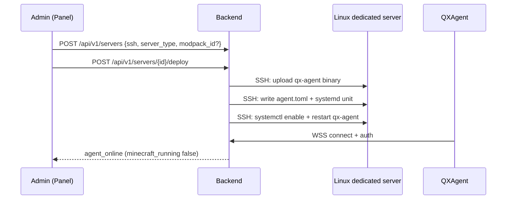
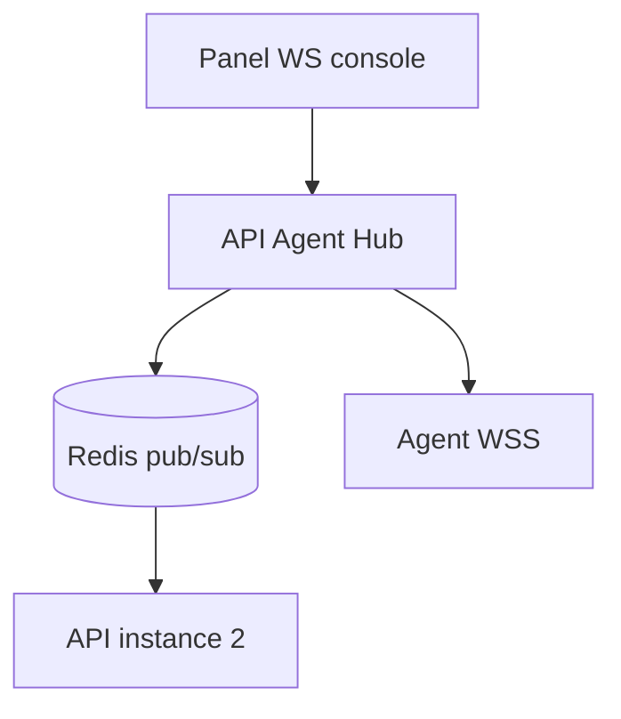

# QXAgent Protocol

> Версия: **1.0** · Transport: **WebSocket (WSS)** · Format: **JSON**
> Shared types: `pkg/protocol` (Go)
> **Конфиг:** [configuration.md](./configuration.md) (`agent.toml` / `/etc/qxsystem/agent/agent.toml`)
> **Статус реализации:** ✅ Phase 2 — `pkg/protocol`, QXApi hub, QXAgent WSS client; idempotency cache (`request_id` replay); SSH deploy + systemd

---

## 1. Обзор

QXAgent — Go daemon на **Linux**, systemd service. QXApi разворачивает QXAgent через **SSH** (см. §2). После deploy
QXAgent устанавливает **WSS** к Agent Hub и обменивается командами/events.

| Свойство | Значение |
| ---------- | ---------- |
| Platform | **Linux only** (amd64, arm64 TBD) |
| Transport | WSS (`wss://mc.qx-dev.ru/agent/v1/connect`) |
| Auth | JWT agent token (issued at deploy) |
| Idempotency | `request_id` UUID на каждую command |
| Ordering | At-least-once delivery; agent dedupe by `request_id` |

---

## 2. SSH Deploy (установка)

Backend выполняет deploy job — agent **не** ставится вручную пользователем.

### 2.1 Flow



### 2.2 Файлы на dedicated server

| Path | Назначение |
| ------ | ------------ |
| `/opt/qxsystem/agent/qx-agent` | Binary |
| `/opt/qxsystem/server/` | Server root (jar, mods, configs) |
| `/etc/qxsystem/agent/agent.toml` | `agent_token`, `api_base_url`, `server_id`, `server_root` |
| `/etc/systemd/system/qx-agent.service` | systemd unit |

### 2.3 systemd unit (шаблон)

```ini
[Unit]
Description=QX Minecraft Agent
After=network-online.target

[Service]
Type=simple
ExecStart=/opt/qxsystem/agent/qx-agent
WorkingDirectory=/opt/qxsystem/server
Restart=always
RestartSec=5

[Install]
WantedBy=multi-user.target
```

QXAgent reads `/etc/qxsystem/agent/agent.toml` on startup. Local dev: `agent.toml` в корне репо; override: `-config /path/to/agent.toml`.

Example `agent.toml`:

```toml
api_base_url = "https://mc.qx-dev.ru/api/v1"
server_id = "uuid"
agent_token = "eyJ..."
server_root = "/opt/qxsystem/server"
```

### 2.4 SSH требования

- Backend хранит `private_key_enc` (AES-GCM, master key из `qxapi.toml` → `ssh_master_key`).
- Supported: Ed25519, RSA keys.
- Minimum: user with sudo for `/opt/qxsystem`, systemd.
- Firewall: исходящий HTTPS/WSS к QXApi (443).

---

## 3. WebSocket Connection

### 3.1 Handshake

```text
GET /agent/v1/connect HTTP/1.1
Upgrade: websocket
Authorization: Bearer <agent_jwt>
X-Agent-Version: 1.0.0
X-Server-Id: <uuid>
```

**Agent JWT claims:**

```json
{
  "sub": "agent:<server_uuid>",
  "server_id": "<uuid>",
  "exp": 1735689600
}
```

### 3.2 Reconnect

| Параметр | Значение |
| ---------- | ---------- |
| Initial backoff | 1s |
| Max backoff | 60s |
| Jitter | ±20% |
| Heartbeat interval | 30s |
| Heartbeat timeout | 90s (server closes) |

При reconnect agent **не** перезапускает MC process. Backend re-associates WSS session with `server_id`.

### 3.3 Idempotency

Каждая **command** содержит `request_id` (UUID v4).

- Agent хранит cache последних **1000** `request_id` (TTL 24h).
- Повтор command с тем же `request_id` → agent отвечает cached `*.result` без re-execution.
- Backend может safely retry on timeout (30s default).

---

## 4. Message Envelope

```typescript
interface Envelope {
  v: 1;
  type: string;
  request_id?: string;   // required for commands & results
  ts: string;            // ISO8601
  payload: unknown;
}
```

**Direction prefix:**

| Prefix | Direction |
| -------- | ----------- |
| `cmd.*` | Backend → Agent |
| `evt.*` | Agent → Backend |
| `res.*` | Agent → Backend (response to cmd) |

---

## 5. Commands (Backend → Agent)

### 5.1 Lifecycle

```json
{
  "v": 1,
  "type": "cmd.server.start",
  "request_id": "550e8400-e29b-41d4-a716-446655440000",
  "ts": "2026-06-09T12:00:00Z",
  "payload": {
    "server_type": "paper",
    "jar_path": "/opt/qxsystem/server/server.jar",
    "jvm_args": ["-Xms2G", "-Xmx4G"],
    "extra_args": ["--nogui"]
  }
}
```

| type | payload |
| ------ | --------- |
| `cmd.server.start` | `server_type`, `jar_path`, `jvm_args[]`, `extra_args[]` |
| `cmd.server.stop` | `{ "graceful": true, "timeout_sec": 30 }` |
| `cmd.server.restart` | same as start + stop |
| `cmd.server.kill` | `{}` |

**server_type:** `vanilla` \| `paper` \| `spigot` \| `purpur` \| `forge` \| `neoforge` \| `fabric` \| `quilt` \|
`hybrid` (требует `hybrid_platform`: `mohist` \| `magma` \| `arclight`).

См. [server-content-install.md](./server-content-install.md).

### 5.2 Console & RCON

| type | payload |
| ------ | --------- |
| `cmd.console.input` | `{ "line": "say hello" }` |
| `cmd.rcon.command` | `{ "command": "list", "password_from_config": true }` |

### 5.3 Files

| type | payload |
| ------ | --------- |
| `cmd.files.list` | `{ "path": "plugins" }` |
| `cmd.files.read` | `{ "path": "server.properties", "max_bytes": 1048576 }` |
| `cmd.files.write` | `{ "path": "...", "content_base64": "..." }` |
| `cmd.files.upload` | `{ "path": "...", "url": "https://presigned..." }` |
| `cmd.files.delete` | `{ "path": "..." }` |

Paths relative to server root. Traversal blocked (`..`, absolute paths).

### 5.4 Modpack, mods & plugins

**Modpack** — полная сборка; пути зависят от `server_type` ([server-content-install.md](server-content-install.md)).

```json
{
  "v": 1,
  "type": "cmd.modpack.install",
  "request_id": "...",
  "payload": {
    "modpack_id": "uuid",
    "manifest_url": "https://api.../modpacks/{id}/manifest",
    "manifest_sha256": "abc...",
    "wipe_existing": false
  }
}
```

**Отдельные моды** — только если `server_type` поддерживает mods (`forge`, `neoforge`, `fabric`, `quilt`, `hybrid`):

```json
{
  "type": "cmd.mods.install",
  "payload": {
    "items": [{ "url": "...", "sha256": "...", "filename": "mod.jar" }],
    "target_dir": "mods"
  }
}
```

**Плагины** — только если `server_type` поддерживает plugins (`paper`, `spigot`, `purpur`, `hybrid`):

```json
{
  "type": "cmd.plugins.install",
  "payload": {
    "items": [{ "url": "...", "sha256": "...", "filename": "plugin.jar" }],
    "target_dir": "plugins"
  }
}
```

QXAgent скачивает по URL на диск сервера, verify hash. **Не MinIO.**

| server_type | `cmd.mods.install` | `cmd.plugins.install` |
| ------------- | :----------------: | :-------------------: |
| paper, spigot, purpur | ✗ | ✓ |
| forge, neoforge, fabric, quilt | ✓ | ✗ |
| hybrid (Mohist, …) | ✓ | ✓ |
| vanilla | ✗ | ✗ |

### 5.5 Agent maintenance

| type | payload |
| ------ | --------- |
| `cmd.agent.update` | `{ "binary_url": "...", "sha256": "..." }` |
| `cmd.agent.ping` | `{}` |

---

## 6. Events & Responses (Agent → Backend)

### 6.1 Heartbeat

```json
{
  "v": 1,
  "type": "evt.agent.heartbeat",
  "ts": "2026-06-09T12:00:30Z",
  "payload": {
    "cpu_percent": 12.5,
    "ram_used_mb": 4096,
    "ram_total_mb": 8192,
    "disk_free_mb": 50000,
    "uptime_sec": 86400,
    "agent_version": "1.0.0"
  }
}
```

### 6.2 Server status

```json
{
  "v": 1,
  "type": "evt.server.status",
  "payload": {
    "status": "running",
    "pid": 12345,
    "exit_code": null
  }
}
```

`status`: `stopped` \| `starting` \| `running` \| `stopping` \| `crashed`

### 6.3 Console stream

```json
{
  "v": 1,
  "type": "evt.console.output",
  "payload": {
    "stream": "stdout",
    "line": "[12:00:01 INFO]: Done!"
  }
}
```

`stream`: `stdout` \| `stderr` \| `rcon`

### 6.4 Metrics

```json
{
  "v": 1,
  "type": "evt.metrics",
  "payload": {
    "tps": 20.0,
    "players_online": 3,
    "players_max": 20,
    "player_list": ["Steve", "Alex"]
  }
}
```

### 6.5 Content installed

После `cmd.modpack.install`, `cmd.mods.install` или `cmd.plugins.install`:

```json
{
  "v": 1,
  "type": "evt.content.installed",
  "request_id": "550e8400-...",
  "payload": {
    "kind": "mods",
    "count": 3,
    "target_dir": "mods"
  }
}
```

`kind`: `modpack` \| `mods` \| `plugins`

### 6.6 Command result

```json
{
  "v": 1,
  "type": "res.files.list",
  "request_id": "550e8400-...",
  "payload": {
    "ok": true,
    "entries": [{ "name": "server.jar", "size": 123, "is_dir": false }]
  }
}
```

Error:

```json
{
  "payload": {
    "ok": false,
    "error": { "code": "PATH_DENIED", "message": "..." }
  }
}
```

| Error code | Meaning |
| ------------ | --------- |
| `PATH_DENIED` | Outside server root |
| `FILE_TOO_LARGE` | Exceeds max_bytes |
| `PROCESS_BUSY` | Start while running |
| `PROCESS_NOT_RUNNING` | Stop while stopped |
| `MODPACK_HASH_MISMATCH` | Manifest sha256 mismatch |
| `DOWNLOAD_FAILED` | Network/hash error |
| `CONTENT_NOT_ALLOWED` | `server_type` не поддерживает mods/plugins (см. [server-content-install.md](./server-content-install.md)) |

---

## 7. Backend Routing (Agent Hub)



- Map: `server_id → websocket.Conn`
- Panel subscribes: `WS /api/v1/servers/{id}/console?access_token=<user_jwt>`
- Hub forwards `evt.console.output` → panel; `cmd.console.input` → agent
- Multi-admin: RBAC check `server_members` before forward

---

## 8. Security

| Rule | Implementation |
| ------ | ---------------- |
| Agent token rotation | On redeploy; old token revoked |
| SSH keys encrypted at rest | AES-GCM in MySQL |
| File sandbox | chroot-like prefix `/opt/qxsystem/server` |
| Command RBAC | owner/admin: all; viewer: console read-only |
| TLS | WSS only in production |

---

## 9. Versioning

| Field | Policy |
| ------- | -------- |
| `v` in envelope | Breaking change → increment |
| `X-Agent-Version` | semver; backend may reject outdated |

---

*См. также: [api.md](./api.md), [schema.sql](./schema.sql), [ssh-deploy.md](./ssh-deploy.md), [production-deploy.md](./production-deploy.md), [configuration.md](./configuration.md)*

Последнее обновление: 2026-06-21 (Phase 2 ✅, TOML config)
