# QXProject — Архитектура

> Документ описывает целевую архитектуру платформы и **текущий статус реализации**.
> **Версия:** v1.9 (2026-06-10) — **MVP alpha (dev) ✅** · Flows A/B/C manual ☑ · **Prod 🔲** · [mvp.md](./mvp.md)
> **Документация:** [mvp](./mvp.md) · [api](./api.md) · [agent-protocol](./agent-protocol.md) ·
> [device-linking](./device-linking.md) · [launch-bridge](./launch-bridge.md) ·
> [security-legal](./security-legal.md) · [schema.sql](./schema.sql)

## Статус реализации

| Компонент | Фаза | Статус |
| ----------- | ------ | -------- |
| **QXApi** — auth, users | Phase 0 | ✅ `register`, `login`, `refresh`, `guest`, `logout`, `GET /users/me`, `PATCH /users/me/password`, `PATCH /users/me/email` |
| **QXApi** — health | Phase 0 | ✅ `GET /api/v1/health`, `GET /api/v1/health/ready` |
| **QXWeb** | Phase 0–2 | ✅ `/`, auth modal, `/profile`, `/launcher`, **`/servers`** (SSH, deploy agent, MC controls при `minecraft_running`) |
| **QXApi** — launcher, servers | Phase 1–2 | ✅ devices, instances, launch-requests, servers CRUD/deploy, agent hub |
| **Infra dev** | Phase 0–2 | ✅ Docker Compose (MySQL, Redis, MinIO); **dev VPS** `make dev-vps-up` (Flow C) |
| **CI / тесты** | Phase 0–Alpha | ✅ GitHub Actions; Go и web — **100% unit coverage**; Playwright + manual matrix |
| **QXLauncher** | Phase 1 | ✅ device link, tray loop, Vanilla launch |
| **QXAgent** | Phase 2 | ✅ WSS client, start/stop JAR |
| **pkg/protocol** | Phase 2 | ✅ WSS envelope types |
| Auth bridge (registered flow) | Phase 3 | ✅ JWT refresh в QXLauncher, device status в UI |
| **Prod deploy** | Post-alpha | 🔲 см. [mvp §7.1](./mvp.md) |

Следующий шаг: **Prod readiness** — VPS, TLS, smoke на prod ([mvp §7.1](./mvp.md)); MVP alpha flows в dev — ✅.

### URL и префиксы API

| Контекст | Base URL (dev) | Пример |
| ---------- | ---------------- | -------- |
| **REST (QXApi)** | `http://localhost:3000/api/v1` | `POST …/api/v1/auth/login` |
| **Health** | тот же префикс | `GET …/api/v1/health`, `GET …/api/v1/health/ready` |
| **QXWeb (Vite)** | `http://localhost:5173` | `VITE_API_BASE_URL` → API base |
| **Agent Hub (WSS)** | `wss://api.qx.example.com` | `WS /agent/v1/connect` — **вне** `/api/v1` |

В спецификации [api.md](./api.md) пути REST указаны **относительно** `/api/v1` (например `/auth/login` = `/api/v1/auth/login`).
Исключение: WebSocket агента и внешние API (CurseForge, Modrinth) — свои base URL.

## Специализированные docs

| Doc | Тема |
| ----- | ------ |
| [mojang-java.md](./mojang-java.md) | Java runtime matrix |
| [ssh-deploy.md](./ssh-deploy.md) | SSH agent provisioning |
| [auto-update.md](./auto-update.md) | Tray updates |
| [skin-server.md](./skin-server.md) | Skins (registered) |
| [modpacks-pipeline.md](./modpacks-pipeline.md) | CF/MR, client install |
| [server-content-install.md](./server-content-install.md) | Server mods/plugins by type |
| [observability-ops.md](./observability-ops.md) | Self-hosted ops |

## 1. Видение продукта

**QXProject** — единая экосистема для Minecraft, объединяющая:

| Компонент | Назначение |
| ----------- | ------------ |
| **QXWeb** | Личный кабинет и панель управления серверами (React SPA): auth, профиль, инстансы, серверы, UI `/launcher` |
| **QXApi** | Backend: REST + WebSocket, Agent Hub, auth, modpacks, deploy |
| **QXLauncher** | Desktop tray (Go): device link, sync, Mojang Java, JVM; **без встроенного UI** |
| **QXAgent** | Linux daemon на BYOS-сервере пользователя: lifecycle JAR, консоль, файлы, modpack |

### Ключевые сценарии использования

Инстанс **создаётся на сайте** (метаданные, версия, modloader, модпак), но **физически разворачивается на ПК
пользователя** через QXLauncher.
Перед инстансами и игрой **обязательна привязка QXLauncher к Backend сайта** (guest и registered) —
[device-linking.md](./device-linking.md).

---

#### Сценарий 1 — Игра с регистрацией (полный flow)

**Актор:** зарегистрированный пользователь. **Сначала обязательная привязка QXLauncher к сайту**
([device-linking.md](./device-linking.md)) — без `linked` нельзя создавать инстансы и запускать игру.

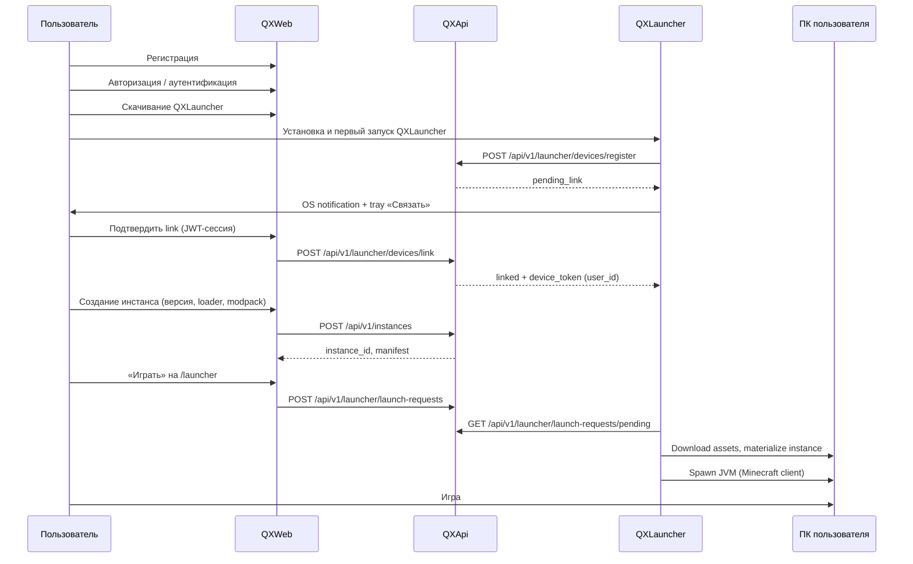

| Шаг | Действие | Где |
| ----- | ---------- | ----- |
| 1 | Регистрация | QXWeb |
| 2 | Авторизация / аутентификация | QXWeb |
| 3 | Скачивание QXLauncher | QXWeb |
| 4 | Первый запуск QXLauncher | ПК |
| 5 | **Привязка QXLauncher к аккаунту** | QXWeb confirm + QXLauncher poll |
| 6 | Создание игрового аккаунта | QXWeb `/launcher` — **QXAccount**, **Local** или **Microsoft** |
| 7 | Создание инстанса | QXWeb (метаданные) → QXLauncher (файлы на ПК) |
| 8 | Запуск → Игра | QXWeb `/launcher` → launch-bridge → JVM |

---

#### Сценарий 2 — Игра без регистрации (guest + device link)

**Актор:** гость. **Сначала обязательная привязка лаунчера к сайту** ([device-linking.md](./device-linking.md)).

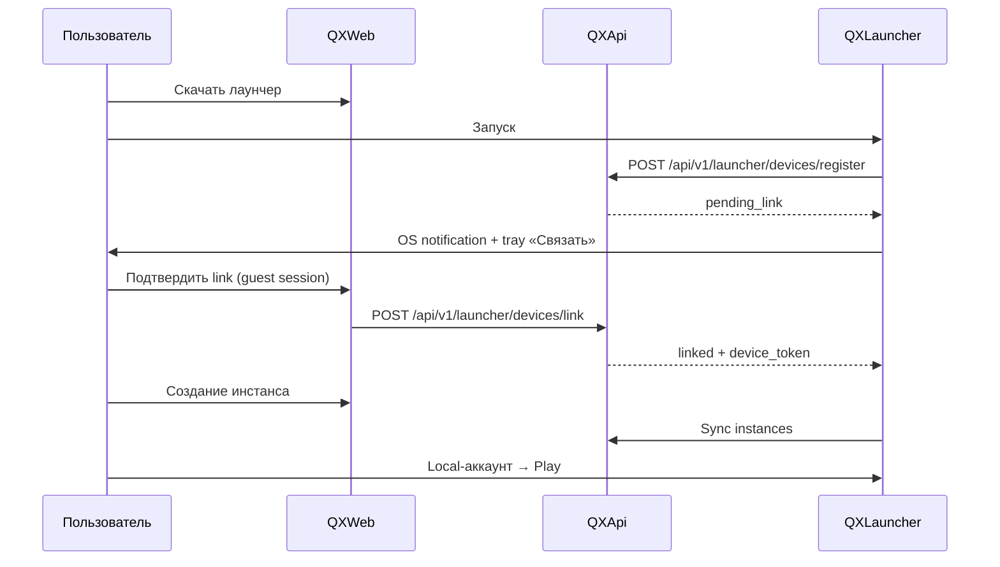

| Шаг | Действие |
| ----- | ---------- |
| 1 | Скачать → запустить QXLauncher |
| 2 | **Связать** с сайтом (уведомление или ПКМ в трее) |
| 3 | Local-аккаунт · инстанс на сайте · sync · игра |

> При регистрации позже: guest data **merge** в user ([device-linking.md §5](./device-linking.md)).

---

#### Сценарий 3 — Управление игровым сервером (админ)

**Актор:** владелец сервера (BYOS).

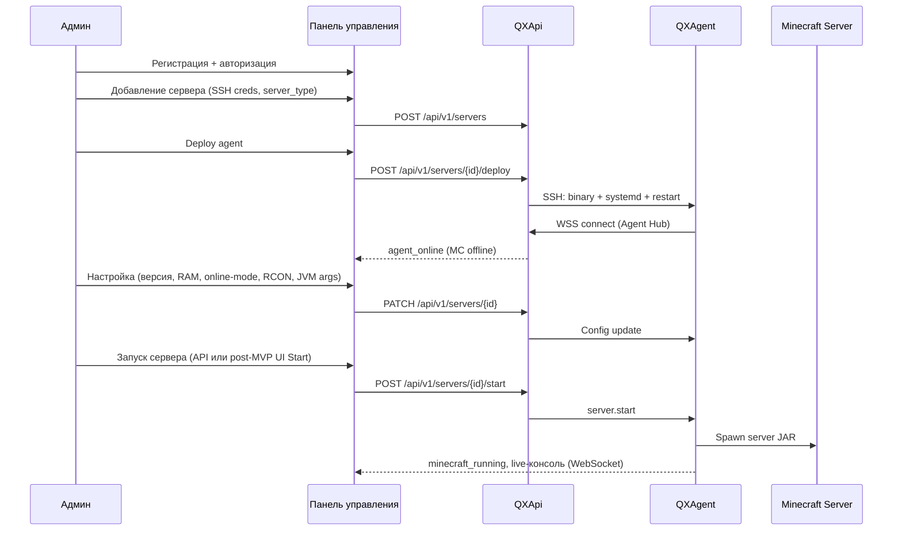

| Шаг | Действие | Где |
| ----- | ---------- | ----- |
| 1 | Регистрация + авторизация | Web |
| 2 | Добавление сервера (SSH, `server_type`) | Web |
| 3 | SSH deploy QXAgent | Backend → Linux VPS |
| 4 | Настройка сервера | Web-панель |
| 5 | Запуск игрового сервера | API/UI → Agent → JAR (UI Start — post-MVP) |

---

### Типы игровых аккаунтов

| Тип | Где создаётся | Назначение |
| ----- | --------------- | ------------ |
| **QXAccount** | Launcher (при auth) | Привязан к QX-профилю; синхронизация между устройствами |
| **Local** | Launcher | Offline/cracked; без Mojang-лицензии |
| **Microsoft** | Launcher (OAuth) | Лицензионный вход через Mojang/Microsoft |

---

### Архитектурный паттерн: Web-defined, Launcher-materialized

Инстанс существует в двух слоях:

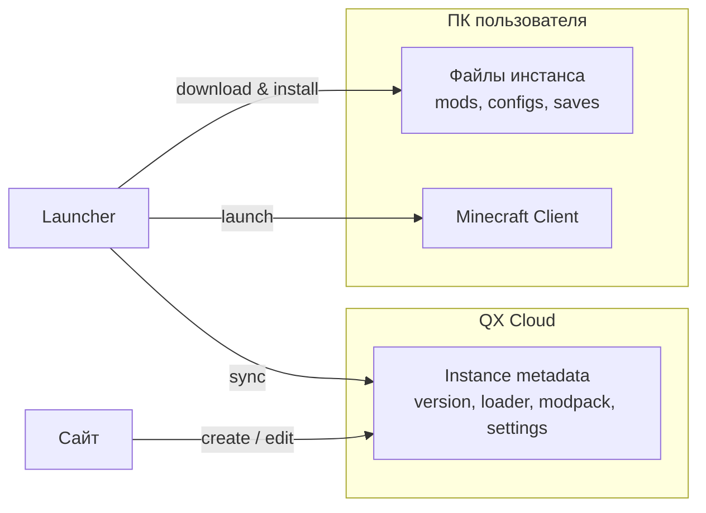

- **QXWeb** — CRUD инстансов, выбор версии/modpack, настройки.
- **QXApi** — хранит **манифест** (метаданные, URLs, hashes), не файлы модов.
- **QXLauncher** — скачивает mods/modpacks/shaders/RP **на диск ПК** (CF/MR/Mojang), verify hash, launch JVM.

> Файлы инстанса **не** проходят через MinIO — [ADR-0011](./adr/0011-client-local-content-install.md).

---

## 2. Высокоуровневая схема

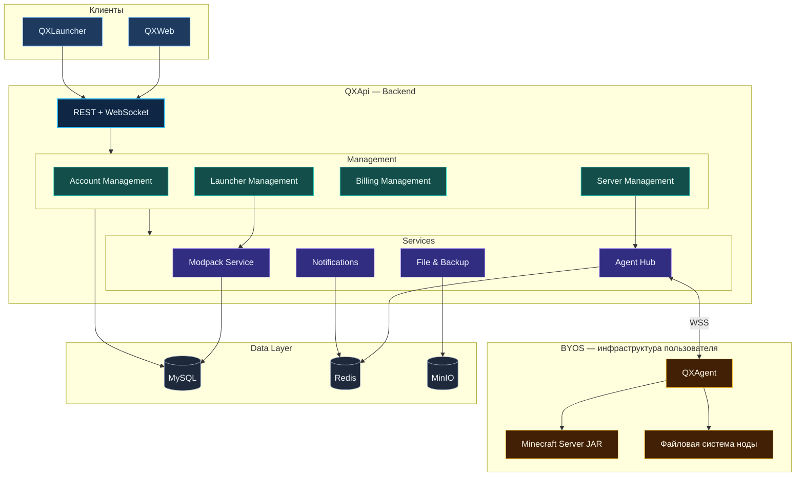

> Связи Management ↔ Management (Billing/Launcher → Account) и Server → Modpack — в §3.2; на схеме только
> вертикальный поток и ключевые вызовы.

---

## 3. Компоненты системы

| Имя | Репозиторий | Описание |
| ----- | ------------- | ---------- |
| **QXWeb** | `web/qxweb/` | Личный кабинет, панель серверов, UI `/launcher` |
| **QXApi** | `services/qxapi/` | Backend REST + WebSocket |
| **QXLauncher** | `services/qxlauncher/` | Desktop tray (Go), без встроенного UI |
| **QXAgent** | `services/qxagent/` | Linux daemon на BYOS-сервере пользователя |

### 3.1 QXWeb — личный кабинет и панель управления

**Стек:** TypeScript + React + Vite + Ant Design (SPA). Static build → Nginx.

**Ответственность:**

- **Account Management:** регистрация, вход, профиль, guest-сессии, игровые аккаунты (QX / Local / Microsoft), skins.
- CRUD **серверов** (Server Management): SSH deploy QXAgent, multi-admin, консоль.
- CRUD **инстансов** (Launcher Management): modpack picker, **modpack ↔ server sync**.
- UI **`/launcher`** (Launcher Management UI в QXWeb): инстансы, выбор аккаунта, «Играть»; см. §3.4.
- Live-консоль, RCON, файловый менеджер через QXAgent.
- Каталог modpacks; **Billing Management** (Premium) — **отложено**, см. §3.5.

---

### 3.2 QXApi

**Стек:** Go + Gin + GORM + MySQL + Redis.

**Слои QXApi** (сверху вниз): **REST + WebSocket** → **Management** (Account, Server, Billing, Launcher) →
**Services** (Modpack, Agent Hub, Files, Notify) → **Data Layer** (MySQL, Redis, MinIO).

**Phase 0 (реализовано):**

```text
services/qxapi/          # QXApi (отдельный go.mod)
  cmd/main.go, run.go
  internal/
    api/         # Gin router, handlers, middleware, JSON responses
    auth/        # JWT, bcrypt, Register/Login Service
    config/      # env: API_ADDR, DATABASE_DSN, JWT_*, CORS
    database/    # GORM Open, migrate users, Ping
    models/      # User
    testutil/    # SQLite helpers для тестов
pkg/protocol/            # doc.go — типы WSS (Phase 2)
```

**Целевая структура (Phase 1+):**

```text
services/qxapi/internal/
  auth/  users/  profiles/  skinserver/   # Account Management
  servers/  agents/  deploy/             # Server Management
  billing/                               # post-MVP
  launcher/  instances/  devices/        # Launcher Management
  modpacks/  integrations/  files/
```

| Домен | Модули | Ответственность |
| ------- | -------- | ----------------- |
| **Account Management** | `auth/`, `users/`, `profiles/`, `skinserver/` | QX-аккаунты, guest, JWT, QXAccount / Local / Microsoft, skins & capes |
| **Server Management** | `servers/`, `agents/`, `deploy/` | BYOS-серверы, SSH deploy, QXAgent, консоль, файлы на ноде |
| **Billing Management** | `billing/` | Premium tier, лимиты, подписки, платёжные webhooks (post-MVP) |
| **Launcher Management** | `launcher/`, `instances/`, `devices/` | Device link, инстансы, launch-requests, manifests, auto-update |
| **Shared (Services)** | `modpacks/`, `files/`, `integrations/`, Agent Hub, Notify | Catalog + manifest (MySQL); MinIO — только platform blobs |

Связи между доменами: **Billing / Launcher → Account**; **Server / Launcher → Modpack Service**;
**Server → Agent Hub**.

| Канал | Протокол | Base / prefix | Документ |
| ------- | ---------- | --------------- | ---------- |
| QXWeb ↔ QXApi | HTTPS REST + WS | `/api/v1` | [api.md](./api.md) |
| QXLauncher UI (`/launcher`) ↔ QXApi | HTTPS REST | `/api/v1` | [api.md](./api.md) |
| QXLauncher tray ↔ QXApi | HTTPS REST | `/api/v1` | auth, sync, auto-update |
| QXAgent ↔ QXApi | WSS + JWT | `/agent/v1/connect` | [agent-protocol.md](./agent-protocol.md) |

---

### 3.3 QXAgent

**Стек:** Go · **Платформа: Linux only** · systemd service.

**Установка:** QXApi подключается к VPS по **SSH** (ключ пользователя, хранится encrypted) и разворачивает QXAgent
binary + systemd unit. См. [agent-protocol.md §2](./agent-protocol.md).

| Категория | Функции |
| ----------- | --------- |
| **Deploy** | Установка через SSH job с backend (не ручной pairing token) |
| **Связь** | WSS к Agent Hub, heartbeat, reconnect + idempotency |
| **Lifecycle** | start/stop/restart/kill — **все типы JAR** (см. §3.7) |
| **Modpack** | `modpack.install` — manifest на диск сервера (см. [server-content-install.md](./server-content-install.md)) |
| **Mods / Plugins** | `mods.install` / `plugins.install` — по `server_type` |
| **Консоль / RCON / Файлы / Метрики** | Полный набор (A2) |

**Безопасность:**

- mTLS или подписанные JWT на каждое соединение.
- QXAgent привязан к одному серверу/владельцу.
- Sandbox: whitelist путей (server root), лимиты размера файлов.

**Предлагаемый стек:** ~~Go или Rust~~ **Go** — `services/qxagent/`.

```text
services/qxagent/          # QXAgent (отдельный go.mod)
  cmd/
  internal/
    connector/      process/        console/
    filesystem/     modpack/        metrics/
```

---

### 3.4 QXLauncher — tray + UI на QXWeb

**WebView не используется.** UI — React SPA в QXWeb (`/launcher/*`). QXLauncher — **system tray daemon** (Go).

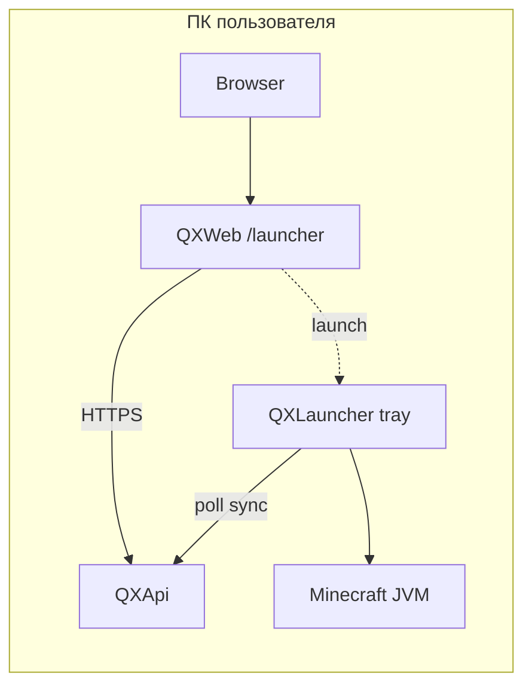

| Часть | Где | Роль |
| ----------- | ----- | ------ |
| **UI `/launcher`** | QXWeb (React + Ant Design) | Инстансы, аккаунты, публичные серверы, modpacks, «Играть» |
| **Tray daemon** | QXLauncher (Win / macOS / Linux) | Device link, sync, Mojang Java, JVM, auto-update, notifications |
| **Связь** | [device-linking.md](./device-linking.md) | Обязательна до первого инстанса |

**QXLauncher:** ПКМ → «Связать QXLauncher» · «Открыть сайт» → `/launcher` в браузере.

```text
services/qxlauncher/     # QXLauncher tray (отдельный go.mod)
web/qxweb/               # QXWeb (+ /launcher routes)
```

**Поддерживаемые modloader'ы (целевой продукт):**

| Loader | Версии MC (ориентир) | Meta / installer | Modpack-источник |
| -------- | ---------------------- | ------------------ | ------------------ |
| **Vanilla** | Все официальные | Mojang manifest | — |
| **Forge** | Legacy (≤1.20.1 и отдельные ветки) | Forge installers, `version.json` | CurseForge |
| **NeoForge** | 1.20.1+ (форк Forge) | NeoForge installer API | CurseForge |
| **Fabric** | Широкий диапазон | Fabric loader + intermediary | Modrinth, CurseForge |
| **Quilt** | Fabric-совместимые | Quilt loader | Modrinth |

> **Forge ≠ NeoForge** — разные installer pipeline и classpath; в QX каждый loader — отдельный adapter в
> `packages/mc-manifest` / launcher.

**Поток запуска игры:**

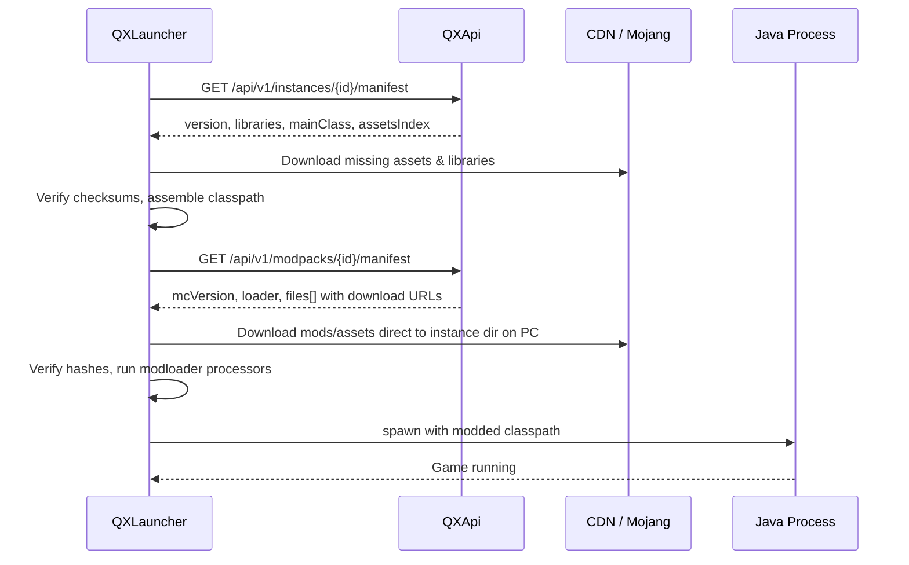

---

### 3.5 Billing Management — отложено

Premium и платёжка **не в текущей фазе**. Домен **`billing/`**: tier (`free` / `premium`), лимиты серверов,
webhooks провайдера оплаты. Поле `users.tier` — на будущее; gating через Billing Management → Account Management.

---

### 3.6 Skin / Cape Server

**Только зарегистрированные QX-аккаунты.** Guest Local — без upload/sync skins.

- `GET /skins/{uuid}.png`, `POST /users/me/skin`
- Launcher auth-server URL для licensed/offline QX profiles

---

### 3.7 Server JAR types & content

Тип сервера задаёт, **что можно ставить на BYOS-ноду** через QXAgent:

| Категория | `server_type` | Контент на диске |
| ----------- | --------------- | ------------------ |
| Vanilla | `vanilla` | только jar + configs |
| Plugins | `paper`, `spigot`, `purpur` | **`plugins/`** только |
| Mods | `forge`, `neoforge`, `fabric`, `quilt` | **`mods/`** только |
| Hybrid | `hybrid` + `hybrid_platform` (Mohist, Magma, Arclight) | **`mods/` + `plugins/`** |

Примеры: **Paper** — только плагины; **NeoForge** — только моды; **Mohist** — и моды, и плагины.

Полная матрица и команды агента: **[server-content-install.md](./server-content-install.md)**.

Config: `server_type`, `hybrid_platform?`, `jar_path`, `jvm_args`.

---

### 3.8 Modpack sync

Shared `modpack_id` на `launcher_instances` и `servers` → QXLauncher (ПК) + QXAgent (сервер).
QXApi проверяет совместимость loader modpack с `server_type` до install.

---

### 3.9 Multi-admin & SSH Deploy

`server_members` (owner/admin/viewer). Deploy: backend SSH job → Linux systemd agent.
DDL: [schema.sql](./schema.sql) · Protocol: [agent-protocol.md](./agent-protocol.md)

---

## 4. Модель данных (основные сущности)

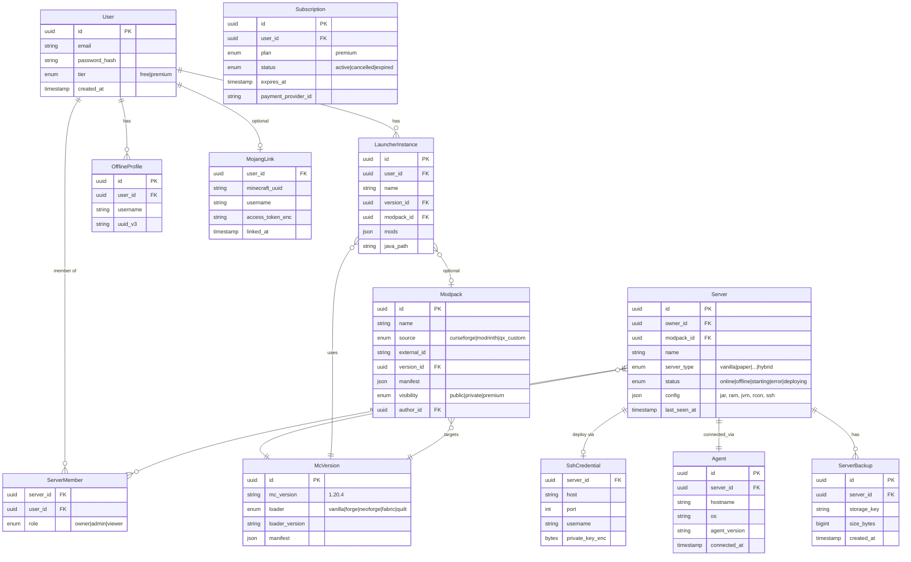

**Хранилища:**

| Данные | Хранилище |
| -------- | ----------- |
| Пользователи, серверы, метаданные, manifests | MySQL |
| Сессии, pub/sub Agent Hub, кэш metadata | Redis |
| **Платформенные файлы** (launcher builds, server backups, skins) | **MinIO** |
| Mods / modpacks / shaders / RP инстанса | **Диск ПК** (QXLauncher) |
| Mods / plugins / modpack на BYOS-сервере | **Диск ноды** (QXAgent), см. [server-content-install.md](./server-content-install.md) |
| Логи (опционально) | Loki / Elasticsearch — TBD |

---

## 5. Протокол Agent ↔ Platform

Детальная спецификация: **[agent-protocol.md](./agent-protocol.md)** (SSH deploy, WSS connect, reconnect, idempotency,
modpack / mods / plugins install).

Краткая сводка типов сообщений:

```typescript
// Platform → Agent
type Command =
  | { type: "server.start"; payload: { jvmArgs: string[]; jarPath: string } }
  | { type: "server.stop"; payload: { graceful: boolean } }
  | { type: "server.restart"; payload: {} }
  | { type: "console.input"; payload: { line: string } }
  | { type: "rcon.command"; payload: { command: string } }
  | { type: "files.list"; payload: { path: string } }
  | { type: "files.read"; payload: { path: string } }
  | { type: "files.write"; payload: { path: string; content: string } }
  | { type: "files.upload"; payload: { path: string; url: string } }
  | { type: "files.delete"; payload: { path: string } }
  | { type: "modpack.install"; payload: { manifestUrl: string; manifestSha256: string } }
  | { type: "mods.install"; payload: { items: FileItem[] } }
  | { type: "plugins.install"; payload: { items: FileItem[] } };

// Agent → Platform
type Event =
  | { type: "agent.heartbeat"; payload: { cpu: number; ram: number; uptime: number } }
  | { type: "server.status"; payload: { status: string; pid?: number } }
  | { type: "console.output"; payload: { stream: "stdout"|"stderr"|"rcon"; line: string } }
  | { type: "metrics"; payload: { tps?: number; playersOnline: number; playerList?: string[] } }
  | { type: "files.result"; payload: { requestId: string; data: unknown } }
  | { type: "evt.content.installed"; payload: { kind: "modpack"|"mods"|"plugins"; count: number } };
```

---

## 6. Внешние интеграции

Legacy-систем **нет** — проект пишется с нуля. Вся интеграция с внешним миром идёт через три провайдера.

### 6.1 Обзор

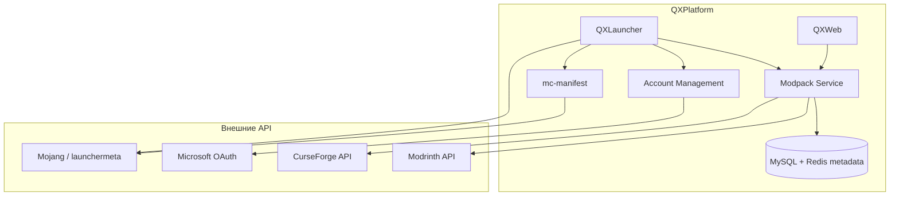

| Интеграция | Назначение | Где используется |
| ------------ | ------------ | ------------------ |
| **Microsoft/Mojang** | OAuth, лицензионный вход, version manifest, assets, libraries | Account Management, QXLauncher, `internal/mc/manifest` |
| **Modrinth** | Каталог modpacks (Fabric/Quilt) — **secondary** | Modpack Service |
| **CurseForge** | Каталог modpacks — **primary** ([ADR-0007](./adr/0007-curseforge-priority.md)) | Modpack Service, Web-каталог |

---

### 6.2 Microsoft / Mojang

**Два разных контура:**

| Контур | Endpoint / протокол | Назначение |
| -------- | --------------------- | ------------ |
| **Microsoft OAuth** | `login.live.com`, Xbox Live auth chain | Лицензионный вход игрока в лаунчере |
| **Mojang Meta** | `launchermeta.mojang.com`, `piston-meta.mojang.com` | `version.json`, libraries, assets index |
| **Mojang CDN** | `resources.download.minecraft.net`, `launcher.mojang.com` | Скачивание assets и client JAR |

**Auth flow (лаунчер, Microsoft-аккаунт):**

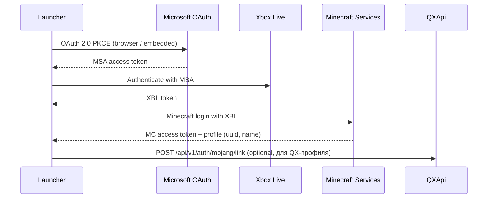

**Mojang manifest flow (Vanilla + база для modloaders):**

1. `GET https://launchermeta.mojang.com/mc/game/version_manifest_v2.json`
2. Resolve version → `version.json` (libraries, mainClass, assetIndex)
3. Download libraries/assets with SHA1 verification
4. Modloader (Forge / NeoForge / Fabric / Quilt) добавляет свои libraries поверх Mojang base

**Хранение:** refresh token Microsoft — encrypted в `MojangLink`; MC session token — только в памяти лаунчера (не на
сервере).

---

### 6.3 CurseForge

**API:** [CurseForge for Studios API](https://docs.curseforge.com/) (`api.curseforge.com`)

| Использование | Endpoint (пример) |
| --------------- | ------------------- |
| Поиск modpacks | `GET /v1/mods/search?gameId=432&classId=4471` |
| Файлы modpack | `GET /v1/mods/{modId}/files` |
| Download URL | `GET /v1/mods/{modId}/files/{fileId}/download-url` |

**Особенности:**

- **API Key** — есть у команды (env `CURSEFORGE_API_KEY`).
- Rate limits — кэш **metadata** в Redis/MySQL; файлы качает **QXLauncher** с CF/MR/Mojang.
- Сильная сторона: **Forge / NeoForge** modpacks, крупные сборки.

**Пакет:** `packages/integrations/curseforge`

---

### 6.4 Modrinth (secondary)

> **Приоритет:** CurseForge primary — см. [ADR-0007](./adr/0007-curseforge-priority.md). Modrinth — fallback и
> Fabric/Quilt-only packs.

**API:** [Modrinth API v2](https://docs.modrinth.com/api/) (`api.modrinth.com`)

| Использование | Endpoint (пример) |
| --------------- | ------------------- |
| Поиск modpacks | `GET /v2/search?facets=[["project_type:modpack"]]` |
| Версия / files | `GET /v2/project/{id}/version/{version_id}` |
| Download | URL из version payload |

**Особенности:**

- **Open API**, ключ не обязателен для read (рекомендуется User-Agent).
- Формат **`.mrpack`** — native modpack format; парсить в unified QX manifest.
- Сильная сторона: **Fabric / Quilt** modpacks и mods.

**Пакет:** `packages/integrations/modrinth`

---

### 6.5 Unified Modpack Layer (абстракция QX)

CurseForge и Modrinth имеют разные форматы. QX вводит **единый внутренний манифест**:

```typescript
interface QxModpackManifest {
  id: string;
  name: string;
  source: "curseforge" | "modrinth" | "qx_custom";
  externalId: string;          // CF modId или Modrinth project id
  mcVersion: string;
  loader: "vanilla" | "forge" | "neoforge" | "fabric" | "quilt";
  loaderVersion?: string;
  files: Array<{
    url: string;
    path: string;
    sha1?: string;
    sha512?: string;           // Modrinth
  }>;
  overrides?: Record<string, string>;
}
```

**Pipeline:**

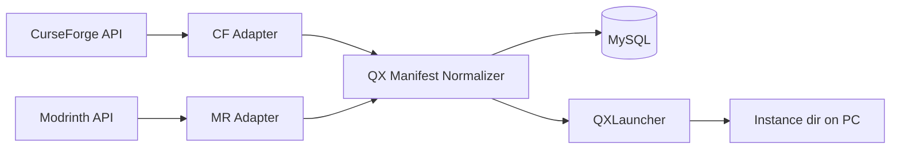

| Шаг | Действие |
| ----- | ---------- |
| 1 | Поиск modpack: CF API first → MR if not found |
| 2 | QXApi fetch metadata, normalize → `QxModpackManifest`, save to **MySQL** |
| 3 | QXLauncher: `GET /api/v1/modpacks/{id}/manifest` |
| 4 | Скачивание по authorized URLs **на диск ПК**, verify hash |
| 5 | Локальный cache на ПК при повторных install |

**Кэш-политика:**

| Данные | TTL | Хранилище |
| -------- | ----- | ----------- |
| Search results | 1–6 h | Redis |
| Modpack metadata | 24 h | MySQL |
| Mod/modpack/shader/RP **files** | На ПК пользователя | QXLauncher local cache |

---

### 6.6 Структура пакетов интеграций

```text
packages/
├── mc-manifest/              # Mojang version.json, library resolver
├── integrations/
│   ├── curseforge/
│   │   ├── client.ts         # API client
│   │   ├── adapter.ts        # CF → QxModpackManifest
│   │   └── types.ts
│   ├── modrinth/
│   │   ├── client.ts
│   │   ├── mrpack.ts         # .mrpack parser
│   │   ├── adapter.ts        # MR → QxModpackManifest
│   │   └── types.ts
│   └── mojang/
│       ├── manifest.ts       # version_manifest_v2
│       ├── assets.ts
│       └── microsoft-auth.ts # OAuth helpers (shared Web + Launcher)
└── modpacks/                 # Catalog, manifest normalizer (metadata only)
```

---

### 6.7 Roadmap интеграций

| Фаза | Microsoft/Mojang | CurseForge | Modrinth |
| ------ | ------------------ | ------------ | ---------- |
| Phase 2 (Launcher MVP) | Mojang manifest + assets (Vanilla) | — | — |
| Phase 3 (Modpacks) | + modloader libraries | Каталог + install | Каталог + install |
| Phase 4 (Premium) | Microsoft OAuth login | — | То же |

---

## 7. Безопасность и compliance

Полная спецификация: **[security-legal.md](./security-legal.md)**

| Область | Документ |
| --------- | ---------- |
| Rate limiting | security-legal §1 |
| Audit log | security-legal §2 |
| SSH encryption & rotation | security-legal §3, [ssh-deploy.md](./ssh-deploy.md) |
| Mojang EULA / offline | security-legal §4 |
| CurseForge / client install | security-legal §5, [modpacks-pipeline.md](./modpacks-pipeline.md), [ADR-0011](./adr/0011-client-local-content-install.md) |
| 2FA (post-MVP) | security-legal §6 |
| TLS без Cloudflare | security-legal §7, [observability-ops.md](./observability-ops.md) |
| Guest vs Registered RBAC | security-legal §8 |

### Кратко

| Область | Подход |
| --------- | -------- |
| Auth | JWT + device_token; bcrypt passwords |
| Agent | JWT per server, Linux only |
| SSH keys | AES-256-GCM + master key rotation |
| API | Redis rate limits, audit append-only |

---

## 8. Нагрузка и масштабирование

Точные KPI пока не зафиксированы — это нормально для pre-launch. Ниже — **рабочие допущения** и инфраструктурные tier'ы,
чтобы не переписывать архитектуру при росте от «десятков» до «сотен тысяч».

### 8.1 Ориентиры по фазам

| Фаза | Горизонт | Пользователи (ориентир) | Активность | Примечание |
| ------ | ---------- | ------------------------- | ------------ | ------------ |
| **Alpha / MVP** | 0–6 мес | **Десятки → сотни** MAU | 10–50 DAU | Закрытая beta, друзья, первые админы серверов |
| **Launch** | 6–12 мес | **Сотни → тысячи** MAU | 100–500 DAU | Публичный релиз, guest-flow, первые Premium |
| **Growth** | 1–2 года | **Тысячи → десятки тысяч** MAU | 1k–10k DAU | Успешный сценарий для нишевого лаунчера + панель |
| **Scale** | 2+ года | **Сотни тысяч+** MAU | 50k+ DAU | Уровень TLauncher/KLauncher — отдельный этап инвестиций в CDN и SRE |

> Референсы (TLauncher и др.) — **миллионы** установок, но QX на старте realistic target — **сотни–тысячи**.
> Архитектура должна **не мешать** дойти до scale-tier, но **не требовать** Kubernetes в первый день.

### 8.2 Что нагружает систему

| Источник нагрузки | Характер | Пик |
| ------------------- | ---------- | ----- |
| **Launcher sync** | REST: список инстансов, манифесты | При каждом запуске лаунчера |
| **Modpack / game assets download** | Трафик **ПК ↔ CF/MR/Mojang** (не через QX VPS) | Первый install modpack |
| **Launcher auto-update** | Исходящий с MinIO/Nginx | Релизы QXLauncher |
| **Agent Hub (WSS)** | Долгоживущие соединения | 1 conn на сервер; консоль = steady stream |
| **Web-панель** | REST + WS консоль | Админы (меньше DAU, но тяжёлые WS) |
| **Auth** | Login, refresh, guest tokens | Волны при релизах / маркетинге |
| **MySQL** | CRUD users, instances, servers | Линейно с MAU |

**Вывод:** bottleneck VPS — **Agent Hub** (WSS) и **platform** downloads (launcher builds, backups), не modpack-трафик
(он идёт напрямую на ПК пользователя).

### 8.3 Инфраструктурные tier'ы (Self-Hosted)

> Все tier'ы — **свои серверы** (VPS или dedicated). Managed DB/S3 не используем.
> **Pure self-hosted** — без Cloudflare ([ADR-0009](./adr/0009-pure-self-hosted.md)); TLS через Nginx + Let's Encrypt.

#### Tier 0 — MVP (десятки–сотни пользователей)

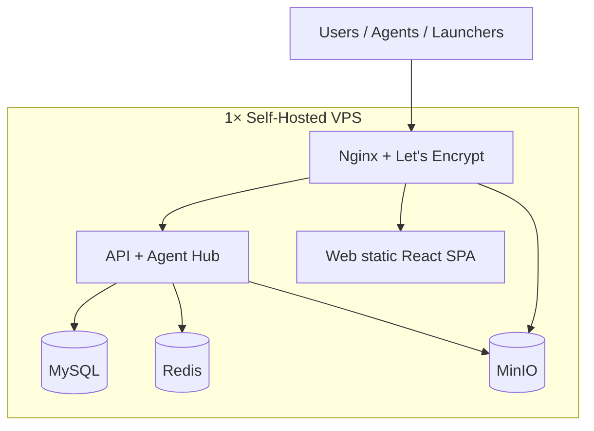

| Комponent | Self-Hosted стек |
| ----------- | ------------------ |
| **VPS** | 1× 4–8 GB RAM, 2 vCPU, 80+ GB SSD (Hetzner, Timeweb, Selectel, домашний dedicated) |
| **Orchestration** | **Docker Compose** — один `docker-compose.prod.yml` |
| **Reverse proxy** | Nginx + Certbot (Let's Encrypt) |
| **MySQL** | Official Docker image, volume на SSD, **mysqldump cron** → локальный бэкап |
| **Redis** | Official Docker image, AOF persistence |
| **Object storage** | **MinIO** — launcher builds, server backups, skins (не client mods/modpacks) |
| **Web** | React SPA static + Nginx |
| **Мониторинг** | Uptime Kuma + (опц.) Netdata на том же VPS |
| **Стоимость** | **$5–30/мес** (VPS) + electricity если домашний сервер |

#### Tier 1 — Launch (сотни–тысячи MAU)

| Компонент | Self-Hosted изменение |
| ----------- | ------------------------- |
| **Topology** | 2× VPS: **app** (API, Nginx, Redis) + **data** (MySQL, MinIO) |
| **Load balancing** | Nginx upstream на 2 app-ноды **или** второй app-VPS |
| **MySQL** | Отдельный VPS; pool на app-ноде (GORM / ProxySQL); daily mysqldump + offsite copy |
| **MinIO** | Dedicated disk / второй VPS; Nginx для launcher releases |
| **Backups** | Restic → второй VPS / NAS / внешний HDD |
| **Стоимость** | **$30–80/мес** (2–3 VPS) |

#### Tier 2 — Growth (тысячи–десятки тысяч MAU)

| Компонент | Self-Hosted изменение |
| ----------- | ------------------------- |
| **App tier** | 2–3 VPS с API; Redis pub/sub для Agent Hub |
| **MySQL** | Primary + **replica** на втором VPS (read-only) |
| **MinIO** | Distributed mode (4 drives) **или** отдельный storage VPS с большим диском |
| **Modpack mirror** | Не нужен — файлы на ПК клиента ([ADR-0011](./adr/0011-client-local-content-install.md)) |
| **Observability** | Prometheus + Grafana (self-hosted stack) |
| **Стоимость** | **$80–200/мес** (4–6 VPS / dedicated) |

#### Tier 3 — Scale (100k+ MAU)

| Компонент | Self-Hosted изменение |
| ----------- | ------------------------- |
| **Geo** | 2 self-hosted PoP (RU + EU VPS), DNS geo-routing |
| **Storage** | MinIO cluster или dedicated storage server (NVMe) |
| **Agent Hub** | Sharding по `server_id`, отдельные WSS-ноды |
| **CDN** | Self-hosted Nginx cache / второй MinIO node для downloads |
| **Ops** | Ansible/Terraform для provisioning VPS, runbooks |

### 8.4 Self-Hosted: что не используем

| Managed-сервис | Self-Hosted замена |
| ---------------- | ------------------- |
| AWS S3 / Yandex Object Storage | **MinIO** |
| Managed cloud DB | **MySQL** в Docker (self-hosted) |
| ElastiCache | **Redis** в Docker |
| Kubernetes (EKS/GKE) | **Docker Compose** → позже **k3s** на своих VPS |
| Vercel / Netlify | Nginx + React static |
| Managed LB | Nginx upstream / HAProxy |

### 8.5 Проектные решения под масштаб

| Решение | Зачем |
| --------- | ------- |
| **Stateless API** | Горизонтальное масштабирование с первого дня |
| **Presigned URLs** | MinIO — backups, skins; **не** для modpack redistribution |
| **Launcher: local cache + delta updates** | Снижает повторные загрузки (как TLauncher/KLauncher) |
| **Agent: reconnect + backoff** | Устойчивость при кратковременных падениях API |
| **Guest device token** | Не создавать User row в MySQL до регистрации — экономия на «скачал и ушёл» |
| **Connection pooling** | Pool обязателен с Tier 1 (GORM / ProxySQL) |

### 8.6 Метрики для принятия решений о scale-up

Когда переходить на следующий tier:

| Метрика | Порог «пора масштабироваться» |
| --------- | ------------------------------- |
| API p95 latency | > 500 ms стабильно |
| CPU VPS / pod | > 70% sustained |
| MySQL connections | > 80% pool |
| Concurrent Agent WSS | > 500 на одном инстансе |
| CDN egress | > лимита тарифа или > $X/мес |
| Modpack download errors | > 1% |

---

| Disk I/O (MinIO/MySQL) | > 80% sustained |
| Modpack download errors | > 1% |

---

## 9. Self-Hosted деплой

### 9.1 Production stack (Docker Compose)

```text
infra/
├── docker/
│   ├── docker-compose.yml          # Dev
│   ├── docker-compose.prod.yml     # Production
│   ├── .env.example
│   └── nginx/
│       ├── nginx.conf
│       └── conf.d/qx.conf          # api.*, panel.*, cdn.*
├── scripts/
│   ├── backup.sh                   # mysqldump + restic
│   ├── restore.sh
│   └── deploy.sh                   # pull + compose up
└── ansible/                        # Tier 1+: provisioning VPS (TBD)
```

**Сервисы в `docker-compose.prod.yml`:**

| Service | Image | Ports (internal) | Volume |
| --------- | ------- | ------------------ | -------- |
| `nginx` | nginx:alpine | 80, 443 | `./nginx`, certs |
| `api` | qx-api:latest | 3000 | — |
| `web` | qx-web:latest | 3001 | — |
| `mysql` | mysql:8 | 3306 | `mysql_data` |
| `redis` | redis:7-alpine | 6379 | `redis_data` |
| `minio` | minio/minio | 9000, 9001 | `minio_data` |
| `uptime-kuma` | louislam/uptime-kuma | 3002 | `kuma_data` |

### 9.2 Домены и маршрутизация (Nginx)

| Subdomain | Backend | Назначение |
| ----------- | --------- | ------------ |
| `qx.example.com` | `web:3001` | Лендинг, ЛК, панель |
| `api.qx.example.com` | `api:3000` | REST API |
| `ws.qx.example.com` | `api:3000` | WebSocket (Agent Hub, консоль) |
| `cdn.qx.example.com` | `minio:9000` | Launcher builds, skins, backups (не modpacks) |

### 9.3 TLS и безопасность

- **Let's Encrypt** через Certbot (auto-renew cron).
- Firewall: только 80/443 наружу; SSH по ключу, non-default port.
- MinIO: bucket policy public-read только для `cdn/` prefix.
- MySQL / Redis: **не** expose наружу, только docker network.
- Secrets: `.env` на сервере, не в git; `docker secret` при переходе на swarm/k3s.

### 9.4 Бэкапы (обязательно для Self-Hosted)

| Что | Как часто | Куда |
| ----- | ----------- | ------ |
| MySQL | Daily | Restic → второй VPS / NAS |
| MinIO buckets | Daily incremental | Restic |
| `.env`, nginx configs | On change | Git (private) + encrypted backup |
| Launcher builds | On release | MinIO versioning |

### 9.5 Dev vs Prod

| Env | Dev | Prod (Self-Hosted) |
| --- | ----- | --------------------- |
| Запуск | `docker compose up` локально | `deploy.sh` на VPS |
| TLS | mkcert / HTTP | Let's Encrypt |
| Домен | localhost | Реальный домен |
| MinIO | Local | Production VPS SSD |

### 9.6 Схема prod (Tier 0)

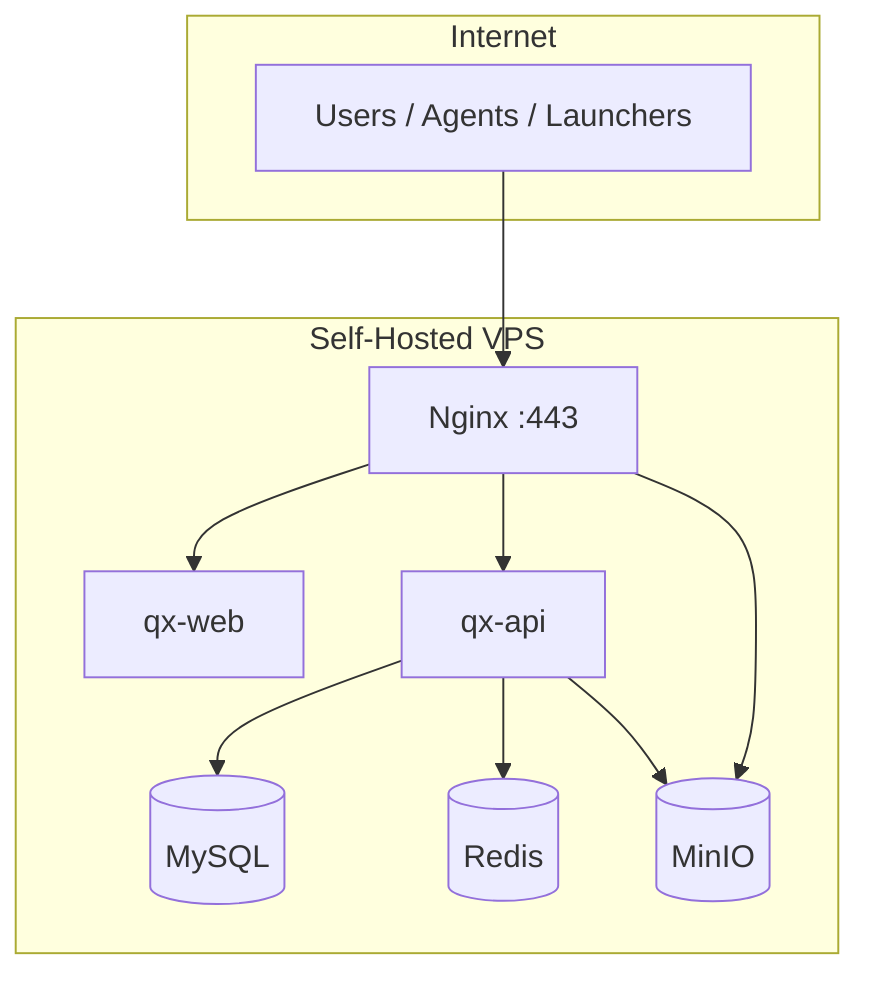

**MVP:** один VPS + Docker Compose — см. §8.3 Tier 0, §9.6.
**Масштабирование:** добавление VPS, без перехода на public cloud — см. Tier 1–3.

### 9.7 Ops-нагрузка на команду (Self-Hosted)

| Задача | Кто | Частота |
| -------- | ----- | --------- |
| `deploy.sh`, обновления | Senior | По релизам |
| Проверка бэкапов | Senior | Weekly |
| Certbot renew | Cron (auto) | — |
| Disk space alert | Uptime Kuma | Daily check |
| OS security updates | Senior | Monthly |

> Self-Hosted экономит **$**, но ops ложится на **Senior**. Для команды из 2 человек — Tier 0–1 оптимален долгое время.

---

## 10. Структура репозитория (monorepo)

```text
QXProject/
├── services/
│   ├── qxapi/               # QXApi (go.mod, cmd/, internal/)
│   ├── qxagent/             # QXAgent — WSS daemon, start/stop JAR
│   └── qxlauncher/          # QXLauncher — tray, launch-bridge, Vanilla
├── web/
│   ├── qxweb/               # QXWeb — React SPA (+ Vitest, Playwright)
│   └── README.md
├── pkg/
│   ├── mcmanifest/          # Mojang manifest helpers
│   └── protocol/            # Agent ↔ API WSS types
├── scripts/                 # e2e-manual, dev-vps, gen-dev-vps-key
├── docs/                    # архитектура, API, ADR, schema.sql
├── infra/docker/            # compose dev + prod + vps-dev (Flow C)
├── .github/workflows/ci.yml # Go test + web test:coverage + Playwright
├── go.work                  # Go workspace
├── Makefile                 # dev-up, dev-vps-up, api, test, e2e-alpha
├── .env.example
└── README.md
```

### 10.1 Тестирование

| Область | Инструмент | Покрытие | Команда |
| --------- | ------------ | ---------- | --------- |
| QXApi | `go test` | 100% statements | `cd services/qxapi && go test ./...` |
| QXAgent / QXLauncher | `go test` | cmd + internal | `cd services/qxagent && go test ./...` |
| QXWeb | Vitest + Testing Library | 100% (stmts/branches) | `cd web/qxweb && npm run test:coverage` |
| E2E automated | Playwright + router tests | Flow A/B/C | `make e2e-alpha` |
| E2E manual | [qa/test-matrix.md](./qa/test-matrix.md) | ☑ dev (A09, L03, I04, I05, Flow C) | `make e2e-manual` |

`make test` — unit-тесты; `make test-coverage` — с отчётом; `make e2e-alpha` — автоматизированный alpha smoke.

---

## 11. Команда, роли и сроки

### 11.1 Состав

| Роль | FTE* | Фокус |
| ------ | ------ | ------- |
| **Senior (опытный)** | ~1.0 | Архитектура, API, Agent, Launcher core, инфра, code review |
| **Junior (новичок)** | ~0.2 → 0.5** | Web UI, документация, тестирование, контент; со временем — изолированные фичи |

\* *Effective Full-Time Equivalent — реальная продуктивная нагрузка.*
\** *0.2 на старте (обучение), ~0.5 через 3–6 мес при ментorship.*

**Эффективная команда на старте: ~1.2 разработчика.** Полный scope QX (лаунчер + панель + агент + billing + 5 loader'ов)
— проект на **12–24 месяца** для такой команды. Критично: **резать scope MVP**, а не сроки качества.

### 11.2 Распределение зон ответственности

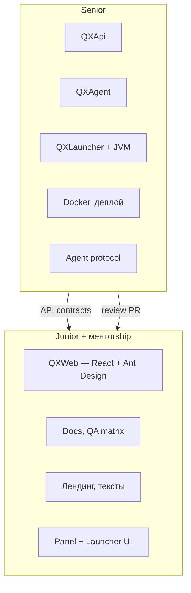

| Комponent | Кто | Почему |
| ----------- | ----- | -------- |
| QXApi, Auth, Agent Hub | **Senior** | Сложная логика, безопасность, WSS |
| QXAgent | **Senior** | Systems programming, process management |
| QXLauncher (modloaders, JVM) | **Senior** | Самая сложная часть; свой codebase ([ADR-0010](./adr/0010-own-launcher-not-gml.md)) |
| QXWeb — страницы ЛК, формы | **Junior** + review | React + Ant Design |
| QXWeb — live-консоль, file manager | **Senior** | WebSocket, edge cases |
| Docker Compose, CI | **Senior** | Junior подключается позже |
| Тест-кейсы, баг-репорты | **Junior** | Не требует deep backend |

### 11.3 Онboarding новичка (первые 4–8 недель)

| Неделя | Задача | Результат |
| -------- | -------- | ----------- |
| 1–2 | Git, TypeScript, React + Ant Design tutorial | Первый PR: тексты / стили |
| 3–4 | Ant Design: auth modal (login/register) | ✅ Phase 0 — real API |
| 5–6 | Профиль (email, смена email/пароля в модалках) | ✅ Phase 0 — `/profile` |
| 7–8 | CRUD инстанса (UI only) | Phase 1 — `/launcher` |

> Senior не должен тратить >30% времени на обучение — иначе MVP сдвигается на месяцы. Junior берёт **UI и docs**, не Agent/Launcher.

### 11.4 MVP scope reduction (обязательно для 2 человек)

Полный продукт сразу — нереалистичен. Детальный scope, чеклисты и Definition of Done — в **[mvp.md](./mvp.md)**.

Кратко:

| В MVP v1 | Отложить на v2+ |
| ---------- | ----------------- |
| Auth QX (email/password) | Microsoft OAuth |
| Guest flow + Local-аккаунт | QXAccount sync между устройствами |
| Vanilla only в лаунчере | Forge / NeoForge / Fabric / Quilt |
| Web: создание инстанса → sync → запуск | Modpacks |
| Agent: SSH deploy, Stop/Restart, консоль (при MC) | RCON, файловый менеджер, mods/plugins, Start UI |
| 1 сервер на пользователя (Free) | Premium, billing |
| Windows launcher only | macOS / Linux |
| Tier 0 infra (1 Self-Hosted VPS) | Multi-VPS, MinIO cluster |

### 11.5 Оценка сроков (реалистично)

| Фаза | Scope | Срок (Senior + Junior) | Milestone |
| ------ | ------- | ------------------------ | ----------- |
| **Phase 0** | API auth + profile, MySQL, Web auth modal + profile | **6–8 недель** | ✅ **Готово** (2026-06) — регистрация, вход, профиль |
| **Phase 1** | Launcher Win, device link, Vanilla, guest + auth | **10–14 недель** | ✅ **Готово** — скачал → связал → играет (manual I04, I05) |
| **Phase 2** | Agent SSH deploy + panel Stop/Restart/console (при MC running) | **8–12 недель** | ✅ deploy agent; Start UI — post-MVP |
| **Phase 3** | Auth bridge (registered user + device) | **2–4 недели** | ✅ JWT refresh, `/users/me/launcher-device` |
| **Alpha** | Flows A/B/C manual, docs | **4–6 недель** | ✅ dev/manual ☑ · prod 🔲 |
| **Phase 4+** | Modloaders, modpacks, billing, cross-platform | **+6–12 мес** | Public launch |

**До playable alpha: ~7–9 месяцев** при фокусе и урезанном MVP.
**До public launch с modpacks и Premium: ~12–18 месяцев.**

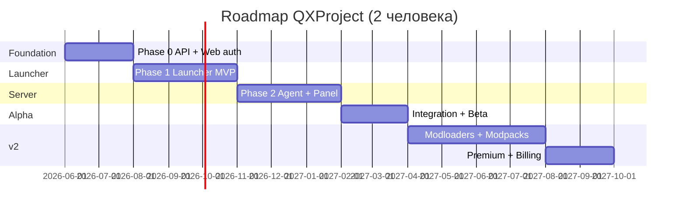

### 11.6 Риски для маленькой команды

| Риск | Митигация |
| ------ | ----------- |
| Senior — single point of failure | Документировать API; junior ведёт docs; Prism/GML — **только референс** логики |
| Scope creep (все loader'ы сразу) | Жёсткий MVP v1 (Vanilla only) |
| Junior blocked без помощи | Задачи только с mock API; daily 15-min sync |
| Burnout senior | Не параллелить Agent + Launcher — **сначала launcher ИЛИ agent** |
| Рекомендация порядка | **Launcher first** (видимый прогресс, user-facing) → Agent → связка |

---

## 12. Roadmap по фазам

### Phase 0 — Foundation *(6–8 нед, Senior + Junior UI)* ✅

- [x] API scaffold + MySQL + Redis/MinIO dev *(Senior)*
- [x] Auth: register, login, refresh, guest, logout; `/users/me`, change password/email *(Senior)*
- [x] Web UI: auth modal, profile (модалки), `/launcher`, **`/servers`** (SSH, deploy agent) *(Junior)*
- [x] Docker Compose dev env (`infra/docker/`) *(Senior)*
- [x] CI: `go test`, web `test:coverage`, build *(Senior)*
- [x] Unit tests 100% (qxapi, qxweb) *(Senior)*

### Phase 1 — Launcher MVP *(10–14 нед, mostly Senior)*

- [x] Windows QXLauncher tray loop, device link, Vanilla only
- [x] Guest flow + QX auth + Local-аккаунт
- [x] QXWeb `/launcher`: создание инстанса → launch-bridge → JVM
- [ ] Forge / NeoForge / Fabric / Quilt — отложено на **v2**

### Phase 2 — Agent + Panel *(8–12 нед, mostly Senior)* ✅

- [x] SSH deploy QXAgent, WSS connect, heartbeat, redeploy restart
- [x] Stop/Restart + live-консоль при `minecraft_running` (stdout/stderr)
- [x] QXWeb: сервер (SSH, `server_type`), deploy agent *(Junior UI)*
- [x] `agent_online` / `minecraft_running` — раздельные статусы
- [ ] Start + install JAR из UI *(post-MVP)*

### Phase 3 — Auth bridge *(2–4 нед)* ✅

- [x] QXLauncher JWT refresh (`EnsureFreshAccessToken`)
- [x] Instances scoped to linked `user_id`
- [x] Web: статус device на `/launcher` и в профиле

### Phase Alpha — Integration *(4–6 нед)*

- [x] Сценарии 1–3 end-to-end (dev manual ☑ — [test-matrix](./qa/test-matrix.md))
- [x] Test matrix, FAQ, README
- [ ] Prod VPS + TLS + smoke ([mvp §7.1](./mvp.md))

### Phase 4 — Modloaders & Modpacks *(+4–6 мес)*

- [ ] Forge + NeoForge + Fabric + Quilt
- [ ] Modpack catalog + client↔server sync
- [ ] Server mods/plugins по `server_type` ([server-content-install.md](./server-content-install.md))
- [ ] macOS / Linux launcher

### Phase 5 — Premium & Polish *(+2–4 мес)*

- [ ] Microsoft OAuth
- [ ] Billing / Premium
- [ ] Agent: RCON, files, backups, metrics
- [ ] Agent self-update, аналитика

> Детальные оценки и MVP scope reduction — §11.4–11.5.

---

## 13. Открытые вопросы (TBD)

| # | Вопрос | Статус |
| --- | -------- | -------- |
| I8 | VPS-провайдер / регион | **TBD** |

**Закрыто:** B3 launch bridge · I9 pure self-hosted · E6 linking · W1 no WebView · X3/X4 CF · L3 own launcher · B2
guest/auth tiers — см. [adr/](./adr/).

---

## 14. Референсы

### 14.1 Лаунчеры (основные — продуктовый UX)

| Продукт | Описание | Что взять для QX |
| --------- | ---------- | ------------------ |
| **[TLauncher](https://tlauncher.org/)** | Популярный лаунчер с offline-аккаунтами, modpacks, скинами; сильная аудитория в CIS | Guest/offline flow без регистрации; быстрый старт «скачал → играешь»; каталог версий и сборок; интеграция скинов/cape для offline |
| **[KLauncher](https://klauncher.gg/)** | Аналог TLauncher: modpacks, серверы, скины, offline-режим | UX выбора modpack и серверов; витрина публичных серверов; простой wizard первого запуска |
| **[GML](https://github.com/GamerVII/NM)** | Open-source фреймворк (Java) | **Только референс** UX/архитектуры — **не форкаем** ([ADR-0010](./adr/0010-own-launcher-not-gml.md)) |
| **[AuroraLauncher](https://aurora-launcher.ru/)** | Web sync, modpacks | Паттерн site ↔ tray sync; **свой Go launcher** |

**Позиционирование QX vs референсы:**

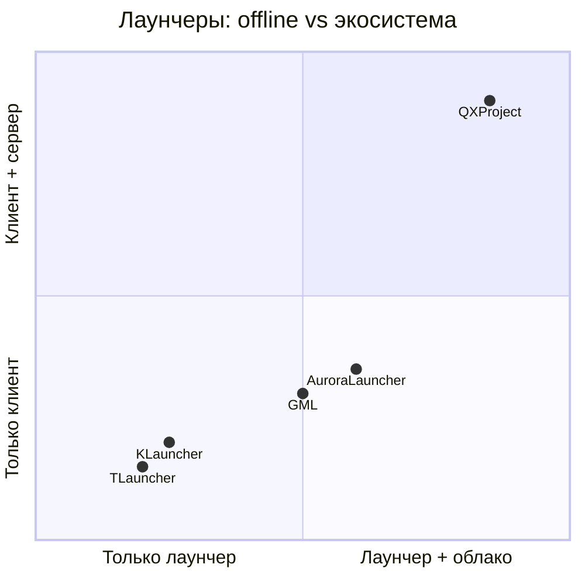

QXProject = **TLauncher/KLauncher UX** (offline, modpacks) + **Aurora sync** (инстансы с сайта, `/launcher` UI) +
**уникально:** панель управления сервером через QXAgent (BYOS). **Свой QXLauncher**, не GML.

**Ключевые паттерны из референсов:**

| Паттерн | Источник | Применение в QX |
| --------- | ---------- | ----------------- |
| Offline-first запуск | TLauncher, KLauncher | Сценарий 2 (guest flow) |
| Modpack wizard | KLauncher, Aurora | Web: выбор сборки → tray install |
| Instance manifest | Prism, Aurora | `internal/mc/manifest`, QXLauncher engine |
| Auth-server | Aurora | QXAccount validation, [skin-server.md](./skin-server.md) |
| Version/mod cache | Все | CDN + локальный cache dir |

---

### 14.2 Панель и инфраструктура (server-side)

| Продукт | Что взять |
| --------- | ----------- |
| **Pterodactyl** | Модель Wings-агента, API панели, файловый менеджер, live-консоль |
| **AMP (CubeCoders)** | UX управления инстансами, scheduling |
| **MultiMC / Prism Launcher** | Open-source: архитектура инстансов, Java detection, modloader isolation |
| **CurseForge App** | Modpack distribution, manifest format |
| **Mojang Launcher** | Official `version.json`, library resolution, asset index |

---

### 14.3 QXLauncher codebase

**Решение:** собственный Go launcher — **не форк GML** ([ADR-0010](./adr/0010-own-launcher-not-gml.md)).

| За | Против (осознанно принимаем) |
| ---- | ------------------------------ |
| Единый стек Go (API + Agent + Tray) | Modloader resolution с нуля — дольше MVP |
| Tray без UI + `/launcher` на сайте — чистое разделение | Нет готового Java/Kotlin core из GML |
| Полный контроль auth, sync, updates | Больше работы Senior на JVM/classpath |

**Референсы (не fork):** GML, Prism Launcher, Mojang official launcher — алгоритмы versions/libraries/assets.

---

Последнее обновление: 2026-06-10 (v1.9 — MVP alpha dev ✅, prod 🔲, roadmap Phase 0–3 + Alpha)
