# QXProject — Архитектура

> Документ описывает целевую архитектуру платформы.  
> Статус: **v1.3** — стек зафиксирован, см. [adr/](./adr/).  
> **Документация:** [mvp](./mvp.md) · [api](./api.md) · [agent-protocol](./agent-protocol.md) · [device-linking](./device-linking.md) · [launch-bridge](./launch-bridge.md) · [security-legal](./security-legal.md) · [schema.sql](./schema.sql)

### Специализированные docs

| Doc | Тема |
|-----|------|
| [mojang-java.md](./mojang-java.md) | Java runtime matrix |
| [ssh-deploy.md](./ssh-deploy.md) | SSH agent provisioning |
| [auto-update.md](./auto-update.md) | Tray updates |
| [skin-server.md](./skin-server.md) | Skins (registered) |
| [modpacks-pipeline.md](./modpacks-pipeline.md) | CF/MR, mods/shaders |
| [observability-ops.md](./observability-ops.md) | Self-hosted ops |

---

## 1. Принятые решения

| # | Область | Решение |
|---|---------|---------|
| **A1** | Модель хостинга | **BYOS** — серверы на VPS/домашних машинах пользователей; агент ставится на их инфраструктуру |
| **A2** | Возможности агента | **Полный набор:** heartbeat + метрики, запуск/остановка JAR, управление файлами/плагинами/модами, проксирование RCON/консоли в веб-панель |
| **B1** | Modloaders | **Vanilla + Forge + NeoForge + Fabric + Quilt** + modpacks |
| **B2** | Guest vs Auth | **Guest (linked):** Vanilla, Local, базовые инстансы. **Registered+auth:** моды, шейдеры, ресурспаки, modpacks, skins, серверы |
| **B3** | Launch bridge | **Гибрид** — [launch-bridge.md](./launch-bridge.md) |
| **B4** | Платформы tray | Windows, macOS, Linux |
| **C1** | Аккаунты | **Двойная система:** собственные аккаунты QX + интеграция **Microsoft/Mojang OAuth** |
| **C2** | Offline/cracked | **Поддерживается** — offline-mode на серверах и offline-профили в лаунчере |
| **D1** | Монетизация | **Premium** (freemium) — **платёжка отложена**, billing не в MVP |
| **D2** | Аудитория | **Игроки + админы серверов** (оба) |
| **E1** | Backend | **Go — Gin — GORM** |
| **E2** | Web (панель + сайт) | **TypeScript — React — Vite — Ant Design (SPA)** |
| **E3** | Launcher (native) | **Go** — tray daemon (JVM, sync, notifications); **без WebView** |
| **E4** | Launcher (UI) | **React — Vite — Ant Design** на **сайте** (`/launcher/*`); не в desktop app |
| **L1** | Device linking (E6) | **Обязательно** до инстансов: download → run → link via site + tray; см. [device-linking.md](./device-linking.md) |
| **L2** | WebView | **Не нужен** — UI лаунчера на сайте ([ADR-0006](./adr/0006-launcher-website-ui.md)) |
| **X3** | CurseForge API Key | **Есть** |
| **X4** | Приоритет modpacks | **CurseForge primary**, Modrinth secondary ([ADR-0007](./adr/0007-curseforge-priority.md)) |
| **E5** | Agent | **Go**, только **Linux** |
| **F1** | Java Runtime | Предпочтительно **Mojang Java** (bundled/download) |
| **F2** | Auto-update лаунчера | **Да** — канал обновлений через MinIO + manifest |
| **F3** | Server JAR | **Все типы:** Vanilla, Paper, Spigot, Purpur, Forge, NeoForge, Fabric, Quilt, **гибридные** |
| **F4** | Modpack sync | **Один modpack_id** на client instance и BYOS server (agent deploy) |
| **F5** | Skin / Cape | **Только зарегистрированные** QX-аккаунты (auth-server) |
| **F6** | Launcher UI | **`/launcher` на сайте** — внешний вид и управление; **пара** с Go tray на ПК (tray **без UI**) |
| **I8** | VPS / регион | **TBD** (пока не определено) |
| **I9** | CDN / proxy | **Pure self-hosted**, без Cloudflare — [ADR-0009](./adr/0009-pure-self-hosted.md) |
| **L3** | Launcher codebase | **Свой** Go launcher, **не форк GML** — [ADR-0010](./adr/0010-own-launcher-not-gml.md) |
| **F7** | Agent install | **SSH deploy с backend** → Linux server → systemd agent |
| **F8** | Multi-admin | **Несколько админов** на один сервер (roles) |
| **R1** | Референсы (лаунчер) | **TLauncher**, **KLauncher**, **GML**, **AuroraLauncher** |
| **R2** | Референсы (панель) | **Pterodactyl**, AMP — модель агента и server panel |
| **S5** | Ожидаемая нагрузка | **Поэтапный рост без жёстких KPI на старте** — архитектура закладывается «с запасом»; детальные цифры уточняются по мере запуска (=) |
| **T6** | Команда | **1 опытный разработчик** + **1 новичок** (без опыта разработки) |
| **I7** | Бюджет и инфраструктура | **Self-Hosted** — собственный VPS/дedicated; без managed cloud (AWS/GCP); все сервисы под полным контролем команды |
| **X1** | Legacy | **Нет** — greenfield-проект, с нуля |
| **X2** | Внешние интеграции | **CurseForge**, **Modrinth**, **Microsoft/Mojang** |

---

## 2. Видение продукта

**QXProject** — единая экосистема для Minecraft, объединяющая:

| Компонент | Назначение |
|-----------|------------|
| **Личный кабинет (Web)** | Регистрация, профиль, управление серверами и настройками |
| **Панель управления серверами** | Мониторинг, lifecycle (start/stop/restart), логи, конфиги |
| **Desktop-лаунчер** | Скачивание клиента, локальные инстансы разных версий, подключение к серверам |
| **Агент** | Связующее звено между облачной панелью и Minecraft-сервером на машине пользователя |

### Ключевые сценарии использования

Инстанс **создаётся на сайте** (метаданные, версия, modloader, модпак), но **физически разворачивается на ПК пользователя** через лаунчер. Лаунчер всегда подключается к сервису QX (даже без регистрации).

---

#### Сценарий 1 — Игра с регистрацией (полный flow)

**Актор:** зарегистрированный пользователь.

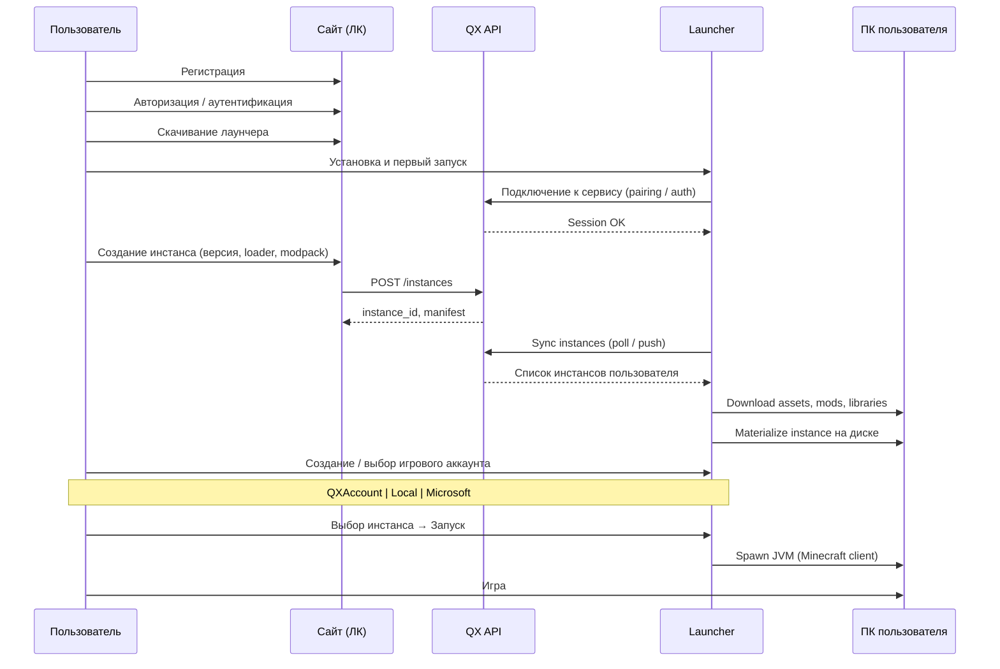

| Шаг | Действие | Где |
|-----|----------|-----|
| 1 | Регистрация | Web |
| 2 | Авторизация / аутентификация | Web |
| 3 | Скачивание лаунчера | Web |
| 4 | Подключение лаунчера к сервису QX | Launcher ↔ API |
| 5 | Создание игрового аккаунта | Launcher — **QXAccount**, **Local** или **Microsoft** |
| 6 | Создание инстанса | Web (метаданные) → Launcher (развёртывание на ПК) |
| 7 | Выбор игрового аккаунта | Launcher |
| 8 | Запуск → Игра | Launcher → JVM |

---

#### Сценарий 2 — Игра без регистрации (guest + device link)

**Актор:** гость. **Сначала обязательная привязка лаунчера к сайту** ([device-linking.md](./device-linking.md)).

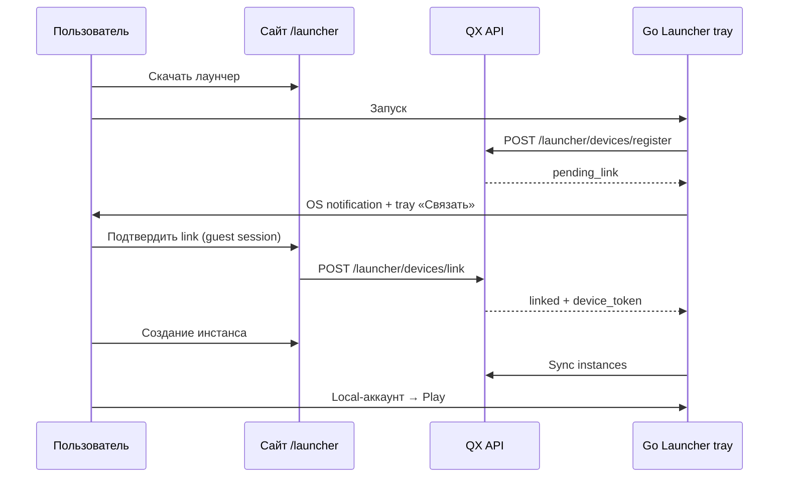

| Шаг | Действие |
|-----|----------|
| 1 | Скачать → запустить tray launcher |
| 2 | **Связать** с сайтом (уведомление или ПКМ в трее) |
| 3 | Local-аккаунт · инстанс на сайте · sync · игра |

> При регистрации позже: guest data **merge** в user ([device-linking.md §5](./device-linking.md)).

---

#### Сценарий 3 — Управление игровым сервером (админ)

**Актор:** владелец сервера (BYOS).

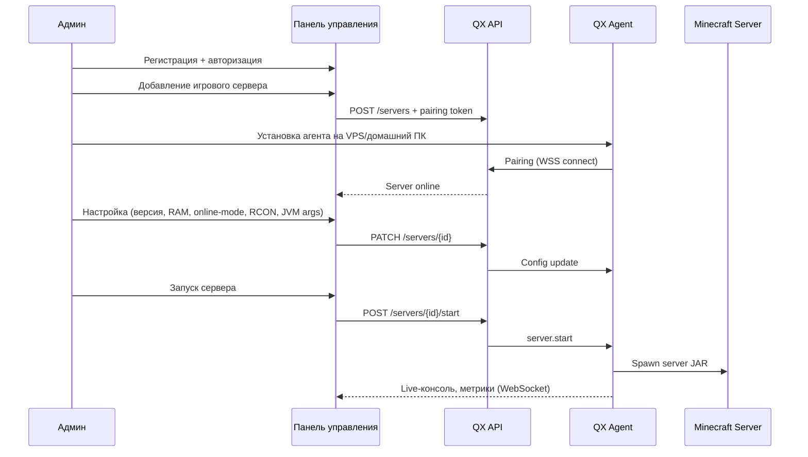

| Шаг | Действие | Где |
|-----|----------|-----|
| 1 | Регистрация + авторизация | Web |
| 2 | Добавление игрового сервера | Web (генерация pairing token) |
| 3 | Установка агента + pairing | VPS / домашний ПК |
| 4 | Настройка сервера | Web-панель |
| 5 | Запуск игрового сервера | Web → Agent → JAR |

---

### Типы игровых аккаунтов

| Тип | Где создаётся | Назначение |
|-----|---------------|------------|
| **QXAccount** | Launcher (при auth) | Привязан к QX-профилю; синхронизация между устройствами |
| **Local** | Launcher | Offline/cracked; без Mojang-лицензии |
| **Microsoft** | Launcher (OAuth) | Лицензионный вход через Mojang/Microsoft |

---

### Архитектурный паттерн: Web-defined, Launcher-materialized

Инстанс существует в двух слоях:

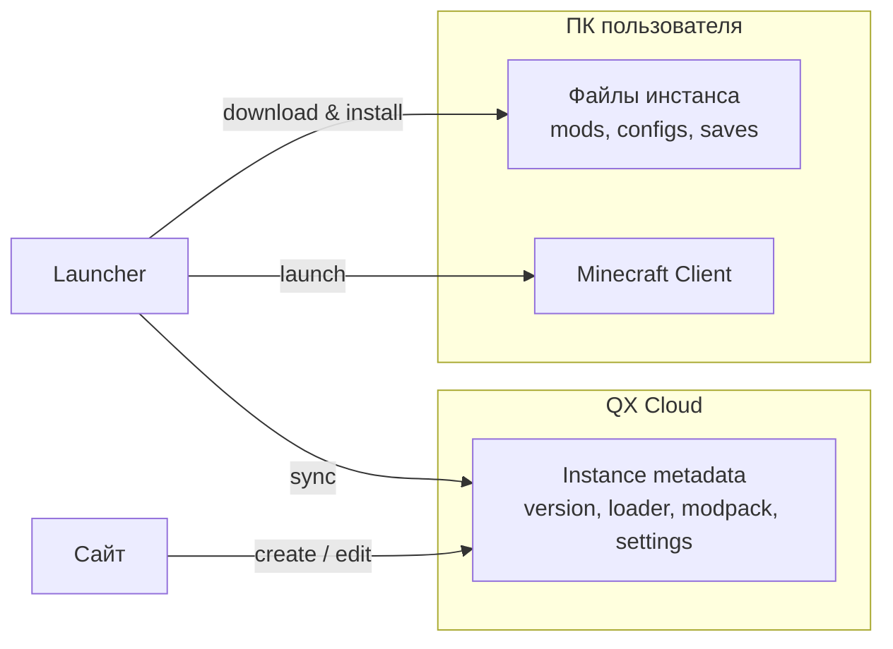

- **Web** — CRUD инстансов, выбор версии/modpack, настройки.
- **API** — хранит манифест, отдаёт лаунчеру при sync.
- **Launcher** — скачивает файлы, собирает classpath, запускает JVM на локальной машине.

---

## 3. Высокоуровневая схема

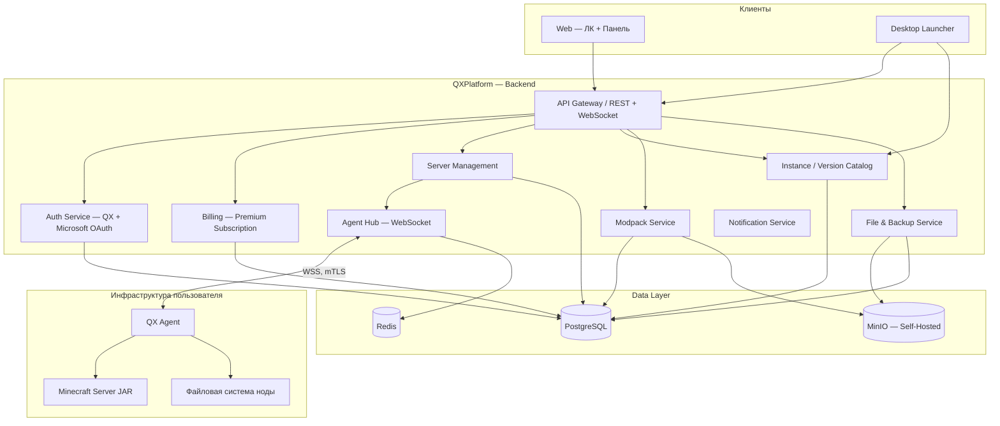

---

## 4. Компоненты системы

### 4.1 Web — Личный кабинет и панель управления

**Стек:** TypeScript + React + Vite + Ant Design (SPA). Static build → Nginx.

**Ответственность:**
- Регистрация, вход (email/password; Microsoft OAuth — post-MVP).
- Профиль; Skin/Cape — **только для зарегистрированных** (см. §4.6).
- CRUD серверов, **SSH deploy agent**, multi-admin invites.
- CRUD инстансов, modpack picker, **modpack ↔ server sync**.
- Live-консоль, RCON, файловый менеджер через agent.
- Каталог modpacks; Premium/billing — **отложено**.

---

### 4.2 Backend API

**Стек:** Go + Gin + GORM + PostgreSQL + Redis.

```
cmd/api/
internal/  auth/  users/  instances/  servers/  agents/
           modpacks/  integrations/  deploy/  skinserver/  files/
pkg/protocol/
```

| Канал | Протокол | Документ |
|-------|----------|----------|
| Panel SPA ↔ API | HTTPS REST + WS | [api.md](./api.md) |
| Launcher UI ↔ API | HTTPS REST | [api.md](./api.md) |
| Launcher Go ↔ API | HTTPS REST | auth, sync, auto-update |
| Agent ↔ API | WSS + JWT | [agent-protocol.md](./agent-protocol.md) |

---

### 4.3 QX Agent

**Стек:** Go · **Платформа: Linux only** · systemd service.

**Установка:** Backend подключается к VPS по **SSH** (ключ пользователя, хранится encrypted) и разворачивает agent binary + systemd unit. См. [agent-protocol.md §2](./agent-protocol.md).

| Категория | Функции |
|-----------|---------|
| **Deploy** | Установка через SSH job с backend (не ручной pairing token) |
| **Связь** | WSS к Agent Hub, heartbeat, reconnect + idempotency |
| **Lifecycle** | start/stop/restart/kill — **все типы JAR** (см. §4.7) |
| **Modpack** | `modpack.install` — тот же manifest, что у client instance |
| **Консоль / RCON / Файлы / Метрики** | Полный набор (A2) |

**Безопасность:**
- mTLS или подписанные JWT на каждое соединение.
- Агент привязан к одному серверу/владельцу.
- Sandbox: whitelist путей (server root), лимиты размера файлов.

**Предлагаемый стек:** ~~Go или Rust~~ **Go** — `cmd/agent/`.

```
cmd/agent/
internal/
  connector/      process/        console/
  filesystem/     modpack/        metrics/
  protocol/
```

---

### 4.4 Desktop Launcher (Go tray + Website UI)

**WebView не используется.** UI — React SPA на сайте (`/launcher/*`). Go app — **system tray daemon**.

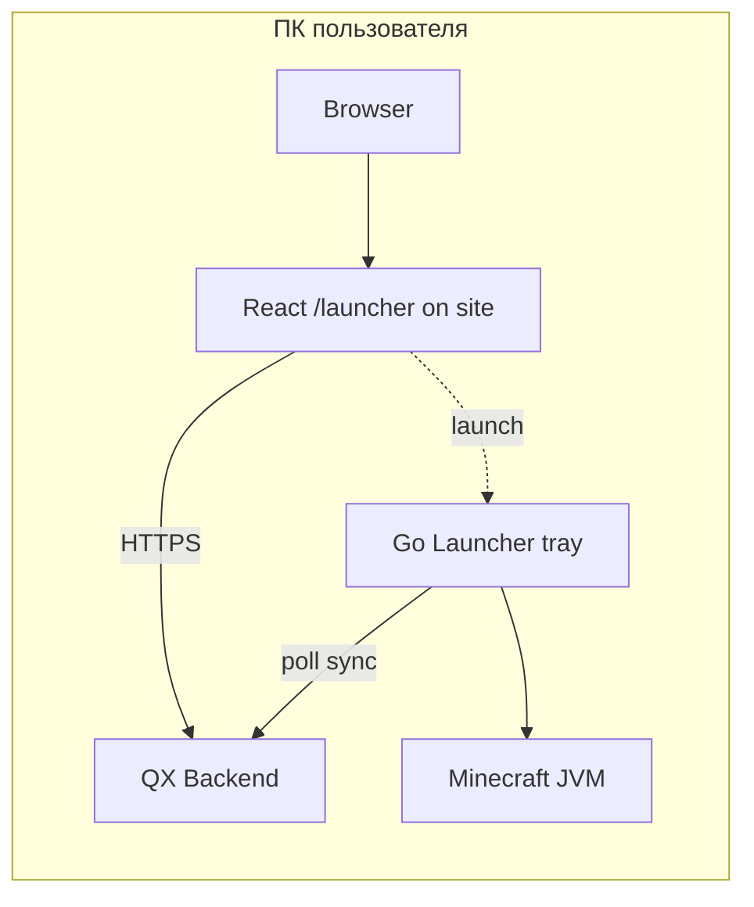

| Компонент | Где | Роль |
|-----------|-----|------|
| **Website `/launcher`** | React + Ant Design | Инстансы, аккаунты, публичные серверы, modpacks |
| **Go tray** | Windows / macOS / Linux | Device link, sync, Mojang Java, JVM, auto-update, OS notifications |
| **Связь** | [device-linking.md](./device-linking.md) | Обязательна до первого инстанса |

**Tray:** ПКМ → «Связать лаунчер» · ЛКМ → открыть `/launcher` в браузере.

```
cmd/launcher/
internal/launcher/  tray/  sync/  jvm/  java/  update/  bridge/
web/panel-ui/src/routes/launcher/   # UI на сайте (не отдельный WebView)
```

**Поддерживаемые modloader'ы (целевой продукт):**

| Loader | Версии MC (ориентир) | Meta / installer | Modpack-источник |
|--------|----------------------|------------------|------------------|
| **Vanilla** | Все официальные | Mojang manifest | — |
| **Forge** | Legacy (≤1.20.1 и отдельные ветки) | Forge installers, `version.json` | CurseForge |
| **NeoForge** | 1.20.1+ (форк Forge) | NeoForge installer API | CurseForge |
| **Fabric** | Широкий диапазон | Fabric loader + intermediary | Modrinth, CurseForge |
| **Quilt** | Fabric-совместимые | Quilt loader | Modrinth |

> **Forge ≠ NeoForge** — разные installer pipeline и classpath; в QX каждый loader — отдельный adapter в `packages/mc-manifest` / launcher.

**Поток запуска игры:**
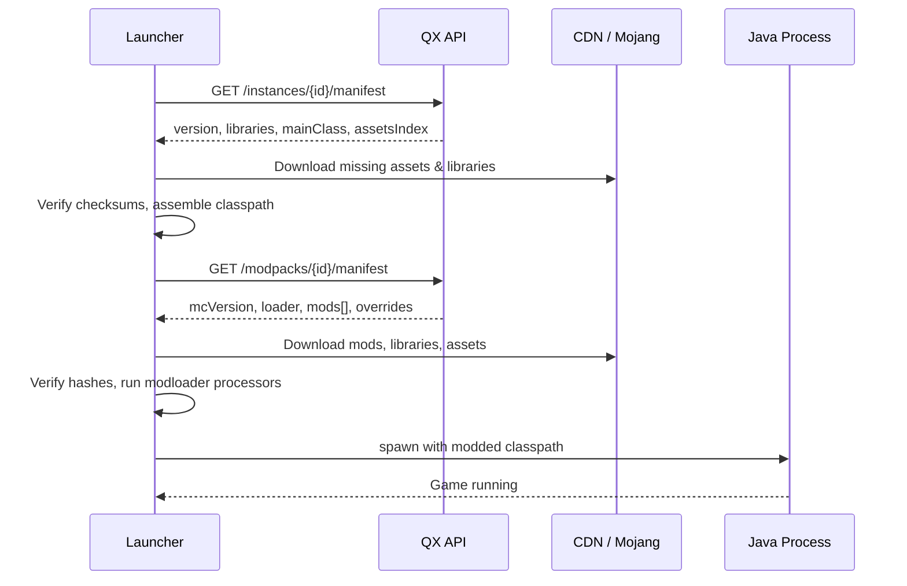

---

### 4.5 Billing — отложено

Premium и платёжка **не в текущей фазе**. Поле `tier` в User — на будущее.

---

### 4.6 Skin / Cape Server

**Только зарегистрированные QX-аккаунты.** Guest Local — без upload/sync skins.

- `GET /skins/{uuid}.png`, `POST /users/me/skin`
- Launcher auth-server URL для licensed/offline QX profiles

---

### 4.7 Server JAR types

Vanilla, Paper, Spigot, Purpur, Forge, NeoForge, Fabric, Quilt, **hybrid** (Mohist, Magma, Arclight…).  
Config: `server_type` + `jar_path` + `jvm_args`.

---

### 4.8 Modpack sync

Shared `modpack_id` on `launcher_instances` and `servers` → client install (Go) + `modpack.install` (agent).

---

### 4.9 Multi-admin & SSH Deploy

`server_members` (owner/admin/viewer). Deploy: backend SSH job → Linux systemd agent.  
DDL: [schema.sql](./schema.sql) · Protocol: [agent-protocol.md](./agent-protocol.md)

---

## 5. Модель данных (основные сущности)

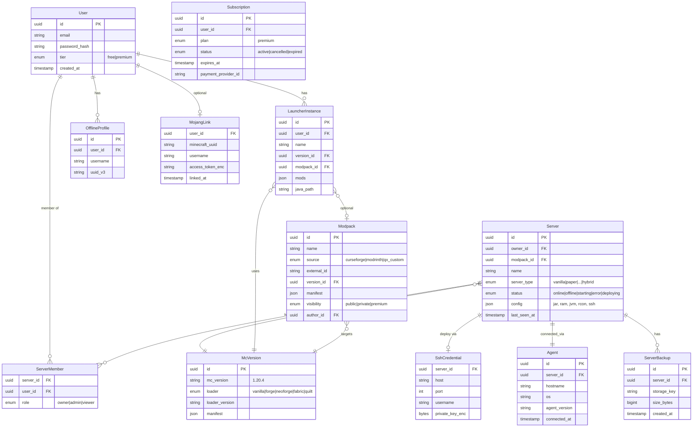

**Хранилища:**
| Данные | Хранилище |
|--------|-----------|
| Пользователи, серверы, метаданные | PostgreSQL |
| Сессии, pub/sub Agent Hub, кэш | Redis |
| Бэкапы, большие файлы, modpacks | **MinIO** (Self-Hosted) |
| Логи (опционально) | Loki / Elasticsearch — TBD |

---

## 6. Протокол Agent ↔ Platform

Детальная спецификация: **[agent-protocol.md](./agent-protocol.md)** (pairing via SSH deploy, reconnect, idempotency, modpack.install).

Краткая сводка типов сообщений:

```typescript
// Platform → Agent
type Command =
  | { type: "server.start"; payload: { jvmArgs: string[]; jarPath: string } }
  | { type: "server.stop"; payload: { graceful: boolean } }
  | { type: "server.restart"; payload: {} }
  | { type: "console.input"; payload: { line: string } }
  | { type: "rcon.command"; payload: { command: string } }
  | { type: "files.list"; payload: { path: string } }
  | { type: "files.read"; payload: { path: string } }
  | { type: "files.write"; payload: { path: string; content: string } }
  | { type: "files.upload"; payload: { path: string; url: string } }
  | { type: "files.delete"; payload: { path: string } };

// Agent → Platform
type Event =
  | { type: "agent.heartbeat"; payload: { cpu: number; ram: number; uptime: number } }
  | { type: "server.status"; payload: { status: string; pid?: number } }
  | { type: "console.output"; payload: { stream: "stdout"|"stderr"|"rcon"; line: string } }
  | { type: "metrics"; payload: { tps?: number; playersOnline: number; playerList?: string[] } }
  | { type: "files.result"; payload: { requestId: string; data: unknown } };
```

---

## 7. Внешние интеграции

Legacy-систем **нет** — проект пишется с нуля. Вся интеграция с внешним миром идёт через три провайдера.

### 7.1 Обзор

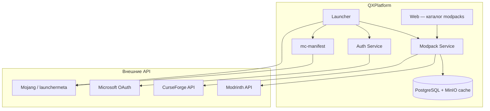

| Интеграция | Назначение | Где используется |
|------------|------------|------------------|
| **Microsoft/Mojang** | OAuth, лицензионный вход, version manifest, assets, libraries | Auth, Launcher, `packages/mc-manifest` |
| **Modrinth** | Каталог modpacks (Fabric/Quilt) — **secondary** | Modpack Service |
| **CurseForge** | Каталог modpacks — **primary** ([ADR-0007](./adr/0007-curseforge-priority.md)) | Modpack Service, Web-каталог |

---

### 7.2 Microsoft / Mojang

**Два разных контура:**

| Контур | Endpoint / протокол | Назначение |
|--------|---------------------|------------|
| **Microsoft OAuth** | `login.live.com`, Xbox Live auth chain | Лицензионный вход игрока в лаунчере |
| **Mojang Meta** | `launchermeta.mojang.com`, `piston-meta.mojang.com` | `version.json`, libraries, assets index |
| **Mojang CDN** | `resources.download.minecraft.net`, `launcher.mojang.com` | Скачивание assets и client JAR |

**Auth flow (лаунчер, Microsoft-аккаунт):**


**Mojang manifest flow (Vanilla + база для modloaders):**

1. `GET https://launchermeta.mojang.com/mc/game/version_manifest_v2.json`
2. Resolve version → `version.json` (libraries, mainClass, assetIndex)
3. Download libraries/assets with SHA1 verification
4. Modloader (Forge / NeoForge / Fabric / Quilt) добавляет свои libraries поверх Mojang base

**Хранение:** refresh token Microsoft — encrypted в `MojangLink`; MC session token — только в памяти лаунчера (не на сервере).

---

### 7.3 CurseForge

**API:** [CurseForge for Studios API](https://docs.curseforge.com/) (`api.curseforge.com`)

| Использование | Endpoint (пример) |
|---------------|-------------------|
| Поиск modpacks | `GET /v1/mods/search?gameId=432&classId=4471` |
| Файлы modpack | `GET /v1/mods/{modId}/files` |
| Download URL | `GET /v1/mods/{modId}/files/{fileId}/download-url` |

**Особенности:**
- **API Key** — есть у команды (env `CURSEFORGE_API_KEY`).
- Rate limits — обязателен **кэш** на стороне QX (PostgreSQL metadata + MinIO files).
- Сильная сторона: **Forge / NeoForge** modpacks, крупные сборки.

**Пакет:** `packages/integrations/curseforge`

---

### 7.4 Modrinth (secondary)

> **Приоритет:** CurseForge primary — см. [ADR-0007](./adr/0007-curseforge-priority.md). Modrinth — fallback и Fabric/Quilt-only packs.

**API:** [Modrinth API v2](https://docs.modrinth.com/api/) (`api.modrinth.com`)

| Использование | Endpoint (пример) |
|---------------|-------------------|
| Поиск modpacks | `GET /v2/search?facets=[["project_type:modpack"]]` |
| Версия / files | `GET /v2/project/{id}/version/{version_id}` |
| Download | URL из version payload |

**Особенности:**
- **Open API**, ключ не обязателен для read (рекомендуется User-Agent).
- Формат **`.mrpack`** — native modpack format; парсить в unified QX manifest.
- Сильная сторона: **Fabric / Quilt** modpacks и mods.

**Пакет:** `packages/integrations/modrinth`

---

### 7.5 Unified Modpack Layer (абстракция QX)

CurseForge и Modrinth имеют разные форматы. QX вводит **единый внутренний манифест**:

```typescript
interface QxModpackManifest {
  id: string;
  name: string;
  source: "curseforge" | "modrinth" | "qx_custom";
  externalId: string;          // CF modId или Modrinth project id
  mcVersion: string;
  loader: "vanilla" | "forge" | "neoforge" | "fabric" | "quilt";
  loaderVersion?: string;
  files: Array<{
    url: string;
    path: string;
    sha1?: string;
    sha512?: string;           // Modrinth
  }>;
  overrides?: Record<string, string>;
}
```

**Pipeline:**

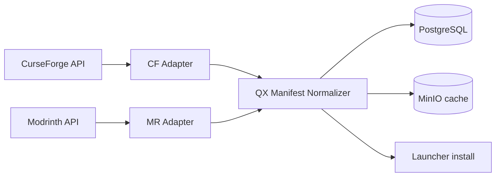

| Шаг | Действие |
|-----|----------|
| 1 | Поиск modpack | CF API first → MR if not found |
| 2 | Backend fetch metadata, normalize → `QxModpackManifest`, save to PG |
| 3 | При install лаунчер запрашивает `GET /modpacks/{id}/manifest` |
| 4 | Файлы: presigned MinIO URL если cached, иначе proxy-fetch → MinIO → presigned |
| 5 | Launcher скачивает, verify hash, assemble instance |

**Кэш-политика (Self-Hosted):**

| Данные | TTL | Хранилище |
|--------|-----|-----------|
| Search results | 1–6 h | Redis |
| Modpack metadata | 24 h | PostgreSQL |
| Mod/modpack files | Permanent (until update) | MinIO |

---

### 7.6 Структура пакетов интеграций

```
packages/
├── mc-manifest/              # Mojang version.json, library resolver
├── integrations/
│   ├── curseforge/
│   │   ├── client.ts         # API client
│   │   ├── adapter.ts        # CF → QxModpackManifest
│   │   └── types.ts
│   ├── modrinth/
│   │   ├── client.ts
│   │   ├── mrpack.ts         # .mrpack parser
│   │   ├── adapter.ts        # MR → QxModpackManifest
│   │   └── types.ts
│   └── mojang/
│       ├── manifest.ts       # version_manifest_v2
│       ├── assets.ts
│       └── microsoft-auth.ts # OAuth helpers (shared Web + Launcher)
└── modpacks/                 # Normalizer, cache, install orchestration
```

---

### 7.7 Roadmap интеграций

| Фаза | Microsoft/Mojang | CurseForge | Modrinth |
|------|------------------|------------|----------|
| Phase 2 (Launcher MVP) | Mojang manifest + assets (Vanilla) | — | — |
| Phase 3 (Modpacks) | + modloader libraries | Каталог + install | Каталог + install |
| Phase 4 (Premium) | Microsoft OAuth login | Premium modpack cache priority | То же |

---

## 8. Безопасность и compliance

Полная спецификация: **[security-legal.md](./security-legal.md)**

| Область | Документ |
|---------|----------|
| Rate limiting | security-legal §1 |
| Audit log | security-legal §2 |
| SSH encryption & rotation | security-legal §3, [ssh-deploy.md](./ssh-deploy.md) |
| Mojang EULA / offline | security-legal §4 |
| CurseForge / MinIO | security-legal §5, [modpacks-pipeline.md](./modpacks-pipeline.md) |
| 2FA (post-MVP) | security-legal §6 |
| TLS без Cloudflare | security-legal §7, [observability-ops.md](./observability-ops.md) |
| Guest vs Registered RBAC | security-legal §8 |

### Кратко

| Область | Подход |
|---------|--------|
| Auth | JWT + device_token; bcrypt passwords |
| Agent | JWT per server, Linux only |
| SSH keys | AES-256-GCM + master key rotation |
| API | Redis rate limits, audit append-only |

---

## 9. Нагрузка и масштабирование

Точные KPI пока не зафиксированы — это нормально для pre-launch. Ниже — **рабочие допущения** и инфраструктурные tier'ы, чтобы не переписывать архитектуру при росте от «десятков» до «сотен тысяч».

### 8.1 Ориентиры по фазам

| Фаза | Горизонт | Пользователи (ориентир) | Активность | Примечание |
|------|----------|-------------------------|------------|------------|
| **Alpha / MVP** | 0–6 мес | **Десятки → сотни** MAU | 10–50 DAU | Закрытая beta, друзья, первые админы серверов |
| **Launch** | 6–12 мес | **Сотни → тысячи** MAU | 100–500 DAU | Публичный релиз, guest-flow, первые Premium |
| **Growth** | 1–2 года | **Тысячи → десятки тысяч** MAU | 1k–10k DAU | Успешный сценарий для нишевого лаунчера + панель |
| **Scale** | 2+ года | **Сотни тысяч+** MAU | 50k+ DAU | Уровень TLauncher/KLauncher — отдельный этап инвестиций в CDN и SRE |

> Референсы (TLauncher и др.) — **миллионы** установок, но QX на старте realistic target — **сотни–тысячи**. Архитектура должна **не мешать** дойти до scale-tier, но **не требовать** Kubernetes в первый день.

### 8.2 Что нагружает систему

| Источник нагрузки | Характер | Пик |
|-------------------|----------|-----|
| **Launcher sync** | REST: список инстансов, манифесты | При каждом запуске лаунчера |
| **Modpack / assets CDN** | Исходящий трафик, большие файлы | Первый install modpack, обновления |
| **Agent Hub (WSS)** | Долгоживущие соединения | 1 conn на сервер; консоль = steady stream |
| **Web-панель** | REST + WS консоль | Админы (меньше DAU, но тяжёлые WS) |
| **Auth** | Login, refresh, guest tokens | Волны при релизах / маркетинге |
| **PostgreSQL** | CRUD users, instances, servers | Линейно с MAU |

**Вывод:** главный bottleneck при росте — **не API**, а **CDN/объектное хранилище** (modpacks) и **Agent Hub** (тысячи одновременных WSS).

### 8.3 Инфраструктурные tier'ы (Self-Hosted)

> Все tier'ы — **свои серверы** (VPS или dedicated). Managed DB/S3 не используем.  
> **Pure self-hosted** — без Cloudflare ([ADR-0009](./adr/0009-pure-self-hosted.md)); TLS через Nginx + Let's Encrypt.

#### Tier 0 — MVP (десятки–сотни пользователей)

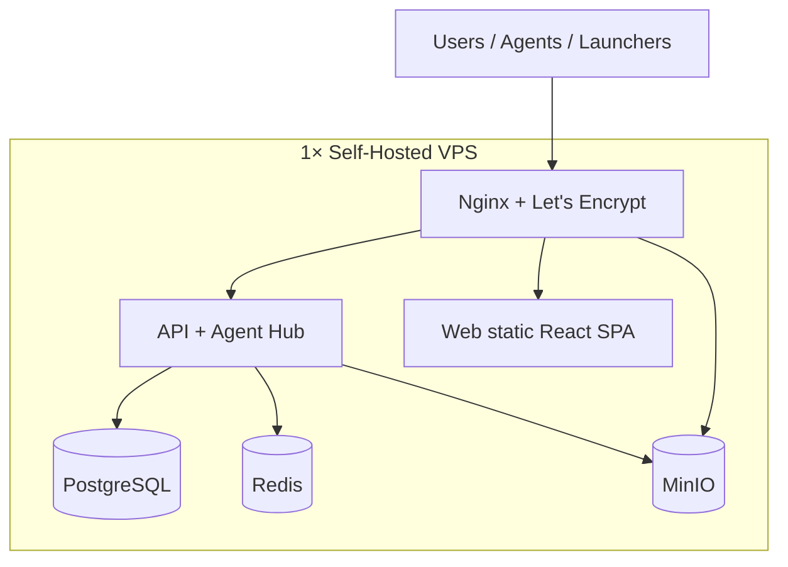

| Комponent | Self-Hosted стек |
|-----------|------------------|
| **VPS** | 1× 4–8 GB RAM, 2 vCPU, 80+ GB SSD (Hetzner, Timeweb, Selectel, домашний dedicated) |
| **Orchestration** | **Docker Compose** — один `docker-compose.prod.yml` |
| **Reverse proxy** | Nginx + Certbot (Let's Encrypt) |
| **PostgreSQL** | Official Docker image, volume на SSD, **pg_dump cron** → локальный бэкап |
| **Redis** | Official Docker image, AOF persistence |
| **Object storage** | **MinIO** (modpacks, бэкапы, launcher builds) |
| **Web** | React SPA static + Nginx |
| **Мониторинг** | Uptime Kuma + (опц.) Netdata на том же VPS |
| **Стоимость** | **$5–30/мес** (VPS) + electricity если домашний сервер |

#### Tier 1 — Launch (сотни–тысячи MAU)

| Компонент | Self-Hosted изменение |
|-----------|-------------------------|
| **Topology** | 2× VPS: **app** (API, Nginx, Redis) + **data** (PostgreSQL, MinIO) |
| **Load balancing** | Nginx upstream на 2 app-ноды **или** второй app-VPS |
| **PostgreSQL** | Отдельный VPS; PgBouncer на app-ноде; daily pg_dump + offsite copy |
| **MinIO** | Dedicated disk / второй VPS; Nginx `proxy_pass` для downloads |
| **Backups** | Restic → второй VPS / NAS / внешний HDD |
| **Стоимость** | **$30–80/мес** (2–3 VPS) |

#### Tier 2 — Growth (тысячи–десятки тысяч MAU)

| Компонент | Self-Hosted изменение |
|-----------|-------------------------|
| **App tier** | 2–3 VPS с API; Redis pub/sub для Agent Hub |
| **PostgreSQL** | Primary + **streaming replica** на втором VPS (read-only) |
| **MinIO** | Distributed mode (4 drives) **или** отдельный storage VPS с большим диском |
| **Modpack mirror** | Nginx cache / второй MinIO node для разгрузки downloads |
| **Observability** | Prometheus + Grafana (self-hosted stack) |
| **Стоимость** | **$80–200/мес** (4–6 VPS / dedicated) |

#### Tier 3 — Scale (100k+ MAU)

| Компонент | Self-Hosted изменение |
|-----------|-------------------------|
| **Geo** | 2 self-hosted PoP (RU + EU VPS), DNS geo-routing |
| **Storage** | MinIO cluster или dedicated storage server (NVMe) |
| **Agent Hub** | Sharding по `server_id`, отдельные WSS-ноды |
| **CDN** | Self-hosted Nginx cache / второй MinIO node для downloads |
| **Ops** | Ansible/Terraform для provisioning VPS, runbooks |

### 8.4 Self-Hosted: что не используем

| Managed-сервис | Self-Hosted замена |
|----------------|-------------------|
| AWS S3 / Yandex Object Storage | **MinIO** |
| RDS / Supabase / Neon | **PostgreSQL** в Docker |
| ElastiCache | **Redis** в Docker |
| Kubernetes (EKS/GKE) | **Docker Compose** → позже **k3s** на своих VPS |
| Vercel / Netlify | Nginx + React static |
| Managed LB | Nginx upstream / HAProxy |

### 8.5 Проектные решения под масштаб

| Решение | Зачем |
|---------|-------|
| **Stateless API** | Горизонтальное масштабирование с первого дня |
| **Presigned URLs для modpacks** | MinIO presigned URL — API не проксирует гигабайты |
| **Launcher: local cache + delta updates** | Снижает повторные загрузки (как TLauncher/KLauncher) |
| **Agent: reconnect + backoff** | Устойчивость при кратковременных падениях API |
| **Guest device token** | Не создавать User row в PG до регистрации — экономия на «скачал и ушёл» |
| **Connection pooling** | PgBouncer обязателен с Tier 1 |

### 8.6 Метрики для принятия решений о scale-up

Когда переходить на следующий tier:

| Метрика | Порог «пора масштабироваться» |
|---------|-------------------------------|
| API p95 latency | > 500 ms стабильно |
| CPU VPS / pod | > 70% sustained |
| PostgreSQL connections | > 80% pool |
| Concurrent Agent WSS | > 500 на одном инстансе |
| CDN egress | > лимита тарифа или > $X/мес |
| Modpack download errors | > 1% |

---

| Disk I/O (MinIO/PG) | > 80% sustained |
| Modpack download errors | > 1% |

---

## 10. Self-Hosted деплой

### 9.1 Production stack (Docker Compose)

```
infra/
├── docker/
│   ├── docker-compose.yml          # Dev
│   ├── docker-compose.prod.yml     # Production
│   ├── .env.example
│   └── nginx/
│       ├── nginx.conf
│       └── conf.d/qx.conf          # api.*, panel.*, cdn.*
├── scripts/
│   ├── backup.sh                   # pg_dump + restic
│   ├── restore.sh
│   └── deploy.sh                   # pull + compose up
└── ansible/                        # Tier 1+: provisioning VPS (TBD)
```

**Сервисы в `docker-compose.prod.yml`:**

| Service | Image | Ports (internal) | Volume |
|---------|-------|------------------|--------|
| `nginx` | nginx:alpine | 80, 443 | `./nginx`, certs |
| `api` | qx-api:latest | 3000 | — |
| `web` | qx-web:latest | 3001 | — |
| `postgres` | postgres:16 | 5432 | `pg_data` |
| `redis` | redis:7-alpine | 6379 | `redis_data` |
| `minio` | minio/minio | 9000, 9001 | `minio_data` |
| `uptime-kuma` | louislam/uptime-kuma | 3002 | `kuma_data` |

### 9.2 Домены и маршрутизация (Nginx)

| Subdomain | Backend | Назначение |
|-----------|---------|------------|
| `qx.example.com` | `web:3001` | Лендинг, ЛК, панель |
| `api.qx.example.com` | `api:3000` | REST API |
| `ws.qx.example.com` | `api:3000` | WebSocket (Agent Hub, консоль) |
| `cdn.qx.example.com` | `minio:9000` | Modpacks, launcher builds, assets |

### 9.3 TLS и безопасность

- **Let's Encrypt** через Certbot (auto-renew cron).
- Firewall: только 80/443 наружу; SSH по ключу, non-default port.
- MinIO: bucket policy public-read только для `cdn/` prefix.
- PostgreSQL / Redis: **не** expose наружу, только docker network.
- Secrets: `.env` на сервере, не в git; `docker secret` при переходе на swarm/k3s.

### 9.4 Бэкапы (обязательно для Self-Hosted)

| Что | Как часто | Куда |
|-----|-----------|------|
| PostgreSQL | Daily | Restic → второй VPS / NAS |
| MinIO buckets | Daily incremental | Restic |
| `.env`, nginx configs | On change | Git (private) + encrypted backup |
| Launcher builds | On release | MinIO versioning |

### 9.5 Dev vs Prod

| | Dev | Prod (Self-Hosted) |
|---|-----|---------------------|
| Запуск | `docker compose up` локально | `deploy.sh` на VPS |
| TLS | mkcert / HTTP | Let's Encrypt |
| Домен | localhost | Реальный домен |
| MinIO | Local | Production VPS SSD |

### 9.6 Схема prod (Tier 0)

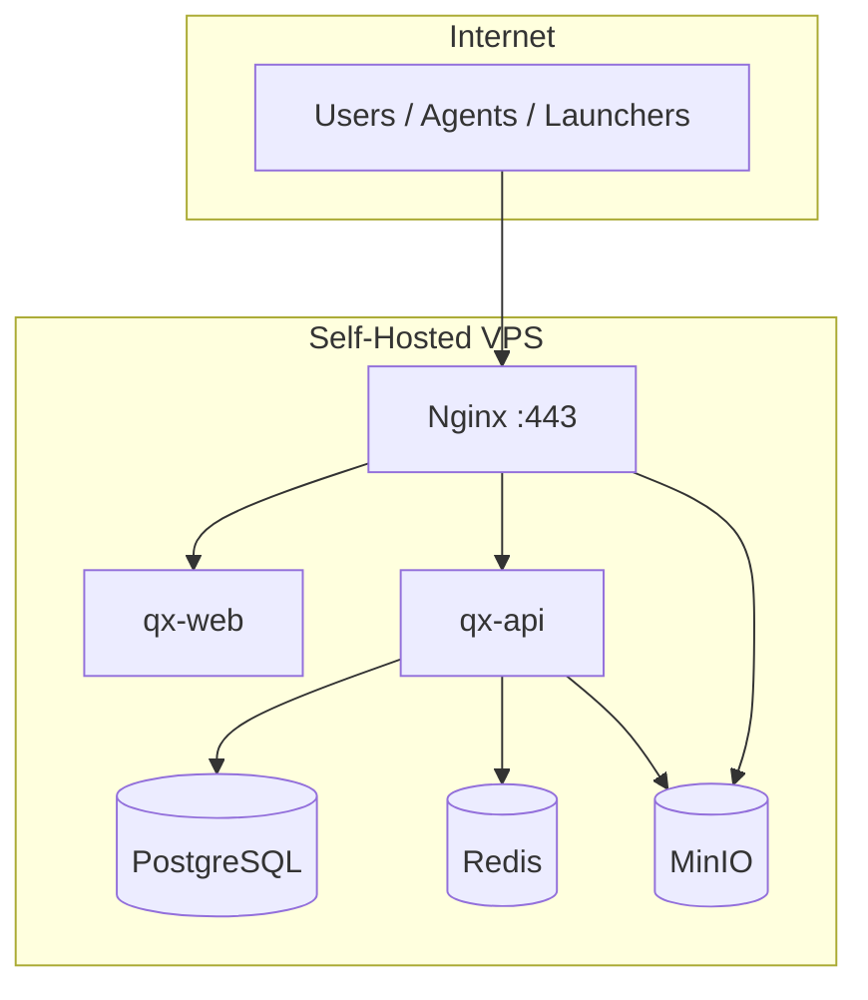

**MVP:** один VPS + Docker Compose — см. §9.3 Tier 0.  
**Масштабирование:** добавление VPS, без перехода на public cloud — см. Tier 1–3.

### 9.7 Ops-нагрузка на команду (Self-Hosted)

| Задача | Кто | Частота |
|--------|-----|---------|
| `deploy.sh`, обновления | Senior | По релизам |
| Проверка бэкапов | Senior | Weekly |
| Certbot renew | Cron (auto) | — |
| Disk space alert | Uptime Kuma | Daily check |
| OS security updates | Senior | Monthly |

> Self-Hosted экономит **$**, но ops ложится на **Senior**. Для команды из 2 человек — Tier 0–1 оптимален долгое время.

---

## 11. Структура репозитория (monorepo)

```
QXProject/
├── cmd/
│   ├── api/                 # Gin HTTP + WS server
│   ├── agent/               # Linux agent
│   └── launcher/            # Go tray daemon
├── web/
│   └── panel-ui/            # React SPA: site + /launcher
├── internal/
├── pkg/protocol/
├── docs/
│   ├── device-linking.md
│   ├── architecture.md
│   ├── mvp.md
│   ├── api.md
│   ├── agent-protocol.md
│   ├── schema.sql
│   ├── qa/test-matrix.md
│   └── adr/
├── infra/docker/
├── go.mod
└── README.md
```

---

## 12. Команда, роли и сроки

### 12.1 Состав

| Роль | FTE* | Фокус |
|------|------|-------|
| **Senior (опытный)** | ~1.0 | Архитектура, API, Agent, Launcher core, инфра, code review |
| **Junior (новичок)** | ~0.2 → 0.5** | Web UI, документация, тестирование, контент; со временем — изолированные фичи |

\* *Effective Full-Time Equivalent — реальная продуктивная нагрузка.*  
\** *0.2 на старте (обучение), ~0.5 через 3–6 мес при ментorship.*

**Эффективная команда на старте: ~1.2 разработчика.** Полный scope QX (лаунчер + панель + агент + billing + 5 loader'ов) — проект на **12–24 месяца** для такой команды. Критично: **резать scope MVP**, а не сроки качества.

### 12.2 Распределение зон ответственности

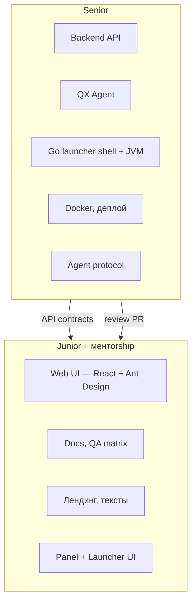

| Комponent | Кто | Почему |
|-----------|-----|--------|
| API, Auth, Agent Hub | **Senior** | Сложная логика, безопасность, WSS |
| QX Agent (Go/Rust) | **Senior** | Systems programming, process management |
| Launcher (modloaders, JVM) | **Senior** | Самая сложная часть; **свой Go tray** ([ADR-0010](./adr/0010-own-launcher-not-gml.md)) |
| Web — страницы ЛК, формы | **Junior** + review | React + Ant Design |
| Web — live-консоль, file manager | **Senior** | WebSocket, edge cases |
| Docker Compose, CI | **Senior** | Junior подключается позже |
| Тест-кейсы, баг-репорты | **Junior** | Не требует deep backend |

### 12.3 Онboarding новичка (первые 4–8 недель)

| Неделя | Задача | Результат |
|--------|--------|-----------|
| 1–2 | Git, TypeScript, React + Ant Design tutorial | Первый PR: тексты / стили |
| 3–4 | Ant Design: login/register (mock API) | Статичные страницы auth |
| 5–6 | Подключение к real API (read-only) | Страница профиля, список серверов |
| 7–8 | CRUD инстанса (UI only) | Форма создания инстанса на сайте |

> Senior не должен тратить >30% времени на обучение — иначе MVP сдвигается на месяцы. Junior берёт **UI и docs**, не Agent/Launcher.

### 12.4 MVP scope reduction (обязательно для 2 человек)

Полный продукт сразу — нереалистичен. Детальный scope, чеклисты и Definition of Done — в **[mvp.md](./mvp.md)**.

Кратко:

| В MVP v1 | Отложить на v2+ |
|----------|-----------------|
| Auth QX (email/password) | Microsoft OAuth |
| Guest flow + Local-аккаунт | QXAccount sync между устройствами |
| Vanilla only в лаунчере | Forge / NeoForge / Fabric / Quilt |
| Web: создание инстанса → sync → запуск | Modpacks |
| Agent: pairing, start/stop, консоль | RCON, файловый менеджер, моды |
| 1 сервер на пользователя (Free) | Premium, billing |
| Windows launcher only | macOS / Linux |
| Tier 0 infra (1 Self-Hosted VPS) | Multi-VPS, MinIO cluster |

### 12.5 Оценка сроков (реалистично)

| Фаза | Scope | Срок (Senior + Junior) | Milestone |
|------|-------|------------------------|-----------|
| **Phase 0** | API auth, PG, Web login/register | **6–8 недель** | Можно зарегистрироваться |
| **Phase 1** | Agent MVP + panel start/stop/console | **8–12 недель** | Сервер управляется из web |
| **Phase 2** | Launcher Win, Vanilla, guest + auth | **10–14 недель** | Скачал → создал инстанс → играет |
| **Alpha** | Связка всех 3 сценариев, bugfix | **4–6 недель** | Закрытая beta |
| **Phase 3+** | Modloaders, modpacks, billing, cross-platform | **+6–12 мес** | Public launch |

**До playable alpha: ~7–9 месяцев** при фокусе и урезанном MVP.  
**До public launch с modpacks и Premium: ~12–18 месяцев.**

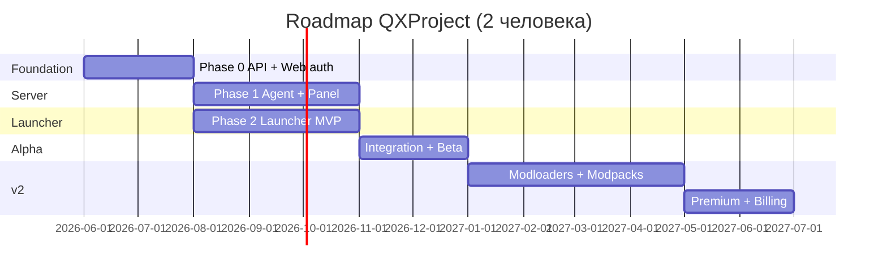

### 12.6 Риски для маленькой команды

| Риск | Митигация |
|------|-----------|
| Senior — single point of failure | Документировать API; junior ведёт docs; Prism/GML — **только референс** логики |
| Scope creep (все loader'ы сразу) | Жёсткий MVP v1 (Vanilla only) |
| Junior blocked без помощи | Задачи только с mock API; daily 15-min sync |
| Burnout senior | Не параллелить Agent + Launcher — **сначала launcher ИЛИ agent** |
| Рекомендация порядка | **Launcher first** (видимый прогресс, user-facing) → Agent → связка |

---

## 13. Roadmap по фазам

### Phase 0 — Foundation *(6–8 нед, Senior + Junior UI)*
- [ ] API scaffold + PostgreSQL + Redis *(Senior)*
- [ ] Auth: QX register/login *(Senior API + Junior forms)*
- [ ] Web UI: login, register, profile *(Junior)*
- [ ] Docker Compose dev env *(Senior)*

### Phase 1 — Agent + Panel *(8–12 нед, mostly Senior)*
- [ ] Agent: pairing, heartbeat, start/stop/restart
- [ ] Live-консоль (stdout/stderr)
- [ ] Web: добавление сервера, статус, кнопки start/stop *(Junior UI)*

### Phase 2 — Launcher MVP *(10–14 нед, mostly Senior)*
- [ ] Windows launcher, Vanilla only
- [ ] Guest flow + QX auth + Local-аккаунт
- [ ] Web: создание инстанса → sync → launch
- [ ] Forge / NeoForge / Fabric / Quilt — отложено на **v2**

### Phase Alpha — Integration *(4–6 нед)*
- [ ] Сценарии 1–3 end-to-end
- [ ] Junior: test matrix, bug reports, docs

### Phase 3 — Modloaders & Modpacks *(+4–6 мес)*
- [ ] Forge + NeoForge + Fabric + Quilt
- [ ] Modpack catalog
- [ ] macOS / Linux launcher

### Phase 4 — Premium & Polish *(+2–4 мес)*
- [ ] Microsoft OAuth
- [ ] Billing / Premium
- [ ] Agent: RCON, files, backups, metrics
- [ ] Agent self-update, аналитика

> Детальные оценки и MVP scope reduction — §12.4–12.5.

---

## 14. Открытые вопросы (TBD)

| # | Вопрос | Статус |
|---|--------|--------|
| I8 | VPS-провайдер / регион | **TBD** |

**Закрыто:** B3 launch bridge · I9 pure self-hosted · E6 linking · W1 no WebView · X3/X4 CF · L3 own launcher · B2 guest/auth tiers — см. [adr/](./adr/).

---

## 15. Референсы

### 15.1 Лаунчеры (основные — продуктовый UX)

| Продукт | Описание | Что взять для QX |
|---------|----------|------------------|
| **[TLauncher](https://tlauncher.org/)** | Популярный лаунчер с offline-аккаунтами, modpacks, скинами; сильная аудитория в CIS | Guest/offline flow без регистрации; быстрый старт «скачал → играешь»; каталог версий и сборок; интеграция скинов/cape для offline |
| **[KLauncher](https://klauncher.gg/)** | Аналог TLauncher: modpacks, серверы, скины, offline-режим | UX выбора modpack и серверов; витрина публичных серверов; простой wizard первого запуска |
| **[GML](https://github.com/GamerVII/NM)** | Open-source фреймворк (Java) | **Только референс** UX/архитектуры — **не форкаем** ([ADR-0010](./adr/0010-own-launcher-not-gml.md)) |
| **[AuroraLauncher](https://aurora-launcher.ru/)** | Web sync, modpacks | Паттерн site ↔ tray sync; **свой Go launcher** |

**Позиционирование QX vs референсы:**

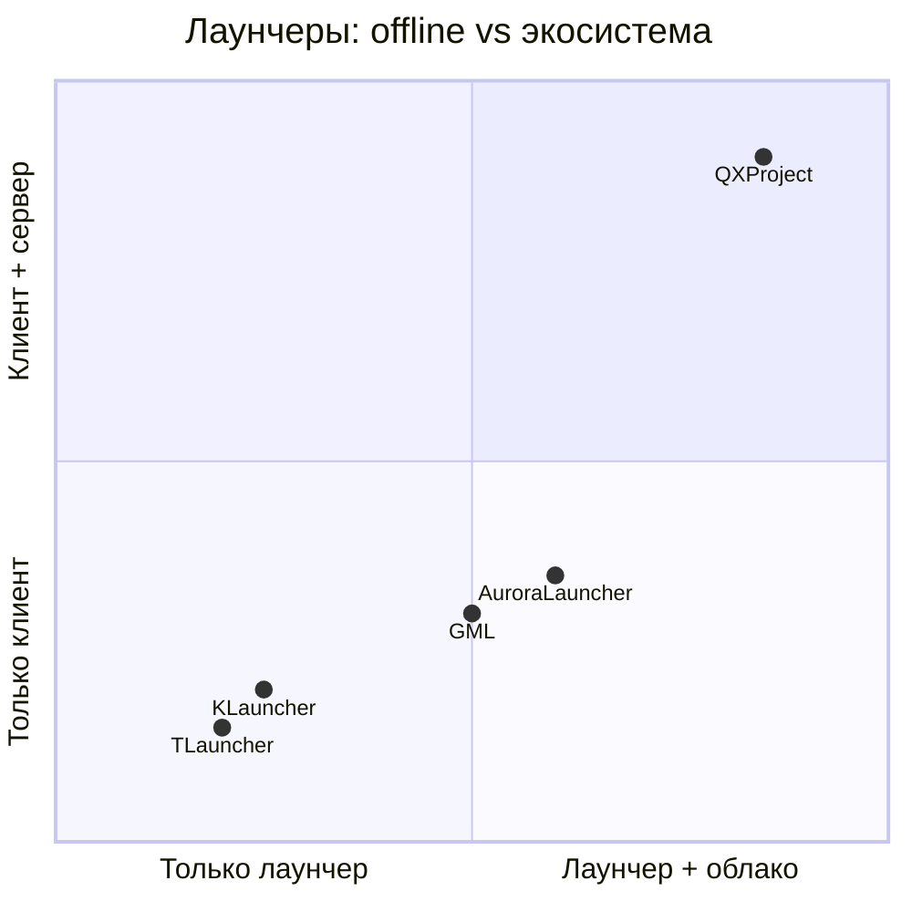

QXProject = **TLauncher/KLauncher UX** (offline, modpacks) + **Aurora sync** (инстансы с сайта, `/launcher` UI) + **уникально:** панель управления сервером через агент (BYOS). **Свой Go tray**, не GML.

**Ключевые паттерны из референсов:**

| Паттерн | Источник | Применение в QX |
|---------|----------|-----------------|
| Offline-first запуск | TLauncher, KLauncher | Сценарий 2 (guest flow) |
| Modpack wizard | KLauncher, Aurora | Web: выбор сборки → tray install |
| Instance manifest | Prism, Aurora | `internal/mc/manifest`, Go tray engine |
| Auth-server | Aurora | QXAccount validation, [skin-server.md](./skin-server.md) |
| Version/mod cache | Все | CDN + локальный cache dir |

---

### 15.2 Панель и инфраструктура (server-side)

| Продукт | Что взять |
|---------|-----------|
| **Pterodactyl** | Модель Wings-агента, API панели, файловый менеджер, live-консоль |
| **AMP (CubeCoders)** | UX управления инстансами, scheduling |
| **MultiMC / Prism Launcher** | Open-source: архитектура инстансов, Java detection, modloader isolation |
| **CurseForge App** | Modpack distribution, manifest format |
| **Mojang Launcher** | Official `version.json`, library resolution, asset index |

---

### 15.3 Launcher codebase: свой Go tray

**Решение:** собственный Go launcher — **не форк GML** ([ADR-0010](./adr/0010-own-launcher-not-gml.md)).

| За | Против (осознанно принимаем) |
|----|------------------------------|
| Единый стек Go (API + Agent + Tray) | Modloader resolution с нуля — дольше MVP |
| Tray без UI + `/launcher` на сайте — чистое разделение | Нет готового Java/Kotlin core из GML |
| Полный контроль auth, sync, updates | Больше работы Senior на JVM/classpath |

**Референсы (не fork):** GML, Prism Launcher, Mojang official launcher — алгоритмы versions/libraries/assets.

---

*Последнее обновление: 2026-06-09 (v1.3 — launch bridge, security-legal, own launcher, pure self-hosted)*
