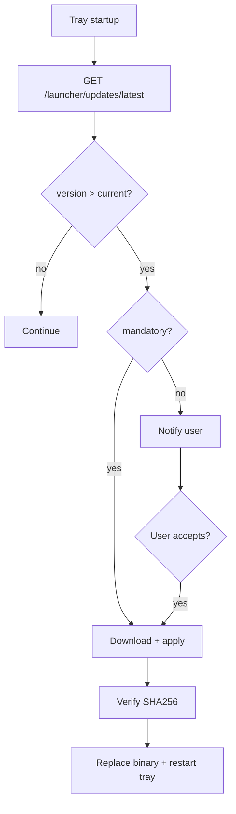

# Launcher Auto-Update

> **F2:** Go tray checks updates on startup + every 6h.

---

## 1. Manifest (MinIO)

Path: `releases/launcher/latest.json`

```json
{
  "version": "1.2.0",
  "mandatory": false,
  "published_at": "2026-06-09T10:00:00Z",
  "platforms": {
    "windows-x64": {
      "url": "https://cdn.qx.example.com/releases/launcher/1.2.0/qx-launcher-win-x64.exe",
      "sha256": "abc123...",
      "size": 15728640
    },
    "linux-x64": { "url": "...", "sha256": "...", "size": 0 },
    "darwin-arm64": { "url": "...", "sha256": "...", "size": 0 }
  },
  "changelog": "Bug fixes and sync improvements"
}
```

---

## 2. Update flow



---

## 3. Platform specifics

| OS | Method |
| ---- | -------- |
| **Windows** | Download to `%TEMP%`, verify, spawn updater `.exe` that replaces and relaunches |
| **Linux** | Download to `/tmp`, verify, `atomic replace` + systemd user service restart |
| **macOS** | Replace `.app` bundle in `/Applications/QX Launcher.app` (post-MVP signing) |

---

## 4. Code signing (roadmap)

| Phase | Windows | macOS |
| ------- | --------- | ------- |
| Alpha | Unsigned (SmartScreen warning) | Gatekeeper warn |
| Beta | Authenticode cert | Apple Developer ID |
| Prod | Required | Required + notarize |

Document in user FAQ: «При первом запуске нажмите Подробнее → Выполнить».

---

## 5. Rollback

Keep previous binary at `qx-agent.prev` / `qx-launcher.prev`. If new version crashes on start (health check fails in
10s), auto-revert once.

---

## 6. API

```text
GET /v1/launcher/updates/latest?platform=windows-x64&current=1.1.0
```

Returns manifest or `304` if up to date.

---

## 7. CI publish

GitHub Action on tag `launcher-v*`:

1. Build matrix GOOS/GOARCH
2. SHA256 sum
3. Upload to MinIO
4. Update `latest.json`

---

*Self-hosted CDN: Nginx `alias` to MinIO bucket — no Cloudflare.*
