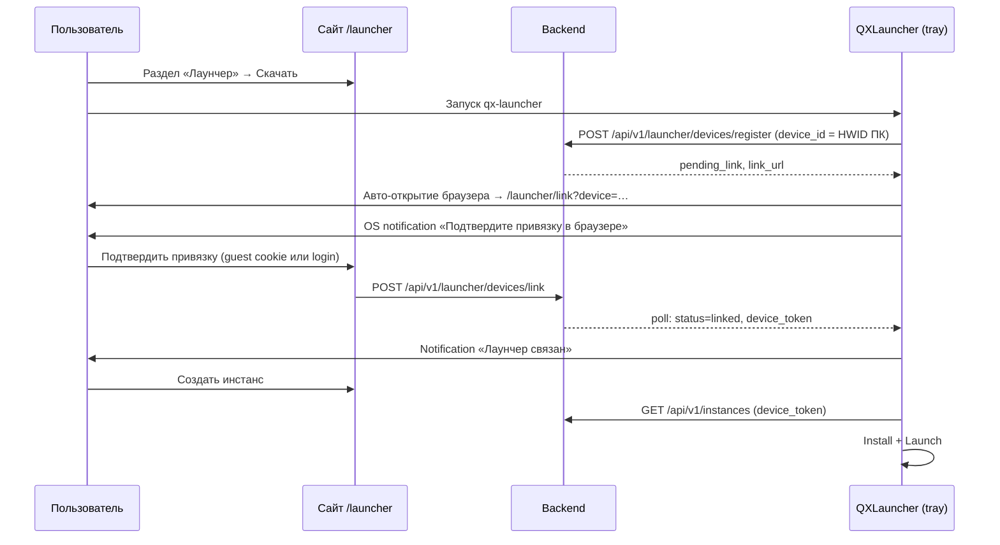
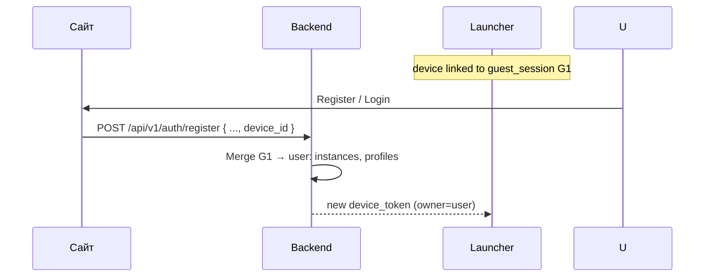
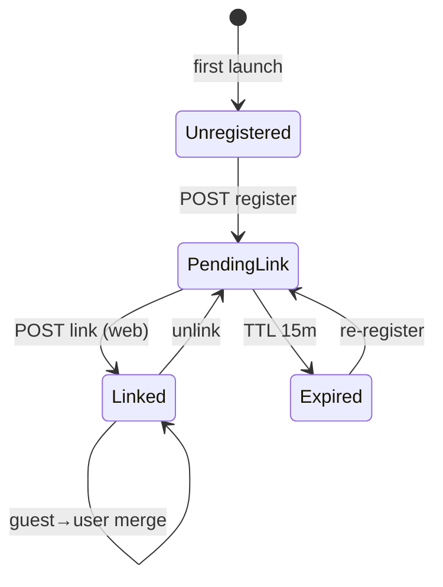

# Device Linking — Связь Launcher ↔ Сайт

> **Статус реализации:** ✅ Phase 1+ — `POST /api/v1/launcher/devices/*`, web `/launcher/link`, tray poll; manual ☑ (A09, L03).
> REST base: `/api/v1` — пути в §3 API относительные к base.
> Решение **E6**: обязательная привязка лаунчера к сайту **до** создания инстансов и игры.
> Работает **без регистрации** (guest) и **с аккаунтом** (после login — re-link или merge).
> **Конфиг:** [configuration.md](./configuration.md) — `launcher.toml` (`api_base_url`, `device_token_path`).

---

## 1. Принцип

| Правило | Описание |
| --------- | ---------- |
| **Обязательно** | Нельзя создавать инстансы и играть, пока `launcher_devices.status ≠ linked` |
| **Registered** | Login на сайте → confirm link → `device_token` привязан к `user_id` |
| **Без регистрации** | Guest на сайте + linked device = полный guest-flow |
| **UI на сайте** | Управление инстансами — **`/launcher`** (React SPA), не в окне tray |
| **Go daemon** | Tray: launch-bridge poll, JVM, Java, уведомления |
| **Guest vs Registered** | Guest (linked): Vanilla, Local. Registered+auth: mods, shaders, resource packs, modpacks — [security-legal §8](./security-legal.md) |

---

## 2. User Flow



### 2.1 Шаги для пользователя

1. Зайти на сайт → **Лаунчер** → скачать установщик.
2. Запустить **qx-launcher** (иконка в трее).
3. **Браузер откроется автоматически** на `/launcher/link?device=<HWID>` — подтвердите привязку.
4. Если браузер не открылся: **ПКМ по иконке в трее** → **«Связать QXLauncher»**.
5. На сайте нажать **«Продолжить как гость»** или **«Связать устройство»** (если вы в аккаунте).
6. Создать инстанс на сайте → лаунчер sync → **Играть**.

**Идентификатор устройства (`device_id`):** стабильный UUID, производный от HWID ПК (Windows: `MachineGuid`, Linux: `/etc/machine-id`). Хранится в `~/.qx/device_id`. Коды подтверждения не используются — секрет в URL + TTL 15 мин + кнопка на сайте.

---

## 3. Tray UI (Go launcher)

| Элемент | Поведение |
| --------- | ----------- |
| Иконка в трее | Статус: 🔴 не связан / 🟢 связан |
| ЛКМ | Открыть сайт `/launcher` в браузере *(Windows: через пункт меню «Открыть сайт» — ограничение `fyne.io/systray`)* |
| ПКМ меню | «Связать QXLauncher» (если не linked) · «Открыть сайт» · «Выход» |
| Уведомления | pending_link · linked · update available · instance ready |

**WebView не используется** — весь UI на сайте ([ADR-0006](./adr/0006-launcher-website-ui.md)).

---

## 4. API

| Method | Path | Кто | Описание |
| -------- | ------ | ----- | ---------- |
| POST | `/launcher/devices/register` | Go app | `{ device_id, os, hostname, launcher_version }` |
| GET | `/launcher/devices/{id}/status` | Go app | Poll: `pending_link` or `linked` |
| POST | `/launcher/devices/link` | Web SPA | `{ device_id }` + guest cookie или JWT |
| POST | `/launcher/devices/unlink` | Web / Go | Отвязка |
| GET | `/launcher/devices/pending` | Web SPA | Список ожидающих (same browser IP/session) — optional |

### Register response (pending)

```json
{
  "device_id": "uuid-from-hwid",
  "status": "pending_link",
  "link_url": "https://qx.example.com/launcher/link?device=uuid-from-hwid",
  "poll_interval_sec": 3,
  "expires_at": "2026-06-09T13:00:00Z"
}
```

### Link response (Go poll)

```json
{
  "status": "linked",
  "device_token": "eyJ...",
  "owner_type": "guest",
  "guest_session_id": "uuid"
}
```

После link Go сохраняет `device_token` локально (`~/.qx/device_token`, путь — `device_token_path` в `launcher.toml`).

---

## 5. Guest → User migration (при регистрации)

Когда пользователь **регистрируется** или **логинится** на сайте, уже имея linked guest device:



| Данные | Политика merge |
| -------- | ---------------- |
| `launcher_instances` | `guest_session_id` → `user_id` |
| `offline_profiles` | Перенос на `user_id` |
| `launcher_devices` | `guest_session_id` → `user_id` |

Конфликт имён инстансов: suffix `(imported)`.

---

## 6. Security

| Риск | Митигация |
| ------ | ----------- |
| Hijack device link | Уникальный HWID в URL + TTL 15 min + confirm на сайте |
| Stolen device_token | Rotate on re-link; bind to device_id |
| Fake register | Rate limit по IP; `device_id` = HWID (не угадываемый UUID) |

---

## 7. State machine



---

*См. [api.md](./api.md), [schema.sql](./schema.sql), [launch-bridge.md](./launch-bridge.md), [configuration.md](./configuration.md)*

Последнее обновление: 2026-06-21 (HWID + auto browser, без user_code)
