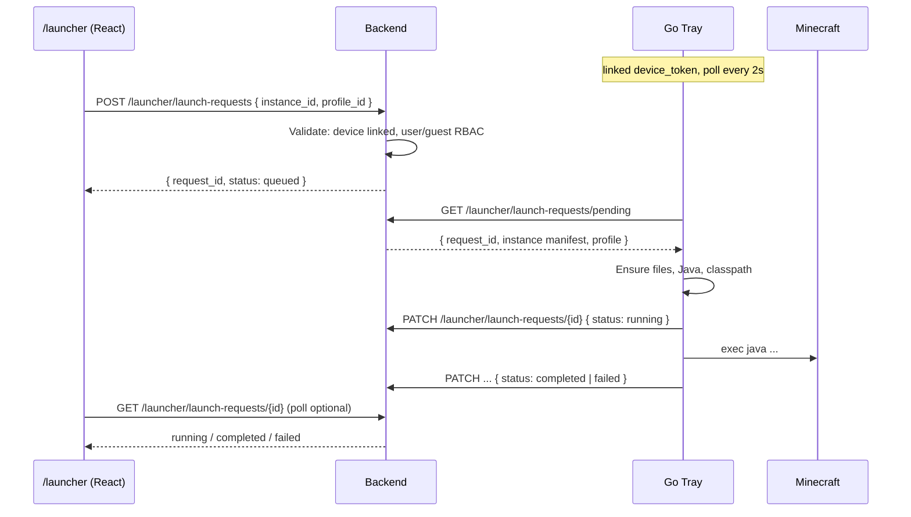
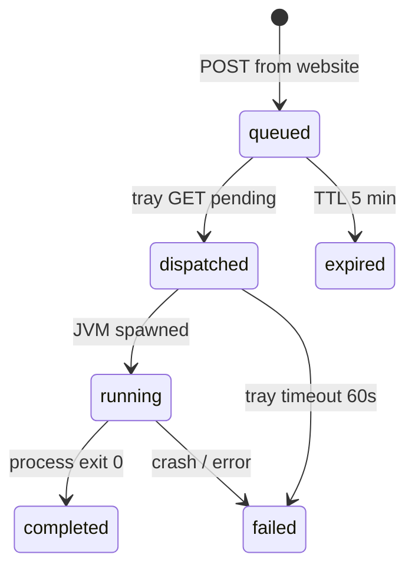

# Launch Bridge — Site → Tray → JVM

> Решение **B1**: **гибрид** — сайт создаёт launch request в API, Go tray poll'ит и запускает JVM.  
> ADR: [0008](./adr/0008-launch-bridge-hybrid.md)

---

## 1. Принцип

| Комponent | Роль |
|-----------|------|
| **`/launcher` на сайте** | UI: кнопка «Играть», выбор инстанса/аккаунта |
| **Backend API** | Очередь `launch_requests`, авторизация, manifest |
| **Go tray (ПК)** | Poll, скачивание файлов, Mojang Java, spawn JVM |

Tray **не имеет UI** — только tray icon, notifications, local engine.

---

## 2. Sequence



---

## 3. API

### 3.1 Create (website)

```
POST /v1/launcher/launch-requests
Authorization: Bearer <user_jwt> | Cookie guest + X-Device-Token
```

```json
{
  "instance_id": "uuid",
  "offline_profile_id": "uuid",
  "jvm_args_override": []
}
```

**RBAC:**

| Owner | Может launch |
|-------|--------------|
| Guest (linked) | Vanilla instances only |
| Registered user | All loaders + mods/shaders/resource packs |

Response `201`:

```json
{
  "id": "uuid",
  "status": "queued",
  "expires_at": "2026-06-09T12:05:00Z"
}
```

### 3.2 Poll pending (tray)

```
GET /v1/launcher/launch-requests/pending
Authorization: Bearer <device_token>
```

Returns **at most one** oldest `queued` request for this device. Atomically marks `dispatched`.

### 3.3 Status update (tray)

```
PATCH /v1/launcher/launch-requests/{id}
Authorization: Bearer <device_token>
```

```json
{ "status": "running", "pid": 12345 }
{ "status": "completed", "exit_code": 0 }
{ "status": "failed", "error": "JAVA_NOT_FOUND" }
```

### 3.4 UI poll (optional)

```
GET /v1/launcher/launch-requests/{id}
```

For progress spinner on website.

---

## 4. State machine



| Status | Meaning |
|--------|---------|
| `queued` | Waiting for tray |
| `dispatched` | Sent to tray, not started yet |
| `running` | JVM alive |
| `completed` | Clean exit |
| `failed` | Error |
| `expired` | Tray offline too long |

---

## 5. Tray loop

```go
// every 2 seconds when linked
for {
    req, err := api.FetchPendingLaunch(ctx, deviceToken)
    if req != nil {
        go executeLaunch(req) // download, java, spawn
    }
    sleep(2 * time.Second)
}
```

**Also poll:** instance sync (30s), launch requests (2s), device link status (3s when pending).

---

## 6. Local execution (tray)

1. Load instance manifest from API (or embedded in launch request).
2. Resolve Mojang Java — [mojang-java.md](./mojang-java.md).
3. Verify / download assets, libraries, mods.
4. Build classpath, natives, modloader processors.
5. `exec.Command(java, args...)` with log file `%APPDATA%/QX/logs/{instance_id}.log`.
6. Notify OS on failure; PATCH API status.

---

## 7. Offline tray

If API unreachable but instance cached locally:

- **Guest:** block launch (must be online for first install).
- **Registered:** optional offline launch cached instance (post-MVP, feature flag).

MVP: **online required** for launch.

---

## 8. Security

| Risk | Mitigation |
|------|------------|
| Hijack launch request | Bound to `device_id`; only linked tray receives |
| Spam Play button | Rate limit 5/min per user — [security-legal.md](./security-legal.md) |
| Malicious manifest | Tray verifies SHA256 from API; API signs manifest server-side |

---

## 9. DDL

```sql
-- see schema.sql: launch_requests
```

---

*См. [device-linking.md](./device-linking.md), [api.md](./api.md)*
