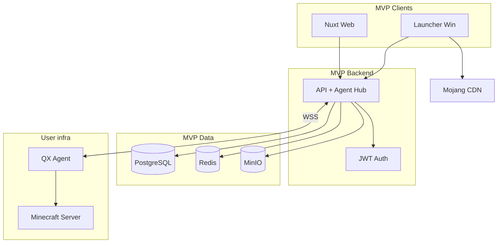
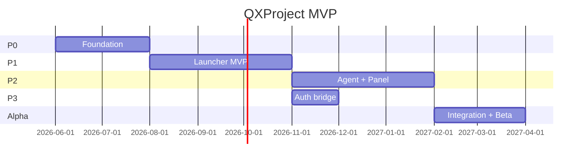

# QXProject — MVP

> Минимально жизнеспособный продукт для закрытой alpha.
> Полная архитектура: [architecture.md](./architecture.md)

**Статус:** v1.2
**Launch:** [launch-bridge.md](./launch-bridge.md) — гибрид site → tray → JVM
**RBAC:** [security-legal.md §8](./security-legal.md) — Guest: Vanilla; Registered: mods/shaders/RP

---

## 1. Цель MVP

Доказать, что экосистема QX **работает end-to-end** для трёх базовых сценариев:

1. **Игра с регистрацией** — сайт → лаунчер → инстанс → запуск Vanilla.
2. **Игра без регистрации** — download → **link device** → guest → инстанс → игра.
3. **Управление сервером** — BYOS Linux VPS → **SSH deploy** agent → start/stop + live-консоль.

**Не цель MVP:** modpacks, modloaders (Forge / NeoForge / Fabric / Quilt), Premium, Microsoft OAuth, macOS/Linux, полный
agent (RCON, files).

---

## 2. Критерии успеха (Definition of Done)

MVP считается готовым, когда:

- [ ] Пользователь регистрируется на сайте и входит в лаунчер тем же аккаунтом.
- [ ] Пользователь скачивает tray, **связывает с сайтом** (tray / notification), создаёт инстанс на `/launcher`, играет.
- [ ] На сайте создаётся инстанс (Vanilla) → `POST /launcher/launch-requests` → tray poll → JVM.
- [ ] Админ добавляет Linux VPS (SSH), backend deploy agent, start/stop JAR из panel.
- [ ] Live-консоль сервера в web (WebSocket).
- [ ] Launcher UI на сайте **`/launcher`** (React, не WebView) показывает инстансы и кнопку «Играть».
- [ ] Test matrix: [qa/test-matrix.md](./qa/test-matrix.md).

---

## 3. Scope: в MVP / вне MVP

### ✅ В MVP v1

| Область | Функционал |
| --------- | ------------ |
| **Web (panel-ui)** | React + Vite + Ant Design — лендинг, auth, instances, servers |
| **Launcher UI** | React на сайте `/launcher` (не WebView) |
| **Guest (linked)** | Vanilla, Local profile, базовые инстансы |
| **Registered** | То же + mods/shaders/resource packs (post-MVP loaders) |
| **API** | Go + Gin + GORM |
| **Agent** | Go, **Linux only**, SSH deploy, systemd |
| **Launcher tray** | Go — link, launch-bridge poll, JVM, Mojang Java, notifications |
| **Интеграции** | **Mojang** manifest + assets (Vanilla) |
| **Infra** | Docker Compose: API, Web, PG, Redis, MinIO, Nginx |

### ❌ Вне MVP (v2+)

| Область | Отложено |
| --------- | ---------- |
| Modloaders | Forge, NeoForge, Fabric, Quilt |
| Modpacks | CurseForge, Modrinth |
| Auth | Microsoft OAuth, QXAccount sync между устройствами |
| Launcher | macOS, Linux |
| Agent | RCON, файловый менеджер, плагины/моды, метрики TPS |
| Skin/Cape server | Только registered users |
| Public server list | Launcher UI → GET /public/servers |
| Modpack client↔server sync | Shared modpack_id + agent install |
| Multi-admin | server_members |
| Billing | Premium |

---

## 4. User flows (MVP)

### Flow A — Registered player

```text
Register (Web) → Download tray → Link device
→ Create instance on /launcher (Vanilla) → POST launch-request
→ Local or QX profile → Tray spawns JVM
```

### Flow B — Guest player

```text
Download tray (Web) → Link device (guest session)
→ Create Vanilla instance on /launcher
→ Local profile → Play (launch-bridge)
```

### Flow C — Server admin

```text
Add Linux VPS (SSH creds) → POST /servers/{id}/deploy → Agent online → Start/Stop → Console
```

---

## 5. Компоненты MVP



### 5.1 Web (Junior + Senior review)

| Страница | Функции |
| ---------- | --------- |
| `/` | Лендинг, ссылка на скачивание лаунчера |
| `/auth/register`, `/auth/login` | Email + password |
| `/profile` | Имя, email, смена пароля |
| `/instances` | Список, создать (mc version dropdown), удалить |
| `/servers` | Список, добавить (pairing token), статус badge |
| `/servers/:id` | Start / Stop / Restart, live-консоль |

**Стек:** Nuxt 4 + Nuxt UI.

### 5.2 API (Senior)

| Модуль | MVP endpoints |
| -------- | --------------- |
| Auth | `POST /auth/register`, `POST /auth/login`, `POST /auth/refresh`, `POST /auth/guest` |
| Instances | `GET/POST/DELETE /instances`, `GET /instances/:id/manifest` |
| Launch | `POST /launcher/launch-requests`, tray `GET .../pending`, `PATCH .../{id}` |
| Servers | `GET/POST/PATCH/DELETE /servers`, `POST /servers/:id/start`, `stop`, `restart` |
| Agent | WSS `/agent/connect`, pairing `POST /agent/pair` |
| Console | WSS `/servers/:id/console` (proxy → agent) |

### 5.3 Launcher (Senior)

| Функция | MVP |
| --------- | ----- |
| Платформа | Windows 10/11 |
| Auth | QX login + guest device token |
| Accounts | Local nickname only (Microsoft → v2) |
| Versions | Vanilla, 2–3 версии MC (напр. 1.20.4, 1.21) |
| Instance sync | Launch-bridge poll 2s + manifest fetch |
| Java | Auto-detect or bundled JRE 17 |
| Update | Manual download с сайта (auto-update → v2) |

**Codebase:** свой Go tray — **не GML fork** ([ADR-0010](./adr/0010-own-launcher-not-gml.md)); Prism/GML — референс
алгоритмов.

### 5.4 Agent (Senior)

| Команда | MVP |
| --------- | ----- |
| `server.start` | ✅ |
| `server.stop` | ✅ |
| `server.restart` | ✅ |
| `console.input` | ✅ |
| `agent.heartbeat` | ✅ |
| `console.output` stream | ✅ |
| `rcon.*` | ❌ v2 |
| `files.*` | ❌ v2 |

**Платформы agent:** Linux + Windows (server OS).

---

## 6. Модель данных (MVP subset)

```text
User          — id, email, password_hash, created_at
GuestSession  — device_token, expires_at (optional table)
Instance      — id, user_id|null, guest_token|null, name, mc_version, loader=vanilla
Server        — id, owner_id, name, status, agent_token_hash, config (jar, ram, port)
Agent         — id, server_id, hostname, connected_at
```

---

## 7. Инфраструктура MVP

Один VPS (4–8 GB RAM), Docker Compose:

| Service | Назначение |
| --------- | ------------ |
| `nginx` | TLS, reverse proxy |
| `api` | Backend + Agent Hub |
| `web` | Nuxt |
| `postgres` | Данные |
| `redis` | Sessions, pub/sub |
| `minio` | Launcher builds, instance assets cache |

**Домены (пример):**

- `qx.example.com` — web
- `api.qx.example.com` — REST + WSS

Детали: [architecture.md §10](./architecture.md).

**Бюджет:** $5–30/мес.

---

## 8. Фазы и чеклист

### Phase 0 — Foundation *(6–8 нед)*

**Milestone:** можно зарегистрироваться и войти.

| # | Задача | Ответственный |
| --- | -------- | --------------- |
| 0.1 | Monorepo scaffold (`pnpm`, apps/api, apps/web) | Senior |
| 0.2 | Docker Compose dev | Senior |
| 0.3 | PostgreSQL schema: users | Senior |
| 0.4 | Auth API: register, login, JWT | Senior |
| 0.5 | Web: login, register, profile | Junior |
| 0.6 | CI: lint + build (optional) | Senior |

### Phase 1 — Launcher first *(10–14 нед)*

**Milestone:** скачал → **связал** → Vanilla → играет.

> **Порядок:** Launcher до Agent — быстрее видимый результат.

| # | Задача | Ответственный |
| --- | -------- | --------------- |
| 1.1 | Go tray + device register/link poll | Senior |
| 1.2 | Web `/launcher/link` page + API | Junior |
| 1.3 | internal/minecraft: Mojang manifest | Senior |
| 1.4 | Download assets/libraries, launch Vanilla | Senior |
| 1.5 | Local profile (offline username) | Senior |
| 1.6 | API: instances CRUD (linked device) | Senior |
| 1.7 | Web: /launcher pages, create instance | Junior |
| 1.8 | Tray sync instances | Senior |

### Phase 2 — Agent + Panel *(8–12 нед)*

**Milestone:** сервер управляется из web.

| # | Задача | Ответственный |
| --- | -------- | --------------- |
| 2.1 | SSH deploy job + agent WSS connect | Senior |
| 2.2 | Agent: start/stop/restart JAR | Senior |
| 2.3 | Agent: console stream | Senior |
| 2.4 | API: servers CRUD, deploy, agent routing | Senior |
| 2.5 | Web: server form (SSH), deploy button | Junior |
| 2.6 | Web: server detail, start/stop, console WS | Junior + Senior |

### Phase 3 — Auth bridge *(2–4 нед)*

**Milestone:** registered user flow полный.

| # | Задача | Ответственный |
| --- | -------- | --------------- |
| 3.1 | Launcher: QX login (JWT) | Senior |
| 3.2 | Instances привязаны к user_id | Senior |
| 3.3 | Web: «Мои инстансы» для auth user | Junior |

### Phase Alpha — Integration *(4–6 нед)*

**Milestone:** закрытая beta.

| # | Задача | Ответственный |
| --- | -------- | --------------- |
| A.1 | E2E: Flow A, B, C | Senior |
| A.2 | Test matrix + bug bash | Junior |
| A.3 | Prod deploy на VPS | Senior |
| A.4 | User docs (README, FAQ) | Junior |
| A.5 | Fix P0/P1 bugs | Senior |

---

## 9. Gantt (ориентир)



---

## 10. Риски MVP

| Риск | Действие |
| ------ | ---------- |
| Launcher с нуля затягивается | Prism/GML — референс; MVP scope = Vanilla only |
| Senior перегружен | Junior только UI; Agent не начинать до launcher play |
| Scope creep | Любая фича вне §3 — в backlog v2 |
| Guest ↔ User merge | Explicitly out of MVP |

---

## 11. Backlog после MVP (v2 preview)

Приоритет после alpha:

1. Forge / NeoForge / Fabric / Quilt
2. CurseForge + Modrinth modpacks
3. Microsoft OAuth
4. macOS / Linux launcher
5. Agent: RCON, file manager
6. Premium + billing
7. Guest → User migration

---

## 12. Связанные документы

| Документ | Содержание |
| ---------- | ------------ |
| [architecture.md](./architecture.md) | Полная архитектура |
| [api.md](./api.md) | REST + WebSocket API |
| [agent-protocol.md](./agent-protocol.md) | Agent WSS, SSH deploy, idempotency |
| [schema.sql](./schema.sql) | PostgreSQL DDL |
| [qa/test-matrix.md](./qa/test-matrix.md) | QA alpha |
| [adr/](./adr/) | ADR |

---

Последнее обновление: 2026-06-09 (v1.1 — стек Go + React)
