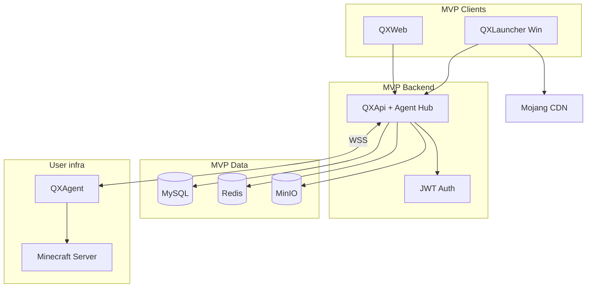
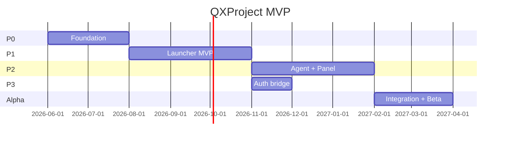

# QXProject — MVP

> Минимально жизнеспособный продукт для закрытой alpha.
> Полная архитектура: [architecture.md](./architecture.md)

**Статус:** v1.18 — **MVP alpha (dev/manual) ✅** · **Prod 🔲 не готов**
**Реализация:** Phase 0 ✅ · Phase 1 ✅ · Phase 2 ✅ · Phase 3 ✅ · Phase Alpha (flows) ✅ · **Prod deploy** 🔲

### Что уже в репозитории

| Область | Готово |
| --------- | -------- |
| Monorepo | `go.work`, `services/*`, `web/qxweb`, `pkg/mcmanifest`, `pkg/protocol` |
| QXApi | Auth, launcher, **servers CRUD/deploy/start/stop**, agent WSS hub |
| QXWeb | `/launcher`, **`/servers`** — SSH-форма, Deploy agent, теги Agent/Minecraft |
| QXLauncher | Device register/link, **иконка в трее**, launch-bridge poll, Vanilla download |
| QXAgent | WSS client, start/stop JAR (`QX_AGENT_DRY_RUN=1` для dev) |
| Infra | `make dev-up` — MySQL, Redis, MinIO; `make dev-vps-up` — dev VPS для Flow C |
| Тесты | Go + React — unit coverage, CI, Playwright Flow A+B+C |
**Launch:** [launch-bridge.md](./launch-bridge.md) — гибрид site → QXLauncher → JVM
**RBAC:** [security-legal.md §8](./security-legal.md) — MVP: Guest и Registered — **Vanilla only**; mods/shaders/RP — v2+
**Server content:** [server-content-install.md](./server-content-install.md) — mods/plugins по `server_type` (post-MVP)  
**Prod:** 🔲 [§7.1](./mvp.md#71-prod-readiness-не-пройдено)

---

## 1. Цель MVP

Доказать, что экосистема QX **работает end-to-end** для трёх базовых сценариев:

1. **Игра с регистрацией** — register → login → download QXLauncher → **link device** → инстанс → launch-bridge → Vanilla.
2. **Игра без регистрации** — download QXLauncher → **link device** → guest → инстанс → игра.
3. **Управление сервером** — BYOS Linux VPS → **SSH deploy** agent → (при запущенном MC) Stop/Restart + live-консоль.

**Не цель MVP:** modpacks, modloaders (Forge / NeoForge / Fabric / Quilt), Premium, Microsoft OAuth, macOS/Linux, полный
agent (RCON, files), **кнопка Start и install JAR из UI** (API готов, UI — post-MVP).

---

## 2. Критерии успеха (Definition of Done)

MVP считается готовым, когда:

- [x] Пользователь регистрируется, логинится, скачивает QXLauncher, **связывает device с аккаунтом**, создаёт инстанс на
  `/launcher`, играет. *(Flow A — manual QXLauncher + JVM ☑)*
- [x] Пользователь скачивает QXLauncher, **связывает с сайтом** (guest или logged-in), создаёт инстанс на `/launcher`, играет.
  *(Flow B — manual QXLauncher + JVM ☑)*
- [x] На сайте создаётся инстанс (Vanilla) → `POST /api/v1/launcher/launch-requests` → QXLauncher poll → JVM. *(API + `make e2e-dry-run` без реального JVM)*
- [x] Админ добавляет Linux VPS (SSH), backend **deploy agent** из panel. *(manual dev VPS ☑ — `make dev-vps-up`)*
- [x] API: start/stop/restart JAR через agent hub. *(unit + router Flow C ☑)*
- [x] Live-консоль сервера в web (WebSocket), когда `minecraft_running === true`. *(API ☑; UI показывает консоль только при запущенном MC)*
- [x] Launcher UI на сайте **`/launcher`** (React, не WebView) показывает инстансы и кнопку «Играть».
- [x] Test matrix: [qa/test-matrix.md](./qa/test-matrix.md) — **Flow A/B manual ☑** (A09, L03, I04, I05); **Flow C deploy ☑** (S01, S02, S11); S03–S06 MC из UI — post-MVP.

> **Prod ≠ MVP alpha.** Definition of Done выше — для **закрытой alpha в dev** (local + dev VPS). Выход в **production** (TLS, домены, секреты, smoke на реальном VPS, бэкапы) — отдельный чеклист, см. §7.1.

---

## 3. Scope: в MVP / вне MVP

### ✅ В MVP v1

| Область | Функционал |
| --------- | ------------ |
| **QXWeb** (`web/qxweb/`) | React + Vite + Ant Design — лендинг, auth, instances, servers, `/launcher` |
| **Launcher UI** | React на QXWeb `/launcher` (не WebView, [ADR-0006](./adr/0006-launcher-website-ui.md)) |
| **Guest (linked)** | Vanilla, Local profile, базовые инстансы |
| **Registered** | MVP: то же (Vanilla); mods/shaders/RP/modpacks — **v2+** |
| **API** | Go + Gin + GORM |
| **Agent** | Go, **Linux only**, SSH deploy, systemd |
| **QXLauncher** (`services/qxlauncher/`) | Windows-приложение — device link, launch-bridge poll, JVM, Mojang Java, уведомления |
| **Интеграции** | **Mojang** manifest + assets (Vanilla) |
| **Infra** | Docker Compose: API, Web, MySQL, Redis, MinIO, Nginx |

### ❌ Вне MVP (v2+)

| Область | Отложено |
| --------- | ---------- |
| Modloaders | Forge, NeoForge, Fabric, Quilt |
| Modpacks | CurseForge, Modrinth |
| Auth | Microsoft OAuth, QXAccount sync между устройствами |
| Launcher | macOS, Linux |
| Agent | RCON, файловый менеджер, mods/plugins по `server_type`, метрики TPS |
| **Server UI** | Кнопка **Start**, install JAR/modpack из panel |
| Skin/Cape server | Только registered users |
| Public server list | Launcher UI → GET /public/servers |
| Modpack client↔server sync | Shared modpack_id + agent install |
| Multi-admin | server_members |
| Billing | Premium |

---

## 4. User flows (MVP)

### Flow A — Registered player

```text
Register + Login (QXWeb) → Download QXLauncher → Link device (JWT confirm on /launcher/link)
→ Create instance on /launcher (Vanilla) → POST launch-request
→ Local or QX profile → QXLauncher spawns JVM
```

### Flow B — Guest player

```text
Download QXLauncher (Web) → Link device (guest session)
→ Create Vanilla instance on /launcher
→ Local profile → Play (launch-bridge)
```

### Flow C — Server admin

```text
Add Linux VPS (SSH creds) → Deploy agent → agent_online (WSS)
→ (MC JAR на VPS вручную или post-MVP install pipeline)
→ POST start (API) или agent cmd → minecraft_running → Stop/Restart + Console WS
```

**Dev VPS:** `make dev-vps-up` → SSH `localhost:2222`, `.env`: `QX_PUBLIC_API_URL=http://host.docker.internal:3000`.
После Deploy в panel: тег **Agent** (синий), статус MC — **offline** до запуска JAR.

---

## 5. Компоненты MVP



### 5.1 QXWeb (Junior + Senior review)

| Страница | Функции |
| ---------- | --------- |
| `/` | Лендинг, ссылка на скачивание QXLauncher |
| `/auth/:mode` | Редирект → модалка входа/регистрации (email + password) |
| `/profile` | Email, смена email и пароля (модалки); имя недоступно |
| `/launcher`, `/launcher/link` | Страница лаунчера (Phase 1: инстансы, device link, «Играть») |
| `/servers` | Список, добавить (SSH creds, `server_type`), Deploy agent, тег Agent |
| `/servers/:id` | Deploy agent; Stop/Restart — **только при `minecraft_running`**; live-консоль — при MC running / starting / error |

**Стек:** TypeScript + React + Vite + Ant Design ([ADR-0001](./adr/0001-tech-stack.md)).

**Статусы сервера (API):** `agent_online` — WSS agent подключён; `minecraft_running` — процесс JAR с `mc_pid`; `status` — lifecycle MC (`offline`, `starting`, `online`, `error`).

### 5.2 QXApi (Senior)

**REST base:** `https://api.qx.example.com/api/v1` (dev: `http://localhost:3000/api/v1`).  
Пути ниже — относительно base. Agent WSS: `/agent/v1/connect` (вне `/api/v1`).

| Модуль | MVP endpoints | Phase 0 |
| -------- | --------------- | --------- |
| Health | `GET /health`, `GET /health/ready` | ✅ |
| Auth | `POST /auth/register`, `/login`, `/refresh`, `/guest`, `/logout` | ✅ |
| Users | `GET /users/me`, `PATCH /users/me/password`, `PATCH /users/me/email` | ✅ |
| Devices | `POST /launcher/devices/register`, `link`, `GET .../status`, `GET /users/me/launcher-device` | ✅ |
| Instances | `GET/POST/DELETE /instances`, `GET /instances/:id/manifest` | ✅ |
| Launch | `POST /launcher/launch-requests`, QXLauncher `GET .../pending`, `PATCH .../{id}` | ✅ |
| Servers | `GET/POST/PATCH/DELETE /servers`, `POST /servers/:id/deploy`, `start`, `stop`, `restart` | ✅ |
| Agent | WSS `/agent/v1/connect` (JWT at SSH deploy) | ✅ |
| Console | WS `/servers/:id/console?access_token=…` (proxy → agent) | ✅ |

Полная спецификация: [api.md](./api.md). Server mods/plugins — post-MVP: [server-content-install.md](./server-content-install.md).

### 5.3 QXLauncher (Senior)

| Функция | MVP |
| --------- | ----- |
| Платформа | Windows 10/11 |
| Auth | QX login + guest device token |
| Accounts | Local nickname only (Microsoft → v2) |
| Versions | Vanilla, 2–3 версии MC (напр. 1.20.4, 1.21) |
| Instance sync | Launch-bridge poll 2s + manifest fetch |
| Java | Auto-detect or bundled JRE 17 |
| Update | Manual download с сайта (auto-update → v2) |

**Codebase:** свой QXLauncher — **не GML fork** ([ADR-0010](./adr/0010-own-launcher-not-gml.md)); Prism/GML — референс
алгоритмов.

### 5.4 QXAgent (Senior)

| Команда | MVP |
| --------- | ----- |
| `server.start` | ✅ |
| `server.stop` | ✅ |
| `server.restart` | ✅ |
| `console.input` | ✅ |
| `agent.heartbeat` | ✅ |
| `console.output` stream | ✅ |
| `rcon.*` | ❌ v2 |
| `files.*` | ❌ v2 |

**Платформа agent:** **Linux only** ([ADR-0003](./adr/0003-agent-linux-ssh-deploy.md)); Windows server OS — не поддерживается.

---

## 6. Модель данных (MVP subset)

```text
User          — id, email, password_hash, created_at
GuestSession  — device_token, expires_at (optional table)
Instance      — id, user_id|null, guest_token|null, name, mc_version, loader=vanilla
Server        — id, owner_id, name, status, agent_token_hash, config (jar, ram, port, mc_pid)
Agent         — id, server_id, hostname, connected_at
```

---

## 7. Инфраструктура MVP

**Dev (Phase 0, сейчас):** `make dev-up` — MySQL, Redis, MinIO. API и QXWeb — на хосте.

**Prod MVP** — один VPS (4–8 GB RAM), Docker Compose:

| Service | Назначение |
| --------- | ------------ |
| `nginx` | TLS, reverse proxy |
| `api` | Backend + Agent Hub |
| `web` | QXWeb static (React SPA) |
| `mysql` | Данные, manifests |
| `redis` | Sessions, pub/sub |
| `minio` | Launcher builds, server backups, skins (не client/server modpack files) |

**Домены (пример):**

- `qx.example.com` — web
- `api.qx.example.com/api/v1` — REST
- `api.qx.example.com/agent/v1/connect` — Agent WSS

Детали: [architecture.md §8.3 Tier 0](./architecture.md).

**Бюджет:** $5–30/мес.

### 7.1 Prod readiness *(не пройдено)*

Infra-скрипты есть (`docker-compose.prod.yml`, `infra/scripts/deploy.sh`), но **prod пока не готов**:

| # | Задача | Статус |
| --- | -------- | -------- |
| P.1 | Prod VPS + `make prod-up` smoke | 🔲 |
| P.2 | TLS (Let's Encrypt) + домены | 🔲 |
| P.3 | Секреты: JWT, MySQL, `SSH_MASTER_KEY`, `.env.prod` | 🔲 |
| P.4 | N02 — HTTPS valid (test matrix) | 🔲 |
| P.5 | Бэкапы MySQL, мониторинг | 🔲 |
| P.6 | Bug bash на prod-окружении | 🔲 |

---

## 8. Фазы и чеклист

### Phase 0 — Foundation *(6–8 нед)* ✅

**Milestone:** можно зарегистрироваться и войти — **достигнут** (2026-06).

| # | Задача | Ответственный | Статус |
| --- | -------- | --------------- | -------- |
| 0.1 | Monorepo scaffold (`go.work`, `services/qxapi`, `web/qxweb`) | Senior | ✅ |
| 0.2 | Docker Compose dev | Senior | ✅ |
| 0.3 | MySQL schema: users | Senior | ✅ |
| 0.4 | Auth API: register, login, refresh, guest, logout, JWT | Senior | ✅ |
| 0.5 | Web: login, register, profile | Junior | ✅ |
| 0.6 | CI: lint, test, build | Senior | ✅ |
| 0.7 | Unit tests 100% (qxapi, qxweb) | Senior | ✅ |

### Phase 1 — Launcher first *(10–14 нед)*

**Milestone:** скачал → **связал** → Vanilla → играет.

> **Порядок:** Launcher до Agent — быстрее видимый результат.

| # | Задача | Ответственный | Статус |
| --- | -------- | --------------- | -------- |
| 1.1 | QXLauncher + device register/link poll | Senior | ✅ |
| 1.2 | Web `/launcher/link` page + API | Junior | ✅ |
| 1.3 | `pkg/mcmanifest`: Mojang manifest | Senior | ✅ |
| 1.4 | Download assets/libraries, launch Vanilla | Senior | ✅ jar + libs + natives + assets |
| 1.5 | Local profile (offline username) | Senior | ✅ |
| 1.6 | API: instances CRUD (linked device) | Senior | ✅ |
| 1.7 | Web: /launcher pages, create instance | Junior | ✅ |
| 1.8 | QXLauncher sync instances | Senior | ✅ poll → `~/.qx/instances.json` |
| 1.9 | QXLauncher UI в трее (icon, menu, OS notify) | Senior | ✅ `fyne.io/systray` |

### Phase 2 — Agent + Panel *(8–12 нед)*

**Milestone:** agent deploy из web; MC lifecycle — API + agent; UI Start — post-MVP.

| # | Задача | Ответственный | Статус |
| --- | -------- | --------------- | -------- |
| 2.1 | SSH deploy job + agent WSS connect | Senior | ✅ `internal/deploy` SSH + systemd |
| 2.2 | Agent: start/stop/restart JAR | Senior | ✅ QXAgent + `cmd.server.*` |
| 2.3 | Agent: console stream | Senior | ✅ stdout/stderr → agent, `cmd.console.input` |
| 2.4 | API: servers CRUD, deploy, agent routing | Senior | ✅ |
| 2.5 | Web: server form (SSH), deploy button | Junior | ✅ |
| 2.6 | Web: server detail, Stop/Restart + console (при `minecraft_running`) | Junior + Senior | ✅ |
| 2.7 | Web: Start + install JAR pipeline | Junior + Senior | 🔲 post-MVP |

### Phase 3 — Auth bridge *(2–4 нед)*

**Milestone:** registered user flow полный.

| # | Задача | Ответственный | Статус |
| --- | -------- | --------------- | -------- |
| 3.1 | Launcher: QX login (JWT) + refresh | Senior | ✅ `user_auth.json`, `EnsureFreshAccessToken` |
| 3.2 | Instances привязаны к user_id | Senior | ✅ `FindLinkedDevice`, device owner scope |
| 3.3 | Web: «Мои инстансы» + статус device | Junior | ✅ `/users/me/launcher-device`, UI alert |

### Phase Alpha — Integration *(4–6 нед)*

**Milestone:** закрытая beta **в dev**; prod — отдельно (§7.1).

| # | Задача | Ответственный | Статус |
| --- | -------- | --------------- | -------- |
| A.1 | E2E: Flow A, B, C | Senior | ✅ `TestRouterFlowA_*`, `TestRouterFlowB_*`, `TestRouterFlowC_*` + Playwright |
| A.2 | Test matrix + bug bash (dev) | Junior | ✅ Flow A/B manual ☑ (A09, L03, I04, I05); Flow C deploy ☑ (S01, S02, S11) |
| A.3 | Prod deploy на VPS | Senior | 🔲 infra ☑ (`docker-compose.prod.yml`); prod smoke + TLS — не пройдены |
| A.4 | User docs (README, FAQ) | Junior | ✅ [faq.md](./faq.md), README |
| A.5 | Fix P0/P1 bugs (dev) | Senior | ✅ Agent vs MC status, console WS auth, redeploy restart |

---

## 9. Gantt (ориентир)



---

## 10. Риски MVP

| Риск | Действие |
| ------ | ---------- |
| Launcher с нуля затягивается | Prism/GML — референс; MVP scope = Vanilla only |
| Senior перегружен | Junior только UI; Agent не начинать до launcher play |
| Scope creep | Любая фича вне §3 — в backlog v2 |
| Guest ↔ User merge | Explicitly out of MVP |
| Agent «online» ≠ MC running | Раздельные поля `agent_online` / `minecraft_running` в API и UI |

---

## 11. Backlog после MVP (v2 preview)

Приоритет после alpha:

1. Forge / NeoForge / Fabric / Quilt
2. CurseForge + Modrinth modpacks
3. Microsoft OAuth
4. macOS / Linux launcher
5. Agent: RCON, file manager
6. **Server UI: Start + JAR/modpack install**
7. Premium + billing
8. Guest → User migration

---

## 12. Связанные документы

| Документ | Содержание |
| ---------- | ------------ |
| [architecture.md](./architecture.md) | Полная архитектура |
| [api.md](./api.md) | REST + WebSocket API |
| [agent-protocol.md](./agent-protocol.md) | Agent WSS, SSH deploy, idempotency |
| [ssh-deploy.md](./ssh-deploy.md) | SSH deploy worker |
| [schema.sql](./schema.sql) | MySQL DDL |
| [qa/test-matrix.md](./qa/test-matrix.md) | QA alpha |
| [server-content-install.md](./server-content-install.md) | Server mods/plugins by type |
| [adr/](./adr/) | ADR |

---

Последнее обновление: 2026-06-10 (v1.19 — doc sync, prod 🔲)
