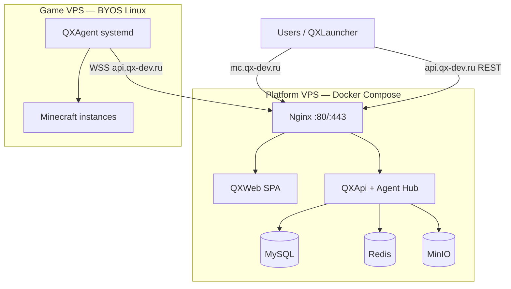

# Production Deploy — Tier 0 (Self-Hosted)

Пошаговый гайд по развёртыванию QXSystem на одном VPS: **QXWeb + QXApi + MySQL + Redis + MinIO + Nginx**, а также подключение **игровых VPS** через QXAgent.

> **Статус:** infra и этот гайд готовы к первому prod smoke; TLS и бэкапы — обязательные шаги перед публичным запуском. Чеклист: [mvp §7.1](./mvp.md#71-prod-readiness).
>
> **Platform VPS (prod):** `178.172.136.26`  
> **Домены:** API — `api.qx-dev.ru`, панель — `mc.qx-dev.ru` (см. § «Prod: api + mc»).

---

## 1. Архитектура



| VPS | Назначение | Минимум |
| --- | ---------- | ------- |
| **Platform** | Панель, API, БД | 4 GB RAM, 2 vCPU, 40 GB SSD |
| **Game** (1+) | Minecraft через QXAgent | 2+ GB RAM на инстанс, Linux x86_64 |

Подробнее: [architecture.md §8.3 Tier 0](./architecture.md).

---

## 2. Требования

### Platform VPS

- Ubuntu 22.04+ / Debian 12+
- Docker Engine 24+ и Docker Compose v2
- Домен (рекомендуется) или публичный IP
- Порты: **80**, **443** (после TLS), **22** (SSH, non-default port — по желанию)

### Game VPS (для Minecraft)

- Linux x86_64, SSH по ключу
- Исходящий **HTTPS/WSS** к platform VPS (порт 443)
- Java (устанавливается агентом при provision игрового сервера)

### Локально (перед деплоем)

- Git, Go 1.25+ (для сборки `qx-agent-linux`, если не собираете на VPS)
- `make jwt-secret` — генерация секретов

---

## 3. Подготовка Platform VPS

```bash
# Обновление и Docker (Ubuntu)
sudo apt update && sudo apt upgrade -y
curl -fsSL https://get.docker.com | sudo sh
sudo usermod -aG docker "$USER"
# перелогиньтесь

# Firewall (пример ufw)
sudo ufw allow OpenSSH
sudo ufw allow 80/tcp
sudo ufw allow 443/tcp
sudo ufw enable
```

Клонируйте репозиторий:

```bash
git clone https://github.com/your-org/qx-project.git /opt/qx
cd /opt/qx
```

---

## 4. Конфигурация `.env.prod`

```bash
cp infra/docker/.env.prod.example infra/docker/.env.prod
chmod 600 infra/docker/.env.prod
```

### Обязательные переменные

| Переменная | Описание |
| ---------- | -------- |
| `CORS_ORIGIN` | Origin панели, напр. `https://mc.qx-dev.ru` (без path) |
| `QX_PUBLIC_API_URL` | Публичный URL API, напр. `https://api.qx-dev.ru` — agent.toml и WSS |
| `VITE_API_BASE_URL` | URL API для сборки QXWeb, напр. `https://api.qx-dev.ru/api/v1` |
| `NGINX_CONF` | `prod-split.conf` (два домена) или `prod.conf` (один origin) |
| `JWT_SECRET` | Случайная строка ≥ 32 символов |
| `SSH_MASTER_KEY` | base64, 32 байта — шифрование SSH-ключей в БД |
| `MYSQL_ROOT_PASSWORD`, `MYSQL_PASSWORD` | Пароли MySQL |
| `MINIO_ROOT_PASSWORD` | Пароль MinIO |

Генерация секретов:

```bash
make jwt-secret
# Скопируйте вывод в JWT_SECRET и SSH_MASTER_KEY (разные значения!)
```

### Prod: api + mc (рекомендуется)

API и панель на **разных поддоменах** одного VPS:

| Сервис | Домен | Назначение |
| ------ | ----- | ---------- |
| QXApi + Agent WSS | `api.qx-dev.ru` | REST `/api/v1`, WebSocket `/agent/` |
| QXWeb | `mc.qx-dev.ru` | React SPA |

**DNS** (оба A → IP platform VPS, напр. `178.172.136.26`):

| Запись | Тип | Значение |
| ------ | --- | -------- |
| `api.qx-dev.ru` | A | `178.172.136.26` |
| `mc.qx-dev.ru` | A | `178.172.136.26` |

```bash
cp infra/docker/.env.prod.qx-dev.example infra/docker/.env.prod
# отредактируйте пароли и секреты
```

Минимальный `.env.prod`:

```env
HTTP_PORT=80
NGINX_CONF=prod-split.conf
CORS_ORIGIN=https://mc.qx-dev.ru
QX_PUBLIC_API_URL=https://api.qx-dev.ru
VITE_API_BASE_URL=https://api.qx-dev.ru/api/v1
```

| Параметр | Зачем |
| -------- | ----- |
| `NGINX_CONF=prod-split.conf` | Nginx маршрутизирует по `Host`: api → API, mc → web |
| `CORS_ORIGIN` | Браузер открывает панель на `mc.*`, API на `api.*` — нужен cross-origin CORS |
| `VITE_API_BASE_URL` | SPA ходит на API по абсолютному URL (REST + console WebSocket) |
| `QX_PUBLIC_API_URL` | Agent на game VPS: `wss://api.qx-dev.ru/agent/v1/connect` |

**QXLauncher** (у игроков):

```toml
api_base_url = "https://api.qx-dev.ru/api/v1"
web_base_url = "https://mc.qx-dev.ru"
```

Шаблон: `infra/docker/.env.prod.qx-dev.example`. Nginx: `infra/docker/nginx/prod-split.conf`.

> После смены `VITE_API_BASE_URL` нужен **`make prod-build`** (пересборка web-образа).

### Prod по IP (без домена)

Если домена пока нет — используйте публичный IP platform VPS.  
**Текущий prod:** `178.172.136.26`.

```bash
cp infra/docker/.env.prod.ip.example infra/docker/.env.prod
# отредактируйте пароли и секреты
```

Минимальный `.env.prod`:

```env
HTTP_PORT=80
CORS_ORIGIN=http://178.172.136.26
QX_PUBLIC_API_URL=http://178.172.136.26
```

| Параметр | Зачем |
| -------- | ----- |
| `HTTP_PORT=80` | Панель на `http://178.172.136.26/` (без `:8080`) |
| `QX_PUBLIC_API_URL` | Agent на game VPS подключается сюда по **WS** (`ws://178.172.136.26/agent/…`) |

На VPS:

```bash
sudo ufw allow 80/tcp
sudo ufw allow 443/tcp   # когда добавите TLS
```

**QXLauncher** (у игроков):

```toml
api_base_url = "http://178.172.136.26/api/v1"
web_base_url = "http://178.172.136.26"
```

> Без TLS агент и лаунчер работают по HTTP/WS. Для публичного prod позже добавьте домен + HTTPS (§6).

Шаблон: `infra/docker/.env.prod.ip.example`.

### Один домен (legacy, path `/api/`)

Если API и панель на одном origin:

```env
HTTP_PORT=8080
NGINX_CONF=prod.conf
CORS_ORIGIN=https://panel.example.com
QX_PUBLIC_API_URL=https://panel.example.com
VITE_API_BASE_URL=/api/v1
```

> **Важно:** `QX_PUBLIC_API_URL` должен быть доступен **с game VPS** по HTTPS. Агент подключается к `wss://<host>/agent/v1/connect`.

Полный список: [configuration.md §6](./configuration.md).

---

## 5. Сборка и запуск стека

На **platform VPS** (`178.172.136.26` или ваш IP):

```bash
cd /opt/qx   # или путь к клону репозитория
git pull
make build-agent-linux
make prod-build
make prod-up
```

Локально (если деплоите с dev-машины через SSH на сервер — выполняйте команды **на VPS**):

```bash
# из корня репозитория
make build-agent-linux   # бинарник для SSH deploy (монтируется в API-контейнер)
make prod-build
make prod-up
```

Или одним скриптом:

```bash
bash infra/scripts/deploy.sh
```

### Сервисы

| Сервис | Назначение |
| ------ | ---------- |
| `nginx` | Reverse proxy: `api.*` → api, `mc.*` → web (`prod-split.conf`) |
| `api` | QXApi |
| `web` | Статика QXWeb (React SPA) |
| `mysql` | БД (схема из `docs/schema.sql`) |
| `redis` | Зарезервировано (post-MVP) |
| `minio` | Object storage (launcher builds, backups — post-MVP) |

Проверка:

```bash
# Split domains (HTTP_PORT=80, prod-split.conf)
curl -fsS http://127.0.0.1/api/v1/health -H 'Host: api.qx-dev.ru'
curl -fsS https://api.qx-dev.ru/api/v1/health

# Prod по IP (prod.conf)
curl -fsS http://178.172.136.26/api/v1/health

# HTTP_PORT=8080
curl -fsS http://127.0.0.1:8080/api/v1/health

docker compose -f infra/docker/docker-compose.prod.yml --env-file infra/docker/.env.prod ps
```

---

## 6. TLS (Let's Encrypt)

Compose по умолчанию слушает **HTTP** на `HTTP_PORT` (8080). Для production нужен HTTPS.

### Вариант A — Certbot на хосте + проброс 443

1. Установите certbot: `sudo apt install certbot`
2. Остановите nginx-контейнер или используйте standalone/webroot
3. Получите сертификат для **обоих** имён:

```bash
sudo certbot certonly --standalone -d api.qx-dev.ru -d mc.qx-dev.ru
```

4. Смонтируйте `/etc/letsencrypt` в nginx-контейнер и добавьте `listen 443 ssl` в `prod-split.conf` (или отдельный `prod-split.tls.conf`)

Минимальный фрагмент nginx (после получения cert):

```nginx
server {
    listen 443 ssl;
    server_name api.qx-dev.ru;
    ssl_certificate     /etc/letsencrypt/live/api.qx-dev.ru/fullchain.pem;
    ssl_certificate_key /etc/letsencrypt/live/api.qx-dev.ru/privkey.pem;
    # ... proxy_pass http://qx_api (как в prod-split.conf)
}

server {
    listen 443 ssl;
    server_name mc.qx-dev.ru;
    ssl_certificate     /etc/letsencrypt/live/api.qx-dev.ru/fullchain.pem;
    ssl_certificate_key /etc/letsencrypt/live/api.qx-dev.ru/privkey.pem;
    # ... proxy_pass http://qx_web
}
```

Добавьте в `docker-compose.prod.yml` для `nginx`:

```yaml
ports:
  - "80:80"
  - "443:443"
volumes:
  - ./nginx/prod-split.conf:/etc/nginx/conf.d/default.conf:ro
  - /etc/letsencrypt:/etc/letsencrypt:ro
```

Обновите `.env.prod` (HTTPS):

```env
CORS_ORIGIN=https://mc.qx-dev.ru
QX_PUBLIC_API_URL=https://api.qx-dev.ru
VITE_API_BASE_URL=https://api.qx-dev.ru/api/v1
```

Auto-renew: `sudo certbot renew --dry-run` (cron/systemd timer).

### Вариант B — внешний reverse proxy

Cloud provider LB или отдельный nginx на хосте проксирует 443 → контейнер nginx. Для split domains нужны два vhost (или SNI): `api.qx-dev.ru` → API, `mc.qx-dev.ru` → web. Убедитесь, что WebSocket upgrade работает на API-хосте (`/agent/` и `/api/v1/servers/.../console`).

---

## 7. DNS

См. § «Prod: api + mc» — два A-записи на один IP platform VPS.

Для одного домена (legacy `prod.conf`): одна A-запись, API по path `/api/`.

---

## 8. Первый вход и smoke

1. Откройте `https://mc.qx-dev.ru/` (или ваш URL панели)
2. Зарегистрируйте аккаунт
3. Проверьте `/launcher` — список инстансов (пустой — норма)
4. Health: `GET /api/v1/health/ready` → 200

Чеклист: [qa/test-matrix.md §8](./qa/test-matrix.md).

---

## 9. Игровые серверы (Game VPS)

### 9.1 Добавление VPS в панели

1. **Servers** → **Add VPS**
2. SSH: host, port, username, **private key** (OpenSSH PEM)
3. **Deploy agent** — API по SSH установит QXAgent (systemd)

Требования и протокол: [ssh-deploy.md](./ssh-deploy.md) · [agent-protocol.md](./agent-protocol.md).

**Prod checklist для deploy:**

- [ ] `QX_PUBLIC_API_URL` указывает на **публичный HTTPS** origin
- [ ] Game VPS может достучаться до platform (curl/wss)
- [ ] `bin/qx-agent-linux` собран и смонтирован в API (`make build-agent-linux`)
- [ ] В firewall game VPS разрешён **исходящий** 443

### 9.2 Создание игрового сервера

1. Откройте VPS → **Add game server**
2. Выберите тип (Vanilla, Paper, Forge, …), версию MC, порт
3. Агент установит ядро, `server.properties`, RCON
4. **Start** — запуск процесса Minecraft

### 9.3 Страница игрового сервера

Маршрут: `/servers/:vpsId/game-servers/:gameServerId`

| Вкладка | Функция |
| ------- | ------- |
| RCON консоль | WebSocket `/api/v1/servers/:id/console?game_server_id=…` |
| Настройки | `server.properties` (Switch для boolean) |
| Моды | Список `mods/` или `plugins/` |
| Файлы | Файловый менеджер рабочей директории |

API: [api.md § Servers / Game servers](./api.md).

---

## 10. QXLauncher (клиенты игроков)

Игроки используют **QXLauncher** на Windows (сборка: `make build-launcher-win`).

В `launcher.toml` (или при сборке дистрибутива):

```toml
api_base_url = "https://api.qx-dev.ru/api/v1"
web_base_url = "https://mc.qx-dev.ru"
```

Flow: запуск лаунчера → браузер `/launcher/link` → привязка устройства → `/launcher` → игра.

См. [device-linking.md](./device-linking.md) · [launch-bridge.md](./launch-bridge.md).

---

## 11. Обновление релиза

```bash
cd /opt/qx
git pull
make build-agent-linux
make prod-build
docker compose -f infra/docker/docker-compose.prod.yml --env-file infra/docker/.env.prod up -d
```

Или: `bash infra/scripts/deploy.sh`

Game VPS: **Update QXAgent** в панели (повторный SSH deploy) или вручную заменить бинарник + `systemctl restart qx-agent`.

---

## 12. Бэкапы

Минимум для prod:

```bash
# MySQL dump (cron daily)
docker compose -f infra/docker/docker-compose.prod.yml exec -T mysql \
  mysqldump -u root -p"$MYSQL_ROOT_PASSWORD" qx > backup-$(date +%F).sql
```

Храните дампы offsite (Restic, S3-compatible). Подробнее: [observability-ops.md §6](./observability-ops.md).

---

## 13. Мониторинг

| Check | URL |
| ----- | --- |
| Liveness | `GET /api/v1/health` |
| Readiness | `GET /api/v1/health/ready` |
| Panel | `GET /` |

Рекомендуется Uptime Kuma на том же или отдельном VPS. Runbooks: [observability-ops.md](./observability-ops.md).

---

## 14. Troubleshooting

### Agent deploy fails

- SSH-ключ и username в panel
- Game VPS: `curl -I https://api.qx-dev.ru/api/v1/health`
- API logs: `docker compose … logs api --tail 100`
- Ошибка `AGENT_BINARY_MISSING` — выполните `make build-agent-linux`, перезапустите stack

### Agent offline после deploy

- На game VPS: `systemctl status qx-agent`, `journalctl -u qx-agent -f`
- Проверьте `/etc/qx-agent/agent.toml` — `api_base_url` и WSS URL
- `QX_PUBLIC_API_URL` должен совпадать с тем, что видит агент (HTTPS, без trailing slash)

### CORS errors в браузере

- `CORS_ORIGIN` в `.env.prod` = точный origin панели (`https://mc.qx-dev.ru`, без path)

### Console WebSocket не подключается

- Nginx на **api**-хосте должен проксировать WebSocket (`Upgrade`) для `/agent/` и console WS
- Проверьте JWT в query `access_token` (см. [api.md](./api.md))

---

## 15. Prod readiness checklist

| # | Задача | Готово |
| --- | ------ | ------ |
| P.1 | Platform VPS + `make prod-up` smoke | ☐ |
| P.2 | TLS (Let's Encrypt) + DNS (`api.qx-dev.ru`, `mc.qx-dev.ru`) | ☐ |
| P.3 | Уникальные `JWT_SECRET`, `SSH_MASTER_KEY`, MySQL passwords | ☐ |
| P.4 | HTTPS valid (curl, browser) | ☐ |
| P.5 | MySQL backup cron | ☐ |
| P.6 | Game VPS: deploy agent + create game server + console | ☐ |
| P.7 | QXLauncher с prod URLs (`api.qx-dev.ru`, `mc.qx-dev.ru`) — launch smoke | ☐ |

---

## 16. Связанные документы

| Документ | Содержание |
| -------- | ---------- |
| [configuration.md](./configuration.md) | Dev TOML vs prod `.env.prod` |
| [ssh-deploy.md](./ssh-deploy.md) | SSH deploy worker |
| [agent-protocol.md](./agent-protocol.md) | WSS протокол |
| [security-legal.md](./security-legal.md) | Секреты, rotation |
| [architecture.md §9](./architecture.md) | Tier 0 infra |
| [mvp.md §7.1](./mvp.md) | Roadmap prod |

---

*Последнее обновление: 2026-06-25 (split domains api/mc.qx-dev.ru)*
