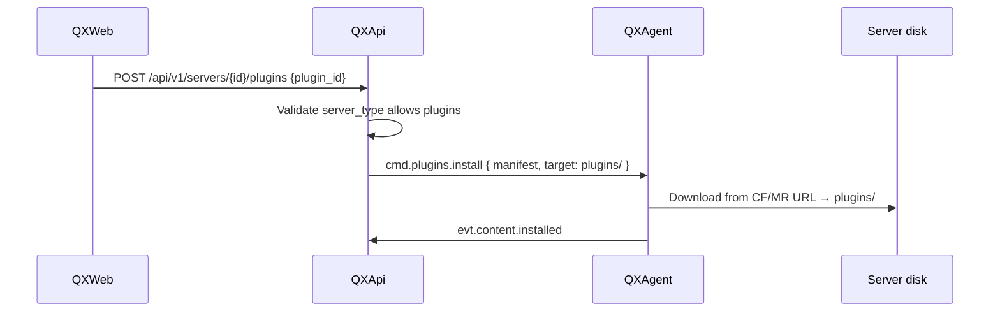

# Server Content Install — Mods & Plugins by server_type

> **Статус реализации:** 🔲 post-MVP / v2+ (см. [mvp.md](./mvp.md)). REST paths — относительно `/api/v1`.  
> API routes для content — заготовка в [api.md](./api.md); UI и agent install — не реализованы.
> **BYOS:** QXAgent ставит контент **на диск сервера** (прямые URL из manifest), не в MinIO.  
> Параллель клиенту: [ADR-0011](./adr/0011-client-local-content-install.md), [modpacks-pipeline.md](./modpacks-pipeline.md).

---

## 1. Принцип

| Слой | Роль |
| ------ | ------ |
| **QXWeb** | Выбор `server_type`, modpack, отдельных mods/plugins |
| **QXApi** | Manifest + **валидация** «тип сервера ↔ тип контента» |
| **QXAgent** | Скачивание в `plugins/`, `mods/` на VPS |

Файлы живут в `{server_root}/` на машине пользователя — как инстанс на ПК у QXLauncher.

---

## 2. Матрица server_type

| `server_type` | Mods | Plugins | Платформа / пример JAR |
| --------------- | :--: | :-----: | ------------------------ |
| `vanilla` | ✗ | ✗ | Official server.jar |
| `paper` | ✗ | ✓ | Paper |
| `spigot` | ✗ | ✓ | Spigot |
| `purpur` | ✗ | ✓ | Purpur |
| `forge` | ✓ | ✗ | Forge server |
| `neoforge` | ✓ | ✗ | NeoForge server |
| `fabric` | ✓ | ✗ | Fabric server |
| `quilt` | ✓ | ✗ | Quilt server |
| `hybrid` | ✓ | ✓ | Mohist, Magma, Arclight, … |

### 2.1 Hybrid (`server_type = hybrid`)

Обязательно поле `hybrid_platform` в конфиге сервера:

| `hybrid_platform` | Mods | Plugins |
| ------------------- | :--: | :-----: |
| `mohist` | ✓ | ✓ |
| `magma` | ✓ | ✓ |
| `arclight` | ✓ | ✓ |

QXApi отклоняет `POST /servers/{id}/plugins` на `neoforge` и `POST .../mods` на `paper` → `403 CONTENT_NOT_ALLOWED`.

---

## 3. Пути на диске (server root)

```text
/opt/qx/server/                 # QX_SERVER_ROOT
├── server.jar
├── plugins/                    # paper, spigot, purpur, hybrid
├── mods/                       # forge, neoforge, fabric, quilt, hybrid
├── config/
└── ...
```

| Контент | Каталог | Допустимые `server_type` |
| --------- | --------- | --------------------------- |
| Plugin `.jar` | `plugins/` | paper, spigot, purpur, hybrid |
| Mod `.jar` / `.zip` | `mods/` | forge, neoforge, fabric, quilt, hybrid |
| Modpack (full) | `mods/` + `config/` + overrides | по loader modpack ↔ server_type |

---

## 4. Установка (QXAgent)



| Command | Когда |
| --------- | ------- |
| `cmd.modpack.install` | Полная сборка; QXApi проверяет loader modpack vs `server_type` |
| `cmd.mods.install` | Отдельные моды → `mods/` |
| `cmd.plugins.install` | Отдельные плагины → `plugins/` |

Payload (общий паттерн):

```json
{
  "type": "cmd.mods.install",
  "payload": {
    "items": [{ "url": "...", "sha256": "...", "filename": "foo.jar" }],
    "wipe_existing": false
  }
}
```

Скачивание — **напрямую** с authorized URL (CurseForge / Modrinth / Hangar / SpigotMC — TBD), verify hash, без MinIO.

---

## 5. Sync client ↔ server

При общем `modpack_id`:

1. QXLauncher → инстанс на **ПК** (`mods/`, client loader)
2. QXAgent → тот же manifest на **сервер**, но **только файлы, разрешённые `server_type`**
   - modpack для Fabric client + Paper server → **ошибка** на этапе создания/привязки в QXWeb
   - modpack Forge + NeoForge server → mods в `mods/`
   - hybrid Mohist + modpack с plugins и mods → оба каталога

`manifest_sha256` должен совпадать; состав путей зависит от `server_type`.

---

## 6. API (QXWeb / QXApi)

| Method | Path | Условие |
| -------- | ------ | --------- |
| POST | `/servers/{id}/plugins` | `server_type` ∈ plugins-capable |
| POST | `/servers/{id}/mods` | `server_type` ∈ mods-capable |
| POST | `/servers/{id}/modpack` | modpack loader compatible with server |
| GET | `/servers/{id}/content` | List plugins/ + mods/ metadata |

Ошибка:

```json
{
  "error": {
    "code": "CONTENT_NOT_ALLOWED",
    "message": "Paper servers support plugins only, not mods"
  }
}
```

---

## 7. QXWeb UX

- При создании сервера: выбор типа → UI показывает только допустимые вкладки (Plugins / Mods / Modpack).
- Mohist / hybrid: обе вкладки.
- Paper: только Plugins + Modpacks marked as plugin packs (Bukkit), не Forge/Fabric modpacks.

---

*См. [agent-protocol.md §5](./agent-protocol.md), [schema.sql](./schema.sql)*
